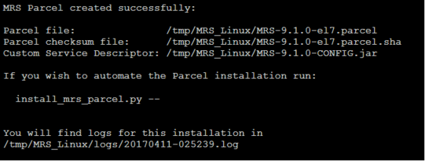

---

# required metadata
title: "Generate a parcel for R Server 9.1.0 on CDH"
description: "Generate a parcel to install Microsoft R Server 9.1.0 on the Cloudera distribution of Apache Hadoop (CDH)."
keywords: ""
author: "HeidiSteen"
manager: "jhubbard"
ms.date: "04/09/2017"
ms.topic: "article"
ms.prod: "microsoft-r"
ms.service: ""
ms.assetid: ""

# optional metadata
ROBOTS: ""
audience: ""
ms.devlang: ""
ms.reviewer: ""
ms.suite: ""
ms.tgt_pltfrm: ""
ms.technology: "r-server"
ms.custom: ""
---

# Generate a parcel

**Applies to:** R Server 9.1.0 on the Cloudera distribution of Apache Hadoop (CDH)

When performing a parcel installation in CDH, you use the **generate_mrs_parcel.sh** script file, support files provided in the R Server 9.1.0 distribution, and Cloudera Manager. Do not run the install.sh script. The instructions in this article walk you through steps performed at the console, prior to using Cloudera Manager.

In previous releases, parcel installation required downloading two pre-built parcel files. The 9.1.0 release improves upon this experience by providing a parcel generator script. The script produces the following output:

+ a parcel
+ a checksum
+ a Custom Service Descriptor (CSD) that integrates Microsoft R Server as a managed service in Cloudera

Before you start, be aware of the following limitations:
 
+ MicrosoftML can only be included in the parcel if CDH is running on RHEL 7.x or later.
+ mrsdeploy features (remote execution, web service deployment), plus web node and compute node configurations, are not supported at all. 

A workaround is to install the packages manually. For instructions, see [Manual package installation](rserver-install-hadoop-manual-package.md).

## Step 1: Download 

The first step is to download a gzipped tar file of the R Server 9.1.0 distribution to the master node from one of the following download sites.

| Site | Edition | Details |
|------|---------|---------|
| [Visual Studio Dev Essentials](http://go.microsoft.com/fwlink/?LinkId=717968&clcid=0x409) | Developer (free) | This option provides a zipped file, free when you sign up for Visual Studio Dev Essentials. Developer edition has the same features as Enterprise, except it is licensed for development scenarios.   1. Click **Join or Access Now** and enter your account information. 2. Make sure you're in the right place: *my.visualstudio.com*. 3. Click **Downloads**, and then search for *Microsoft R*. |
|[Volume Licensing Service Center (VLSC)](http://go.microsoft.com/fwlink/?LinkId=717966&clcid=0x409) | Enterprise | Sign in, search for R Server for Hadoop. A selection for **R Server 9.1.0 for Hadoop** is provided on this site. |
| [MSDN subscription downloads](https://msdn.microsoft.com/subscriptions/downloads/hh442898.aspx) | Developer or Enterprise | Subscribers can download software at given subscription levels. Depending on your subscription, you can get either edition. |

## Step 2: Unpack 

After downloading the software to a writable directory, such as **/tmp**, the second step is to unpack the distribution.

1. On the master node, log in as root or a user with super user privileges (`sudo su`). In our examples, the master node is a machine named `cdh4-mn0`.
2. Switch to the **/tmp** directory (assuming it's the download location): `cd /tmp`
3. Unpack the file:
        `[root@cdh4-mn0 tmp] $ tar zxvf en_microsoft_r_server_910_for_hadoop_x64_10323951.tar.gz`

The distribution is unpacked into an `MRS90HADOOP` folder at the download location. The distribution includes the following files:

| File | Description |
|------|-------------|
|`install.sh` | Script for installing R Server. |
|`generate_mrs_parcel.sh` | Script for generating a parcel used for installing R Server on CDH |
| `EULA.txt` | End user license agreements for each separately licensed component. |
| DEB folder | Contains Microsoft R packages for deployment on Ubuntu. |
| RPM folder | Contains Microsoft R packages for deployment on CentOS/RHEL and SUSE |
| Parcel folder | Contains files used to generate a parcel for installation on CDH. |

## Step 3: Dry run

The parcel generator script is now available in the **tmp** directory. The script includes a **-n** flag that steps through actions without actually deploying anything. We recommend you start with the **-n** parameter to review the prompts.

The script downloads Microsoft R Open and builds a parcel by extracting information from RPM packages. You can append flags to run unattended setup or customize feature selections.

1. Switch to the MRS90HADOOP directory: `cd /MRS90HADOOP`

2. Run the script without actually invoking its operations:

    `[root@cdh4-mn0 MRS90HADOOP] $ bash generate_mrs_parcel.sh -n`

You will be prompted to read and accept license agreements. 
  
You are also asked to specify the underlying operating system. If the platform supports it, the parcel generator adds installation instructions for features having a dependency on .NET Core. Namely, these features include Microsoft machine learning and application components used for remote execution, web service deployment, web node, and compute node configurations. RHEL 7.x is the platform with .NET Core support.

When the script is finished, the location of the parcel, checksum, and CSD is printed to the console. Remember the files do not yet exist. This is just a dry run. Running the script without -n generates the files.

  

## Step 4: Review flags

You can run parcel generator with the following flags.

flag | Option | Description
-----|--------|------------
 -m | --distro-name [DISTRO]| Target Linux distribution for this parcel, one of: el6 el7 sles11
 -l | --add-mml  | Add Microsoft ML to the Parcel regardless of the target system.
 -a | --accept-eula | Accept all end user license agreements.
 -d | --download-mro | Download microsoft r open for distribution to an offline system.
 -s | --silent | Perform a silent, unattended install.
 -u | --unattended | Perform an unattended install.
 -n | --dry-run | Don't do anything, just show what would be done.
 -h | --help | Print this help text.

## Step 4: Actual run

Repeat the command without **-n** parameter. This time, the parcel, .sha, and CSD file are actually created.

~~~~
$ bash generate_mrs_parcel.sh
~~~~

## Step 5: Copy parcel

Cloudera Manager finds parcels in its Cloudera parcel repository. In this step, copy the parcel you generated to the repository.

1. Copy `MRS-9.1.0-el7.parcel` and `MRS-9.1.0-el7.parcel.sha` to the Cloudera parcel repository, typically /opt/cloudera/parcels.

    `[root@cdh4-mn0 MRS_Linux]# cp ./MRS-9.1.0-el7.parcel /opt/cloudera/parcel-repo/`

    `[root@cdh4-mn0 MRS_Linux]# cp ./MRS-9.1.0-el7.parcel.sha /opt/cloudera/parcel-repo/`

## Step 6: Copy CSD 

The Custom Service Descriptor (CSD) enables MRS monitoring and administration from within Cloudera Manager. In this step, copy the CSD (a .jar file) to the Cloudera repository for CSD files. 

1. Copy the CSD file `MRS-9.1.0-el7-CONFIG.jar` to the Cloudera CSD directory, typically /opt/cloudera/csd.

    `[root@cdh4-mn0 MRS_Linux]# service cloudera-scm-server restart`

2. Modify the permissions of CSD file as follows: 

    `sudo chmod 644 /opt/cloudera/csd/MRS-9.1.0-CONFIG.jar`

    `sudo chown cloudera-scm:cloudera-scm /opt/cloudera/csd/MRS-9.1.0-CONFIG.jar`

3.	Restart the cloudera-scm-server service:

    `sudo service cloudera-scm-server restart`

## Next steps

After you generate a parcel and CSD and copy the files to the appropriate repositories, the next steps are in Cloudera Manager. Start at the Home page to [deploy the parcel and activate Microsoft R Server in CDH](rserver-install-cloudera-deploy-activate.md).

## See Also

[Install R Server 9.1.0 on the Cloudera distribution of Apache Hadoop (CDH)](rserver-install-cloudera.md)
