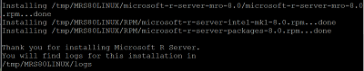

---

# required metadata
title: "R Server installation for Linux systems"
description: "Install Microsoft R Server 8.0 or Microsoft R Server 2016 (version 8.0.5) on Linux."
keywords: ""
author: "HeidiSteen"
manager: "paulettm"
ms.date: "08/03/2016"
ms.topic: "get-started-article"
ms.prod: "microsoft-r"
ms.service: ""
ms.assetid: ""

# optional metadata
ROBOTS: ""
audience: ""
ms.devlang: ""
ms.reviewer: ""
ms.suite: ""
ms.tgt_pltfrm: ""
ms.technology: "r-server"
ms.custom: ""
---

# R Server Installation for Linux Systems

This article explains how to install Microsoft R Server on a standalone Linux server. The newest version, Microsoft R Server 2016 (version 8.0.5), is recommended because it includes an updated installer that deploys R Server in fewer steps. The updated installer includes a slipstream installation of **Microsoft R Open for R Server 2016** that comes with most of its dependencies built into the package.

You can install major versions of R Server side-by-side on Linux, but not minor versions. Specifically, if you already installed Microsoft R Server 8.0, you must uninstall it before using Microsoft R Server 2016 (build 8.0.5). Additionally, if you want to replace 7.4 with 8.0.5 rather than run both side-by-side, you should uninstall the older distribution before installing the new version (there is no in-place upgrade). See [Uninstall Microsoft R Server to upgrade to a newer version](rserver-install-uninstall-upgrade.md) for instructions.

Installer requirements consist of the following:

-   Your system has Internet access
-   Your system is configured to use your platform’s package manager (yum for RHEL systems, zypper for SLES systems)
-   You are installing as root or as super user

If these requirements cannot be met, you can install R Server manually. First, verify that your system meets system requirements and satisfies the [package prerequisites](rserver-install-linux-hadoop-packages.md). You can then follow the more detailed installation instructions described in [Managing Your Microsoft R Server Installation](#managing-your-microsoft-r-server-installation).

## Where Do I Get It?

MSDN subscribers can download Microsoft R Server 2016 (version 8.0.5) for Linux [here](http://aka.ms/rserver/linux/download).

You can also get R Server 2016 for Linux from these sites.

- [Volume Licensing Service Center (VLSC)](http://go.microsoft.com/fwlink/?LinkId=717966&clcid=0x409) provides an ISO file for Microsoft customers who have volume licensing.
- [Visual Studio Dev Essentials](http://go.microsoft.com/fwlink/?LinkId=717968&clcid=0x409) provides a gzipped TAR file for free to developers who sign up for Visual Studio Dev Essentials. This is the Developer edition of Microsoft R Server; it has the same features as Enterprise but is licensed for development scenarios.

  Be sure that you are connected to Visual Studio Dev Essentials before searching the **Downloads** list. You're in the right place if the page shows the site name, as follows, near the top right of the page.

  

## System Requirements

**Processor:** 64-bit processor with x86-compatible architecture (variously known as AMD64, Intel64, x86-64, IA-32e, EM64T, or x64 chips). Itanium-architecture chips (also known as IA-64) are not supported. Multiple-core chips are recommended.

**Operating System:** Microsoft R for Linux can be installed on Red Hat Enterprise Linux (RHEL) or a fully compatible operating system like CentOS, or SUSE Linux Enterprise Server 11. Microsoft R Server has different operating system requirements depending on whether you install 8.0.0 or 8.0.5. See [Supported platforms](rserver-install-supported-platforms.md) for specifics. Only 64-bit operating systems are supported.

**Memory:** A minimum of 2 GB of RAM is required; 8 GB or more are recommended.

**Disk Space:** A minimum of 500 MB of disk space is required.

## Install R Server 2016 on Linux

Download the software to a writable directory, such as **/tmp**, unpack the distribution and then run the installation script.

### Unpack the distribution

The distribution includes one installer for Microsoft R Server. For a gzipped TAR file, you should unpack the file as follows (be sure you have downloaded the file to a writable directory, such as **/tmp**):

1. Log in as root or a user with sudo privileges.
2. Switch to the **/tmp** directory (assuming it's the download location)
3. Unpack the file:
        `[tmp] $ tar zxvf en_microsoft_r_server_for_linux_x64_8944657.tar.gz`

**Unpacking an ISO file**

Volume licensing makes the download available as an ISO file. To unpack this file, create a mount point, and then mount the ISO file to that mount point:

      `mkdir /mnt/mrsimage`
      `mount –o loop sw_dvd5_r_server_2016_english_-2_for_linux_mlf_x20-98713.iso /mnt/mrsimage`

The download file is **sw_dvd5_r_server_2016_english_-2_for_linux_mlf_x20-98713.iso**.

### Run the install script

Microsoft R Server 2016 for Linux is deployed by running the install script with no parameters, which you can install at the root, or as super user via `sudo`.

1. Log in as root or a user with sudo privileges. The following instructions assume user privileges with the sudo override.
2. Verify system repositories are up to date:
		`[username] $ sudo yum clean all`
3. Change to the directory to which you downloaded the rpm (for example, **/tmp**):
		`[username] $ cd /tmp`
4. Change to the `MRS80LINUX` directory containing the installation script:
        `[tmp] $ cd MRS80LINUX`
4. Run the script.
		`[MRS80LINUX] $ sudo bash install.sh`
5. When prompted to accept the license terms for Microsoft R open, click Enter to read the EULA, click **q** when you are finished reading, and then click **y** to accept the terms.
6. Installer output shows the packages and location of the log file.
    
7. Check the version of Microsoft R Open using `rpm -qi`:
		`[MRS80LINUX] $ rpm -qi microsoft-r-server-mro-8.0`
8. Check the version of the intel-mkl package:
		`[MRS80LINUX] $ rpm -qi microsoft-r-server-intel-mkl-8.0`

Partial output is as follows (note version 8.0.5):

		Name        : microsoft-r-server-mro-8.0   Relocations: /usr/lib64
		Version     : 8.0.5                         Vendor: Microsoft
		. . .

## Managing Your Microsoft R Server Installation

In this section, we discuss file management for your Microsoft R Server installation, including file ownership, file permissions, and so on.

### File Ownership

If followed the instructions provided, the installed files are all owned by root. For single-user workstations where the user has either sudo privileges or access to the root password, this is normally fine. In enterprise environments, however, it's common to have third-party applications such as Microsoft R Server installed into an account owned by a non-root user; this can make maintenance easier and reduce security concerns. In such an environment, you may wish to create an "RUser" account, and change ownership of the files to that user. You can do that as follows:

1. Install Microsoft R Server as root, as usual.
2. Create the "RUser" account if it does not already exist. Assign this user to a suitable group, if desired.
3. Use the **chown** command to change ownership of the files (in the example below, we assume RUser has been made a member of the dev group; this command requires root privileges):

		chown -R RUser:dev /usr/lib64/MRS80LINUX

Here we show the default path /usr/lib64/MRS80LINUX; if you have specified an alternate installation path, use that in this command as well.

### Unattended Installs

You can bypass the interactive install steps of the Microsoft R Server install script with the -y flag ("yes" or "accept default" to all prompts except that you also agree to the license agreement). Additional flags can be used to specify which of the usual install options you want, as follows:

flag | Option | Description
-----|--------|------------
 -a | --accept-eula | Accept all end user license agreements.
 -d | --download-mro |  Download microsoft r open for distribution to an offline system.
 -p | --hadoop-components | Install Hadoop components.
 -s | --silent | Perform a silent, unattended install.
 -u | --unattended | Perform an unattended install.
 -h | --help | Print this help text.

For a standard unattended install, run the following script:

	./install.sh –a –s

### File Permissions

Normally, ordinary Microsoft R Server files are installed with read/write permission for owner and read-only permission for group and world. Directories are installed with execute permission as well, to permit them to be traversed. You can modify these permissions using the **chmod** command. (For files owned by root, this command requires root privileges.)

### Installing to a Read-Only File System

In enterprise environments, it is common for enterprise utilities to be mounted as read-only file systems, so that ordinary operations cannot corrupt the tools. Obviously, new applications can be added to such systems only by first unmounting them, then re-mounting them for read/write, installing the software, and then re-mounting as read-only. This must be done by a system administrator.

## Setting Up a Package Repository

One of the strengths of the R language is the thousands of third-party packages that have been made publicly available via CRAN, the Comprehensive R Archive Network. R includes a number of functions that make it easy to download and install these packages. However, in many enterprise environments, access to the Internet is limited or non-existent. In such environments, it is useful to create a local package repository that users can access from within the corporate firewall.

Your local repository may contain source packages, binary packages, or both. If some or all of your users will be working on Windows systems, you should include Windows binaries in your repository. Windows binaries are R-version-specific; if you are running R 3.2.2, you need Windows binaries built under R 3.2. These versioned binaries are available from CRAN and other public repositories. If some or all of your users will be working on Linux systems, you must include source packages in your repository.

The Microsoft Managed R Archive Network (MRAN) provides daily snapshots of all of CRAN, and together with the Microsoft-developed open-source package miniCRAN can be used to easily build a local package repository containing source packages, binary packages, or both.

There are two ways to create the package repository: either copy all the packages from a given MRAN snapshot, or create a new repository and populate it with just those packages you want to be available to your users. We will describe both procedures using MRAN and miniCRAN.

**Note:** The miniCRAN package itself is dependent on 18 other CRAN packages, among which is the RCurl package, which has a system dependency on the curl-devel package. Similarly, package XML has a dependency on libxml2-devel. We recommend, therefore, that you build your local repository initially on a machine with full Internet access, so that you can easily satisfy all these dependencies. Once created, you can either move the repository to a different location within your firewall, or simply disable the machine’s Internet access.

### Installing miniCRAN

On a system with Internet access, the easiest way to install the miniCRAN package (or any R package) is to start R and use the install.packages function:

	install.packages("miniCRAN", dependencies=TRUE)

If your system already contains all the system prerequisites, this will normally download and install all of miniCRAN’s R package dependencies as well as miniCRAN itself. If a system dependency is missing, compilation of the first package that needs that dependency will fail, typically with a specific but not particularly helpful message. In our testing, we have found that an error about curl-config not being found indicates that the curl-devel package is missing, and an error about libxml2 indicates the libxml2-devel package is missing. If you get such an error, exit R, use yum or zypper to install the missing package, then restart R and retry the install.packages command.

### Creating a Repository from an MRAN Snapshot

Creating a repository from an MRAN snapshot is very straightforward:

1. Choose a location for your repository somewhere on your local network. If you have a corporate intranet, this is usually a good choice, provided URLs have the prefix http:// and not https://. Any file system that is mounted for all users can be used; file-based URLs of the form file:// are supported by the R functions. In this example, we suppose the file system /local is mounted on all systems and we will create our repository in the directory /local/repos.

2. Start R and load the miniCRAN package:

		library(miniCRAN)

3. Specify an MRAN snaphot:

		CRAN <- "http://mran.revolutionanalytics.com/snapshot/2015-11-30"

4. Set your MRAN snapshot as your CRAN repo:

		r <- getOption("repos")
		r["CRAN"] <- CRAN
		options(repos=r)

5. Use miniCRAN’s pkgAvail function to obtain a list of (source) packages in your MRAN snapshot:

		pkgs <- pkgAvail()[,1]

6. Use miniCRAN’s makeRepo function to create a repository of these packages in your /local/repos directory:

		makeRepo(pkgs, "/local/repos", type="source")

### Creating a Custom Repository

As mentioned above, a custom repository gives you complete control over which packages are available to your users. Here, too, you have two basic choices in terms of populating your repository: you can either use makeRepo to select specific packages from an existing MRAN snapshot, or you can combine your own locally developed packages with packages from other sources. The latter option gives you the greatest control, but typically means you need to manage the contents using home-grown tools.

#### Creating a Custom Package Directory

Your custom package directory can contain source packages, binary packages, or both. Windows binary packages should have a path of the form

	/local/repos/bin/windows/contrib/3.2

while source packages should have a path of the form:

	local/repos/src/contrib

Windows binary packages should be built with your current R version. Windows binary files will be zip files, package source files will be tar.gz files. Move the desired packages to the appropriate directories, then run the R function write\_PACKAGES in the tools package to create the PACKAGES and PACKAGES.gz index files:

	tools:::write_PACKAGES("/local/repos")

### Configuring R to Use Your Local Repository

To make your local repository available to your R users:

1.  Open the file Rprofile.site in the /etc directory of your installed R (if you installed to the default /usr prefix, the path is /usr/lib64/MRO-for-MRS-8.0.0/R-3.2.2/lib64/R/etc/Rprofile.site).

2.  Find the following line in the Rprofile.site file:

		r <- c(REVO=RevoUtils::getRevoRepos())

3.  Add your repository as follows:

		r <- c(REVO=RevoUtils::getRevoRepos(),
			LOCAL="file:///local/repos")

	 If you added more than one repository and used R version numbers, add multiple lines of the form LOCAL\_VER="file:///local/repos/VER", for example:

		r <- c(REVO=RevoUtils::getRevoRepos(),
		       LOCAL_3.2="file:///local/repos/3.2",
		       LOCAL_3.1="file:///local/repos/3.1",
		       LOCAL_3.0="file:///local/repos/3.0")

4.  Save the file and your repository is ready for use.

If you are in a locked-down environment without access to the standard Microsoft repository, *replace* the Revo repository with your local repository (or repositories).

## Removing Microsoft R Server

For instructions on rolling back your installation, see
[Uninstall Microsoft R Server to upgrade to a newer version](rserver-install-uninstall-upgrade.md).

## Managing Multiple R Installations

You can install the latest Microsoft R Server side-by-side with an existing Microsoft R Server. In this section, we discuss maintaining multiple versions of Microsoft R Server, together with instructions for maintaining Microsoft R Server alongside versions of R obtained from CRAN or third-party repositories such as <http://dl.fedoraproject.org/pub/epel>. (Note, however, that patch releases such as Microsoft R Server 7.4.1 are intended to replace their associated main release, not live side by side with it. You must uninstall and reinstall such releases.)

### Using Microsoft R Server with Other R Installations

If you have an installed R script in your /usr/bin directory and then install Microsoft R Server, the automated installer detects that R exists and does not prompt you to link R to Revo64. In this case, you can use both versions of R simply by calling them by their respective script names, “R” and “Revo64”. To have Microsoft R Server become your default R, do the following:

1.  Rename the R script by appending the R version, for example 3.2.2:

		mv /usr/bin/R /usr/bin/R-3.2.2

2.  Create a symbolic link from the Revo64 script to R:

		ln -s /usr/bin/Revo64 /usr/bin/R

If you have installed Microsoft R Server and then install base R, again there should be no conflict; R and Revo64 point to their respective installations, as usual. You can use the above procedure to make Microsoft R Server your default version of R.

## Install R Server 8.0 on Linux

Build 8.0.0 is no longer available on the Microsoft download sites, but if you already have this distribution and you specifically require this version, you can follow these instructions to deploy version 8.0.0.

Installation of Microsoft R Server consists of two distinct steps:

- Install Microsoft R Open for Microsoft R Server 2016
- Install Microsoft R Server 2016

To download and install Microsoft R Open and R Server:

1. Log in as root, or as a user with super user (sudo) privileges. Optionally, you can install as a non-root user. See [Non-Root Installs](#non-root-installs) for instructions.

2. Download [Microsoft R Open for Microsoft R Server](http://go.microsoft.com/fwlink/?LinkID=699383&clcid=0x409).

3. Install Microsoft R Open according to the [online instructions](http://go.microsoft.com/fwlink/?LinkID=699383&clcid=0x409) for your platform.

5.  Find the download for the 8.0 version of Microsoft R Server for Linux on your system. If you have an img file, you must first mount the file. The following commands create a mount point and mount the file to that mount point:

	    mkdir /mnt/mrsimage
	    mount –o loop <filename> /mnt/mrsimage

  For RHEL/CENTOS systems;
		tar zxvf MRS80RHEL.tar.gz

  For SLES systems;
		tar zxvf MRS80SLES.tar.gz

6.  In either case, you will then want to copy the installer gzipped tar file to a writable directory, such as /tmp:

  From the mounted img file:
		cp /mnt/mrsimage/Microsoft-R-Server-`*`.tar.gz /tmp

  From the unpacked tar file:
		cp /tmp/MRS80*/Microsoft-R-Server-`*`.tar.gz /tmp

7. Unpack the tar file and run the installer script, as follows:

		cd /tmp
		tar xvzf Microsoft-R-Server-8.0.0-<OS>.tar.gz
		pushd rrent
		./install.sh

The installer prompts you for the following:

a. Location of your R installation. If you installed Microsoft R Open for Microsoft R Server to the default location, you can simply press Enter and continue.

b. Location for installing additional Microsoft R Server files. These are files that are not part of specific R packages, such as documentation, licenses, and scripts.

c. Whether you would like to load the rpart and lattice packages by default; these packages are recommended as they enhance some RevoScaleR operations.

d. Agreement to the Microsoft R Server software license.

8.  Once you have agreed to the license, the installation completes. Type the following to return to your original directory: `popd`

On Linux systems with Hadoop installed, the install.sh script also tries to configure Microsoft R Server for use with Hadoop. On such systems, the install.sh script runs a Python script that queries the Hadoop environment for certain environment variables and searches the Hadoop installation for certain files, writing a set of Hadoop environment variables required by Microsoft R Server to a file in the R Server installation directories. For complete details on Hadoop configuration, including troubleshooting when the automated configuration is incomplete or inaccurate, see the [Microsoft R Server Hadoop Configuration Guide](rserver-install-hadoop.md).

If you receive messages about uninstalled dependencies, see [Package Dependencies for Microsoft R Server installations on Linux and Hadoop](rserver-install-linux-hadoop-packages.md).

### Non-Root Installs of Microsoft R Server 8.0

If you have an older distribution of Microsoft R Server 8.0 for Linux, you can run the installer as a non-root user without sudo privileges. You can run either a complete install or simply extract the files to a directory for subsequent installation using your own install scripts. For a complete install to succeed, however, the following conditions must be met:

-   You must have all the prerequisite packages installed on your computer.
-   You must have write permission to the specified base installation directory.

The installer will check that the prerequisite packages are installed and inform you of any that are missing. The prerequisite packages typically do require superuser priviliges to install, so if you do not have sudo privileges, you will probably need to consult your system administrator in order to install them.

If all the prerequisites are installed, you complete the installation as follows:

1. You must already have the 8.0 download because it is no longer available on the download sites. Microsoft has replaced all downloads with the newer 8.0.5 version, which does not support non-root installs.

2. Run the following commands to install the rpm file:

		mkdir $HOME/localmrsrpmdb
		rpm --initdb --dbpath $HOME/localmrsrpmdb
		export MRS_RPM_DBPATH=$HOME/localmrsrpmdb && \
		    rpm --dbpath $MRS_RPM_DBPATH --prefix $HOME \
		        --nodeps -i MRO-for-MRS-`*`.rpm

3. Unpack the Microsoft R Server tarball, then run the installer script, as follows (the tarball name may include an operating system ID; the complete name of the tarball will be in your download letter):

		tar xvzf Microsoft-R-Server-8.0.0-`*`.tar.gz
		pushd rrent
		./install.sh

At this point you are asked for the location of your R installation—be sure to use the same location you provided as the --prefix argument in step 2. You are also asked where you would like to install additional Microsoft R Server files; these are files that are not part of specific R packages, such as documentation, licenses, and scripts.

You are then asked if you would like to load the rpart and lattice packages by default; these packages are recommended as they enhance some RevoScaleR operations.

Finally, you are asked to agree to the Microsoft R Server software license. Once you have agreed to the license, the installation completes. Type the following to return to your original directory: `popd`

The R installation is owned by the user who completed the installation; subsequent updates and uninstalls must be performed by the same user. In particular, multiple users can perform non-root installations–as long as the installations specify separate base installation directories, they will be completely independent. Non-root installations can be performed on systems that have had Microsoft R Server installed as root, and vice versa.

In general, non-root installs require you to specify the complete path to the Revo64 script once installation is complete. To avoid this, add the path to the directory containing your Revo64 script to your PATH environment variable, for example, by adding the following to the end of your .bash\_profile file: `export PATH=/home/$USER/Revo-8.0/R-3.1.3/bin:$PATH`

## See Also

[Install R on Hadoop overview](rserver-install-hadoop.md)

[Install R Server 2016 on Hadoop](rserver-install-hadoop-805.md)

[Install R Server 8.0 on Hadoop](rserver-install-hadoop-800.md)

[Uninstall Microsoft R Server to upgrade to a newer version](rserver-install-uninstall-upgrade.md)

[Troubleshoot R Server installation problems on Hadoop](rserver-install-hadoop-troubleshoot.md)
