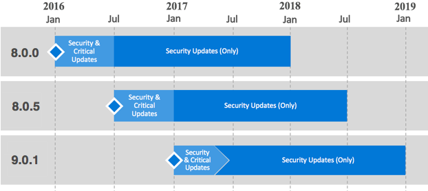
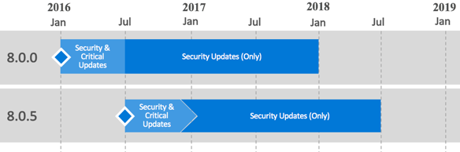

---

# required metadata
title: "Support for Microsoft R Server versions"
description: "A list of the operating systems supported by editions and versions of Microsoft R Server and Revolution R Enterprise."
keywords: ""
author: "j-martens"
manager: "paulettm"
ms.date: "08/09/2016"
ms.topic: ""
ms.prod: "microsoft-r"
ms.service: ""
ms.assetid: ""

# optional metadata
ROBOTS: ""
audience: ""
ms.devlang: ""
ms.reviewer: ""
ms.suite: ""
ms.tgt_pltfrm: ""
ms.technology: "r-server"
ms.custom: ""

---
# Support for Microsoft R Server Versions

Microsoft plans to release updates for Microsoft R Server a few times per year with each update version supported for twelve (12) months from its general availability (GA) release date. Technical support will be provided for the entire twelve (12) months. However, our support structure is now dynamic, evolving into two distinct servicing phases that depend on the availability of the latest version.  
+ Security and Critical Updates servicing phase - When running the latest version of Microsoft R server, you will receive both Security and Critical updates. 
+ Security Updates (Only) servicing phase - After a new version of Microsoft R Server is released, support for older versions will reduce to Security updates only for the remainder of the twelve (12) month support lifecycle (shown in Figure 1). 

<<<<<<< HEAD

=======
## Support Timeline

>>>>>>> dev

_Figure 1. Example of servicing support_

 

>[!NOTE]
>The latest version of Microsoft R Server is always in the Security and Critical Updates servicing phase. This means that in the event that you encounter a code defect that warrants a critical update, you must have the latest version installed in order to receive a fix. All other supported versions will only be eligible to receive security updates. All support ends after the twelve (12) month lifecycle for a current branch version has expired. At that time, customers must update to a supported version. 

 

|Version History|Availability                       |Support End Date                  |
|:-------------------:|:---------------------------------:|:--------------------------------:|
|8.0.0                |1/1/2016                           |1/1/2017                          |
|8.0.5|7/1/2016|7/1/2017|
