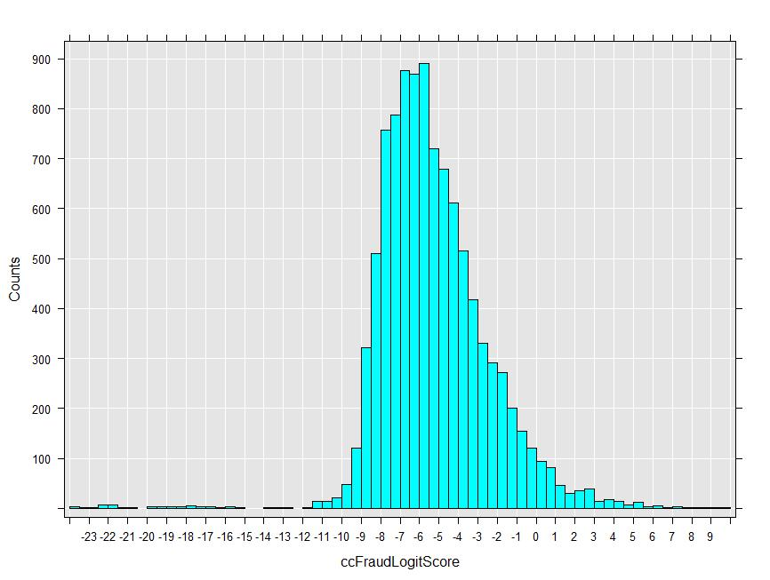

# RevoScaleR SQL Server Getting Started Guide 

## Overview 

This guide is an introduction to high-performance ‘big data’ analytics for ***SQL Server 2016*** using ***RevoScaleR***, an R package included with ***Microsoft R Services***.  A preview of this functionality is included in Microsoft SQL Server 2016 Community Technology Preview 3 (CTP3). This guide is primarily intended for users who are already have a basic familiarity with the R language and would like to understand more about using the RevoScaleR package with SQL Server. It is also useful to have basic familiarity with SQL Server: knowing how to create databases and tables and load data.

There are three key components to running ***RevoScaleR*** high performance analytics:

- The name and arguments of the analysis function: What analysis do you want to perform?
- The specification of your data source(s): Where is your data and what are its characteristics?  And, if you are creating new data, for example with scoring, where does the new data go?
- The specification for your compute context: Where do you want to perform the computations?

***RevoScaleR*** provides a variety of data sources and compute contexts that can be used with the high performance analytics functions.  This guide focuses on analyzing SQL Server data in-database.  That is, the data is located in a SQL Server database and the computations are performed at the location of the data. We also consider a second use case: data is extracted from the SQL Server database using an ODBC connection and computations are performed on a computer alongside the SQL Server Platform.

You can follow this guide from an R IDE of your choice.  On Windows, we recommend using the ***R Productivity Environment*** integrated development environment.  It is included with the client-side download of ***Microsoft R Services*** available for CTP3 customers. It has its own Getting Started Guide. More extensive general examples of using ***RevoScaleR*** can be found in the following guides included with ***Microsoft R Services***:

- *RevoScaleR Getting Started Guide* (RevoScaleR_Getting_Started.pdf)
- *RevoScaleR User’s Guide* (RevoScaleR_Users_Guide.pdf)
- *RevoScaleR Distributed Computing Guide* (RevoScaleR_Distributed_Computing.pdf)
- *RevoScaleR ODBC Data Import Guide* (RevoScaleR_ODBC.pdf)

For information on other distributed computing compute contexts, see:

- *RevoScaleR Hadoop Getting Started Guide* (RevoScaleR_Hadoop_Getting_Started.pdf)

## Using a SQL Server Data Source and Compute Context 

The ***RevoScaleR*** package provides a framework for quickly writing start-to-finish, scalable R code for data analysis.  Even if you are relatively new to R, you can get started with just a few basic functions.  In this guide we’ll be focusing on analyzing data that is located in a ***SQL Server Database***. 

For all of the examples in this guide you will need permission to read from the database specified.  To put the sample data in the database and to run some of the examples in this guide, you will need DDL admin privileges. This can be set in SQL Server Management Studio with the following commands, modified for the appropriate user name and password:

	USE [RevoTestDB]
	GO
	CREATE LOGIN [MyUser] WITH PASSWORD='MyPassword', CHECK_EXPIRATION=OFF, CHECK_POLICY=OFF;
	CREATE USER [MyUser] FOR LOGIN [MyUser] WITH DEFAULT_SCHEMA=[db_datareader]
	ALTER ROLE [db_datareader] ADD MEMBER [MyUser]
	ALTER ROLE [db_ddladmin] ADD MEMBER [MyUser]

Note that an R script containing the R code used in this Guide is available in the *inst/demoScripts* directory of your ***RevoScaleR*** package installation. This directory can be found by running the following R code: *rxGetOption("demoScriptsDir")*.

In the next section you will be guided through the first step to performing your R analysis in SQL Server –  creating a *data source* R object that contains information about the data that will be analyzed.

### Creating an RxSqlServerData Data Source 

To create a SQL Server data source for use in ***RevoScaleR***, you will need basic information about your database connection. Using an R script, modify the code below to specify the connection string appropriate to your setup:

	sqlConnString <- "Driver=SQL Server;Server=.; Database=RevoTestDB;Uid=myUser;Pwd=myPassword"

Then we need a table argument identify the data we want to use.  We’ll be using 2 datasets comprised of simulated credit card fraud data: one for estimating models (*ccFraudSmall.csv*) and the other for scoring (*ccFraudScore.csv*). These are available in the sample data directory of the ***RevoScaleR*** package in comma delimited format, each containing 10,000 rows. This directory can be found by running the following R code: *rxGetOption("sampleDataDir")*. Much larger versions with 10 million observations are also available for download.  See Appendix A if you would like to experiment with using a large data set.  

We’ll begin by setting up the data source in SQL Server. Specify the name of the table in SQL Server that will hold the data we will use for modeling:

	sqlFraudTable <- "ccFraudSmall"	

We use this information to create an *RxSqlServerData* data source object:

	sqlRowsPerRead = 5000
	sqlFraudDS <- RxSqlServerData(connectionString = sqlConnString, 
	     table = sqlFraudTable, rowsPerRead = sqlRowsPerRead)

Note that we have also specified *rowsPerRead*.  This parameter is important for handling memory usage and efficient computations.  Most of the ***RevoScaleR*** analysis functions process data in chunks and accumulate intermediate results, returning the final computations after all of the data has been read.  The *rowsPerRead* parameter controls how many rows of data are read into each chunk for processing.  If it is too large, you may encounter slow-downs because you don’t have enough memory to efficiently process such a large chunk of data.  On some systems, setting *rowsPerRead* to too small a value can also provide slower performance.  You may want to experiment with this setting on your system when you are working with a large data set. 
 
Similarly, we will set up the data source we will use for scoring:

	sqlScoreTable <- "ccFraudScoreSmall"
	sqlScoreDS <- RxSqlServerData(connectionString = sqlConnString, 
	     table = sqlScoreTable, rowsPerRead = sqlRowsPerRead)

### Using rxDataStep to Load the Sample Data into SQL Server 

If you are working with your own database, you will probably need to load the sample data into it.  This can be done without leaving R using the rxDataStep function as long as you have DDL admin privileges.  

We will get the file path for the sample CSV file, then will set up a text data source, specifying that the data type in each column should be treated as integers.

	ccFraudCsv <- file.path(rxGetOption("sampleDataDir"), "ccFraudSmall.csv")
	
	inTextData <- RxTextData(file = ccFraudCsv, 
	    colClasses = c(
	    "custID" = "integer", "gender" = "integer", "state" = "integer",
	    "cardholder" = "integer", "balance" = "integer", 
	    "numTrans" = "integer",
	    "numIntlTrans" = "integer", "creditLine" = "integer", 
	    "fraudRisk" = "integer"))

Now we use rxDataStep, specifying our sqlFraudDS as the output data source:

	rxDataStep(inData = inTextData, outFile = sqlFraudDS, overwrite = TRUE)

Similarly, we can load the data set we will use for scoring into the database:

	ccScoreCsv <- file.path(rxGetOption("sampleDataDir"), "ccFraudScoreSmall.csv")
	
	inTextData <- RxTextData(file = ccScoreCsv, 
	    colClasses = c(
	    "custID" = "integer", "gender" = "integer", "state" = "integer",
	    "cardholder" = "integer", "balance" = "integer", 
	    "numTrans" = "integer",
	    "numIntlTrans" = "integer", "creditLine" = "integer"))
	
	rxDataStep(inData = inTextData, sqlScoreDS, overwrite = TRUE)

### Extracting Basic Information about Your Data 

The SQL Server data source can be used as the ‘data’ argument in RevoScaleR functions.  For example, to get basic information about the data and variables, enter:

	rxGetVarInfo(data = sqlFraudDS)

You should see the following information:

	Var 1: custID, Type: integer
	Var 2: gender, Type: integer
	Var 3: state, Type: integer
	Var 4: cardholder, Type: integer
	Var 5: balance, Type: integer
	Var 6: numTrans, Type: integer
	Var 7: numIntlTrans, Type: integer
	Var 8: creditLine, Type: integer
	Var 9: fraudRisk, Type: integer

### Specifying Column Information in Your Data Source 

All of the variables in our data set are stored as integers in the data base, but some of them actually represent categorical data – called factor variables in R. We can specify this information in the data source, and have them automatically converted to factors when analyzed or imported.  The variable state represents the 50 states plus the District of Columbia.  We can specify the state abbreviations as follows to be used as labels for that variable:

	stateAbb <- c("AK", "AL", "AR", "AZ", "CA", "CO", "CT", "DC",
	    "DE", "FL", "GA", "HI","IA", "ID", "IL", "IN", "KS", "KY", "LA",
	    "MA", "MD", "ME", "MI", "MN", "MO", "MS", "MT", "NB", "NC", "ND",
	    "NH", "NJ", "NM", "NV", "NY", "OH", "OK", "OR", "PA", "RI","SC",
	    "SD", "TN", "TX", "UT", "VA", "VT", "WA", "WI", "WV", "WY")

Now we’ll create a column information object specifying the mapping of the existing integer values to categorical levels in order to create factor variables for *gender*, *cardholder*, and *state*:

	ccColInfo <- list(		
	    gender = list(
		  type = "factor", 
	        levels = c("1", "2"),
	   	  newLevels = c("Male", "Female")),		
	    cardholder = list(
		    type = "factor", 
		    levels = c("1", "2"),	
	          newLevels = c("Principal", "Secondary")),
		state = list(
	          type = "factor", 
	          levels = as.character(1:51),
		    newLevels = stateAbb)
		)

Next we can recreate a SQL Server data source, adding the column information:

	sqlFraudDS <- RxSqlServerData(connectionString = sqlConnString, 
	    table = sqlFraudTable, colInfo = ccColInfo, 
	    rowsPerRead = sqlRowsPerRead)

If we get the variable information for the new data source, we can see that the three variables specified in *colInfo* are now treated as factors:

	rxGetVarInfo(data = sqlFraudDS)
	
	Var 1: custID, Type: integer
	Var 2: gender
	       2 factor levels: Male Female
	Var 3: state
	       51 factor levels: AK AL AR AZ CA ... VT WA WI WV WY
	Var 4: cardholder
	       2 factor levels: Principal Secondary
	Var 5: balance, Type: integer
	Var 6: numTrans, Type: integer
	Var 7: numIntlTrans, Type: integer
	Var 8: creditLine, Type: integer
	Var 9: fraudRisk, Type: integer

### Creating an RxInSqlServer Compute Context 

Since we want to perform ***RevoScaleR*** analytic computations in-database, the next step is to create an *RxInSqlServer* compute context. You will need basic information about your SQL Server platform.  Since the computations are tied to the database, a connection string is required for the *RxInSqlServer* compute context. If you have not done so already, modify the code below to specify the connection string appropriate to your setup:

	sqlConnString <- "Driver=SQL Server;Server=.; Database=RevoTestDB;Uid=myUser;Pwd=myPassword"

Although the data source and compute context have overlapping information (and similar names), be sure to distinguish between them.  The data source (*RxSqlServerData*) tells us where the data is; the compute context (*RxInSqlServer*) tells us where the computations are to take place. Note that the compute context only determines where the ***RevoScaleR*** high- performance analytics computations take place; if you execute R code that is not part of the ***RevoScaleR*** package, it will execute on the client machine.

The compute context also requires information about a local shared directory that is used to serialize R objects back and forth between the client and SQL Server.
 
Specify the appropriate information here:

	sqlShareDir <- paste("c:\\AllShare\\", Sys.getenv("USERNAME"), sep="")

Be sure that the *sqlShareDir* specified exists on your client machine. To create the directory from R, you can run:

	dir.create(sqlShareDir, recursive = TRUE)

Last, we need to specify some information about how we want output handled.  We’ll request that our R session wait for the results, and not return console output from the in-database computations:

	sqlWait <- TRUE
	sqlConsoleOutput <- FALSE

We use all this information to create our *RxInSqlServer* compute context object:

	sqlCompute <- RxInSqlServer(
	    connectionString = sqlConnString, 
	    shareDir = sqlShareDir,
	    wait = sqlWait,
	    consoleOutput = sqlConsoleOutput)

### Troubleshooting the RxInSqlServer Compute Context 

If you encounter difficulties while using the *RxInSqlServer* context, you may find it convenient to turn on run-time tracing. You can do this by passing the arguments *traceEnabled* and *traceLevel* to the *RxInSqlServer* constructor. Set the *traceLevel* to 7 to show all tracing information:

	sqlComputeTrace <- RxInSqlServer(
	    connectionString = sqlConnString, 
	    shareDir = sqlShareDir,
	    wait = sqlWait,
	    consoleOutput = sqlConsoleOutput,
	    traceEnabled = TRUE,
	    traceLevel = 7)

## High-Performance In-Database Analytics in SQL Server 

### Computing Summary Statistics in SQL Server 

Let’s start by computing summary statistics on our *sqlFraudDS* data source, performing the computations in-database. The next step is to change the active compute context.  When you run *rxSetComputeContext* with *sqlCompute* as its argument, all subsequent ***RevoScaleR*** analytics computations will take place in-database in SQL Server (until the compute context is reset to a different compute environment).

	# Set the compute context to compute in SQL Server
	rxSetComputeContext(sqlCompute)

We can use the high-performance *rxSummary* function to compute summary statistics for several of the variables.  The formula used is a standard R formula:

	sumOut <- rxSummary(formula = ~gender + balance + numTrans + 
	    numIntlTrans + creditLine, data = sqlFraudDS)
	sumOut
	Call:
	rxSummary(formula = ~gender + balance + numTrans + numIntlTrans + 
	    creditLine, data = sqlFraudDS)
	
	Summary Statistics Results for: ~gender + balance + numTrans +
	    numIntlTrans + creditLine
	Data: sqlFraudDS (RxSqlServerData Data Source)
	Number of valid observations: 10000 
	 
	 Name         Mean      StdDev      Min Max   ValidObs MissingObs
	 balance      4075.0318 3926.558714 0   25626 10000    0         
	 numTrans       29.1061   26.619923 0     100 10000    0         
	 numIntlTrans    4.0868    8.726757 0      60 10000    0         
	 creditLine      9.1856    9.870364 1      75 10000    0         
	
	Category Counts for gender
	Number of categories: 2
	Number of valid observations: 10000
	Number of missing observations: 0
	
	 gender Counts
	 Male   6154  
	 Female 3846  

You can see that the *ccFraudSmall* data set has 10,000 observations with no missing data.

If you want to set the compute context back to your client machine, enter:

	# Set the compute context to compute locally
	rxSetComputeContext ("local")

### Refining the RxSqlServerData Data Source 

The computed summary statistics provide useful information about our data that can be put in the data source for use in further computations.  For example, ***RevoScaleR*** uses minimum and maximum values in computing histograms, and can very efficiently convert integer data to categorical factor data “on-the-fly” using the F function.  You can include the specification of high and low values in an *RxSqlServerData* data source.  We can add this information for *balance*, *numTrans*, *numIntlTrans*, and *creditLine* to the *colInfo* used to create the data source:

	sumDF <- sumOut$sDataFrame
	var <- sumDF$Name 
	ccColInfo <- list(		
	    gender = list(
		  type = "factor", 
	        levels = c("1", "2"),
	   	  newLevels = c("Male", "Female")),		
	    cardholder = list(
		    type = "factor", 
		    levels = c("1", "2"),	
	          newLevels = c("Principal", "Secondary")),
		state = list(
	          type = "factor", 
	          levels = as.character(1:51),
		    newLevels = stateAbb),
	    balance = list(low = sumDF[var == "balance", "Min"], 
			high = sumDF[var == "balance", "Max"]),
	    numTrans = list(low = sumDF[var == "numTrans", "Min"], 
			high = sumDF[var == "numTrans", "Max"]),
	    numIntlTrans = list(low = sumDF[var == "numIntlTrans", "Min"], 
			high = sumDF[var == "numIntlTrans", "Max"]),
	    creditLine = list(low = sumDF[var == "creditLine", "Min"], 
			high = sumDF[var == "creditLine", "Max"])
		)

Again, recreate a SQL Server data source, adding the additional column information:

	sqlFraudDS <- RxSqlServerData(connectionString = sqlConnString, 
	    table = sqlFraudTable, colInfo = ccColInfo, 
	    rowsPerRead = sqlRowsPerRead)

### Visualizing Your Data Using rxHistogram and rxCube 

The *rxHistogram* function will show us the distribution of any of the variables in our data set.  For example, let’s look at *creditLine* by *gender*.  First we’ll make sure the compute context is set to *sqlCompute* so that all of our analytics computations will be performed in SQL Server.  Note that if the compute context is set to the local context, the computations will still be performed, but done on the client machine extracting the data from SQL Server.

	rxSetComputeContext(sqlCompute)

Next we’ll call *rxHistogram*.  Internally, *rxHistogram* will call the ***RevoScaleR** rxCube* analytics function, which will perform the required computations in-database in SQL Server and return the results to your local workstation for plotting: 

	rxHistogram(~creditLine|gender, data = sqlFraudDS, 
	histType = "Percent")

 

We can also call the *rxCube* function directly and use the results with one of many of R’s plotting functions.  For example, *rxCube* can compute group means, so we can compute the mean of *fraudRisk* for every combination of *numTrans* and *numIntlTrans*. We’ll use the *F()* notation to have integer variables treated as categorical variables (with a level for each integer value). The low and high levels specified in *colInfo* will automatically be used.

	cube1 <- rxCube(fraudRisk~F(numTrans):F(numIntlTrans), 
	data = sqlFraudDS)

The *rxResultsDF* function will convert the results of the *rxCube* function into a data frame that can easily be used in one of R’s standard plotting functions.  Here we’ll create a heat map using the *levelplot* function from the *lattice* package included with R distributions:

	cubePlot <- rxResultsDF(cube1)
	levelplot(fraudRisk~numTrans*numIntlTrans, data = cubePlot)

We can see that the risk of fraud increases with both the number of transactions and the number of international transactions.  (If you are using the large data set, you will see a much denser, cleaner plot because of improved model estimation.)

### Analyzing Your Data with rxLinMod 

Linear models are a work horse of predictive analytics. *RevoScaleR* provides a high performance, scalable algorithm.  As a simple example, let’s estimate a linear model with *balance* as the dependent variable and *gender* and *creditLine* as independent variables:

	linModObj <- rxLinMod(balance ~ gender + creditLine, 
	data = sqlFraudDS)

As long as we have not changed the compute context, the computations will be performed in-database in SQL Server.  The function will return an object containing the model results to your local workstation. We can look at a summary of the results using the standard R *summary* function:

	summary(linModObj)

	Call:
	rxLinMod(formula = balance ~ gender + creditLine, data = sqlFraudDS)
	
	Linear Regression Results for: balance ~ gender + creditLine
	Data: sqlFraudDS (RxSqlServerData Data Source)
	Dependent variable(s): balance
	Total independent variables: 4 (Including number dropped: 1)
	Number of valid observations: 10000
	Number of missing observations: 0 
	 
	Coefficients: (1 not defined because of singularities)
	              Estimate Std. Error t value Pr(>|t|)    
	(Intercept)   3253.575     71.194  45.700 2.22e-16 ***
	gender=Male    -88.813     78.360  -1.133    0.257    
	gender=Female  Dropped    Dropped Dropped  Dropped    
	creditLine      95.379      3.862  24.694 2.22e-16 ***
	---
	Signif. codes:  0 ‘***’ 0.001 ‘**’ 0.01 ‘*’ 0.05 ‘.’ 0.1 ‘ ’ 1
	
	Residual standard error: 3812 on 9997 degrees of freedom
	Multiple R-squared: 0.05765 
	Adjusted R-squared: 0.05746 
	F-statistic: 305.8 on 2 and 9997 DF,  p-value: < 2.2e-16 
	Condition number: 1.0184

### Analyzing Your Data with rxLogit 

Now, let’s estimate a logistic regression on whether or not an individual is a fraud risk.  We’ll continue to use the same compute context and data source, and specify a large model – 60 independent variables, including the 3 dummy variables that are dropped.  Note that in R (and RevoScaleR) every level of a categorical factor variable is automatically treated as a separate dummy variable:

	logitObj <- rxLogit(fraudRisk ~ state + gender + cardholder + balance + 
	    numTrans + numIntlTrans + creditLine, data = sqlFraudDS, 
	    dropFirst = TRUE)
	summary(logitObj)

We get the following output:

	Call:
	rxLogit(formula = fraudRisk ~ state + gender + cardholder + balance + 
	    numTrans + numIntlTrans + creditLine, data = sqlFraudDS, 
	    dropFirst = TRUE)
	
	Logistic Regression Results for: fraudRisk ~ state + gender +
	    cardholder + balance + numTrans + numIntlTrans + creditLine
	Data: sqlFraudDS (RxSqlServerData Data Source)
	Dependent variable(s): fraudRisk
	Total independent variables: 60 (Including number dropped: 3)
	Number of valid observations: 10000 
	-2*LogLikelihood: 2032.8699 (Residual deviance on 9943 degrees of freedom)
	 
	Coefficients:
	                       Estimate Std. Error z value Pr(>|z|)    
	(Intercept)          -8.627e+00  1.319e+00  -6.538 6.22e-11 ***
	state=AK                Dropped    Dropped Dropped  Dropped    
	state=AL             -1.043e+00  1.383e+00  -0.754   0.4511    
	state=AR             -1.216e+00  1.425e+00  -0.853   0.3935    
	state=AZ             -1.063e+00  1.363e+00  -0.780   0.4354    
	state=CA             -1.108e-01  1.305e+00  -0.085   0.9324    
	state=CO             -1.164e+00  1.384e+00  -0.841   0.4003    
	state=CT             -9.016e-01  1.426e+00  -0.632   0.5272    
	state=DC             -2.109e+00  2.042e+00  -1.033   0.3017    
	state=DE             -1.003e+00  1.671e+00  -0.600   0.5484    
	state=FL             -7.972e-01  1.317e+00  -0.605   0.5449    
	state=GA             -3.283e-01  1.330e+00  -0.247   0.8051    
	state=HI              9.393e-03  1.437e+00   0.007   0.9948    
	state=IA             -1.116e+00  1.432e+00  -0.779   0.4357    
	state=ID             -3.703e-01  1.450e+00  -0.255   0.7983    
	state=IL             -8.263e-01  1.333e+00  -0.620   0.5352    
	state=IN             -1.694e+00  1.371e+00  -1.235   0.2167    
	state=KS             -1.041e+00  1.376e+00  -0.757   0.4491    
	state=KY             -7.159e-01  1.377e+00  -0.520   0.6030    
	state=LA             -1.817e+00  1.455e+00  -1.248   0.2119    
	state=MA             -1.727e+00  1.386e+00  -1.246   0.2127    
	state=MD             -7.942e-01  1.348e+00  -0.589   0.5559    
	state=ME             -1.562e+00  1.658e+00  -0.942   0.3461    
	state=MI             -1.798e+00  1.357e+00  -1.325   0.1852    
	state=MN             -1.448e+00  1.365e+00  -1.061   0.2887    
	state=MO             -1.457e+00  1.382e+00  -1.054   0.2919    
	state=MS             -3.241e-01  1.428e+00  -0.227   0.8204    
	state=MT             -2.334e+00  1.744e+00  -1.339   0.1807    
	state=NB             -4.233e-01  1.441e+00  -0.294   0.7690    
	state=NC             -1.366e+00  1.356e+00  -1.007   0.3139    
	state=ND             -3.642e-01  1.737e+00  -0.210   0.8340    
	state=NH             -1.658e+01  6.667e+02  -0.025   0.9802    
	state=NJ             -1.412e+00  1.354e+00  -1.043   0.2970    
	state=NM             -9.366e-02  1.394e+00  -0.067   0.9464    
	state=NV             -8.026e-01  1.396e+00  -0.575   0.5653    
	state=NY             -1.442e+00  1.325e+00  -1.089   0.2763    
	state=OH             -1.456e+00  1.331e+00  -1.094   0.2739    
	state=OK             -1.079e+00  1.438e+00  -0.751   0.4529    
	state=OR             -1.051e+00  1.431e+00  -0.735   0.4626    
	state=PA             -1.500e+00  1.342e+00  -1.117   0.2639    
	state=RI             -1.309e+00  1.775e+00  -0.737   0.4608    
	state=SC             -1.529e+00  1.420e+00  -1.077   0.2816    
	state=SD             -1.055e-01  1.530e+00  -0.069   0.9450    
	state=TN             -3.283e+00  1.434e+00  -2.290   0.0220 *  
	state=TX             -8.616e-01  1.313e+00  -0.656   0.5117    
	state=UT             -1.210e+00  1.499e+00  -0.807   0.4197    
	state=VA             -9.941e-01  1.365e+00  -0.728   0.4664    
	state=VT             -5.016e+00  2.336e+00  -2.147   0.0318 *  
	state=WA              3.909e-01  1.344e+00   0.291   0.7712    
	state=WI             -9.172e-01  1.354e+00  -0.677   0.4982    
	state=WV             -1.175e-01  1.439e+00  -0.082   0.9349    
	state=WY             -1.319e+01  5.339e+02  -0.025   0.9803    
	gender=Male             Dropped    Dropped Dropped  Dropped    
	gender=Female         7.226e-01  1.217e-01   5.936 2.92e-09 ***
	cardholder=Principal    Dropped    Dropped Dropped  Dropped    
	cardholder=Secondary  5.635e-01  3.403e-01   1.656   0.0977 .  
	balance               3.962e-04  1.564e-05  25.335 2.22e-16 ***
	numTrans              4.950e-02  2.202e-03  22.477 2.22e-16 ***
	numIntlTrans          3.414e-02  5.318e-03   6.420 1.36e-10 ***
	creditLine            1.042e-01  4.705e-03  22.153 2.22e-16 ***
	---
	Signif. codes:  0 ‘***’ 0.001 ‘**’ 0.01 ‘*’ 0.05 ‘.’ 0.1 ‘ ’ 1
	
	Condition number of final variance-covariance matrix: 3997.308 
	Number of iterations: 15

### Scoring a Data Set with Your Model 

We can use the estimated logistic regression model to create scores for another data set with the same independent variables.  We will update the sqlScoreDS set up earlier with current column information, and create a new data source for a new table in the SQL Server Database for the results. (You will need DDL admin privileges for this.)

	sqlScoreDS <- RxSqlServerData(connectionString = sqlConnString, 
	    table = sqlScoreTable, colInfo = ccColInfo, 
	    rowsPerRead = sqlRowsPerRead)
	sqlServerOutDS <- RxSqlServerData(table = "ccScoreOutput", 
	    connectionString = sqlConnString, rowsPerRead = sqlRowsPerRead )

Now we set our compute context.  We’ll also make sure that the output table doesn’t exist by making a call to *rxSqlServerDropTable*.

	rxSetComputeContext(sqlCompute)
	if (rxSqlServerTableExists("ccScoreOutput"))
	    rxSqlServerDropTable("ccScoreOutput")

Now we can use the *rxPredict* function to score.  We will set *writeModelVars* to TRUE to have all of the variables used in the estimation included in the new table. The new variable containing the scores will be named *ccFraudLogitScore*. We have a choice of having our predictions calculated on the scale of the response variable or the underlying ‘link’ function.  Here we choose the ‘link’ function, so that the predictions will be on a logistic scale.

	rxPredict(modelObject = logitObj, 
		data = sqlScoreDS,
		outData = sqlServerOutDS,
		predVarNames = "ccFraudLogitScore",
		type = "link",
		writeModelVars = TRUE,
		overwrite = TRUE)

To add additional variables to our output predictions, use the *extraVarsToWrite* argument. For example, we can include the variable *custID*  from our scoring data table in our table of predictions as follows :

	if (rxSqlServerTableExists("ccScoreOutput"))
	    rxSqlServerDropTable("ccScoreOutput")
	
	rxPredict(modelObject = logitObj, 
		data = sqlScoreDS,
		outData = sqlServerOutDS,
		predVarNames = "ccFraudLogitScore",
		type = "link",
		writeModelVars = TRUE,
		extraVarsToWrite = "custID",
		overwrite = TRUE)

After the new table has been created, we can compute and display a histogram of the 10,000 predicted scores.  The computations will be faster if we pre-specify the low and high values.  We can get this information from the database using a special data source with *rxImport*. 

	sqlMinMax <- RxSqlServerData(sqlQuery = paste(
	    "SELECT MIN(ccFraudLogitScore) AS minVal,",
	 	"MAX(ccFraudLogitScore) AS maxVal FROM ccScoreOutput"),
		connectionString = sqlConnString)
	minMaxVals <- rxImport(sqlMinMax)
	minMaxVals <- as.vector(unlist(minMaxVals))

Now we’ll create our data source:

	sqlOutScoreDS <- RxSqlServerData(sqlQuery = 
		"Select ccFraudLogitScore FROM ccScoreOutput", 
	    connectionString = sqlConnString, rowsPerRead = sqlRowsPerRead,
	 	colInfo = list(ccFraudLogitScore = list(
	        low = floor(minMaxVals[1]), 
			high = ceiling(minMaxVals[2]))))

Then we compute and display the histogram:

	rxSetComputeContext(sqlCompute)
	rxHistogram(~ccFraudLogitScore, data = sqlOutScoreDS)

## Using rxDataStep and rxImport 

### Using rxDataStep to Transform Variables 

The *rxDataStep* function will process data a chunk at a time, reading from one data source and writing to another.  In this example, we’ll use a function in another R package.  The *boot* package is ‘recommended’ package that is included with every distribution of R, but is not loaded automatically on start-up. It contains a function *inv.logit* that computes the inverse of a logit; that is, converts a logit back to a probability on the [0,1] scale. (Note that we could have gotten predictions in this scale by setting *type=”response”* in our call to *rxPredict*.) We’d like all of the variables in our *ccScoreOutput* table to be put in the new table, in addition to the newly created variable.  So we specify our input and output data sources as follows:
  
	sqlOutScoreDS <- RxSqlServerData(
	    table =  "ccScoreOutput", 
	    connectionString = sqlConnString, rowsPerRead = sqlRowsPerRead )
	
	sqlOutScoreDS2 <- RxSqlServerData(table = "ccScoreOutput2",
		connectionString = sqlConnString, rowsPerRead = sqlRowsPerRead)
	
	rxSetComputeContext(sqlCompute)
	if (rxSqlServerTableExists("ccScoreOutput2"))
	    rxSqlServerDropTable("ccScoreOutput2")

Now we call the *rxDataStep* function, specifying the transforms we want in a list.  We also specifying the additional R packages that are needed to perform the transformations.  Note that these packages must be pre-installed on the nodes of your SQL Server platform; the ‘boot’ package is part of a standard R installation.

	rxDataStep(inData = sqlOutScoreDS, outFile = sqlOutScoreDS2, 
		transforms = list(ccFraudProb = inv.logit(ccFraudLogitScore)), 
		transformPackages = "boot", overwrite = TRUE)

We can now look at basic variable information for the new data set. 
 
	rxGetVarInfo(sqlOutScoreDS2)
	Var 1: ccFraudLogitScore, Type: numeric
	Var 2: custID, Type: integer
	Var 3: state, Type: character
	Var 4: gender, Type: character
	Var 5: cardholder, Type: character
	Var 6: balance, Type: integer
	Var 7: numTrans, Type: integer
	Var 8: numIntlTrans, Type: integer
	Var 9: creditLine, Type: integer
	Var 10: ccFraudProb, Type: numeric

Notice that factor variables are written to the data base as character data.  To use them as factors in subsequent analysis, use *colInfo* to specify the levels.

### Using rxImport to Extract a Subsample into a Data Frame in Memory 

If we want to examine high risk individuals in more detail, we can extract information about them into a data frame in memory, order them, and print information about those with the highest risk.  Since we will be computing on our local computer, we can reset the compute context to local.  We’ll use the *sqlQuery* argument for the SQL Server data source to specify the observations to select so that only the data of interest is extracted from the data base.
 
	rxSetComputeContext("local")
	
	sqlServerProbDS <- RxSqlServerData(
		sqlQuery = paste(
		"Select * FROM ccScoreOutput2",
	 	"WHERE (ccFraudProb > .99)"),
		connectionString = sqlConnString)
	highRisk <- rxImport(sqlServerProbDS)

Now we have the high risk observations in a data frame in memory.  We can use any R functions to manipulate the data frame:

	orderedHighRisk <- highRisk[order(-highRisk$ccFraudProb),]
	row.names(orderedHighRisk) <- NULL  # Reset row numbers
	head(orderedHighRisk)
	
	  ccFraudLogitScore  custID state gender cardholder balance numTrans
	1          9.786345 1004293    SD   Male  Principal   23456       25
	2          9.433040 1006357    FL Female  Principal   20629       24
	3          8.556785 1009266    NY Female  Principal   19064       82
	4          8.188668 1004030    AZ Female  Principal   19948       29
	5          7.551699 1002171    NY Female  Principal   11051       95
	6          7.335080 1008481    NV   Male  Principal   21566        4
	  numIntlTrans creditLine ccFraudProb
	1            5         75   0.9999438
	2           28         75   0.9999200
	3           53         43   0.9998078
	4            0         75   0.9997223
	5            0         75   0.9994751
	6            6         75   0.9993482

### Using rxDataStep to Create a SQL Server Table from an XDF file 

When we are working in a local compute context, we have access to both local data files and the SQL Server database via an RxSqlServerData data source.  So, we can use rxDataStep to take a data set on our local system, perform any desired transformations, and create a new SQL Server table.  For example, one of the sample .xdf files shipped with RevoScaleR is AirlineDemoSmall.xdf. 
 
	rxSetComputeContext("local")
	xdfAirDemo <- RxXdfData(file.path(rxGetOption("sampleDataDir"),
	    "AirlineDemoSmall.xdf"))
	rxGetVarInfo(xdfAirDemo)
	
	Var 1: ArrDelay, Type: integer, Low/High: (-86, 1490)
	Var 2: CRSDepTime, Type: numeric, Storage: float32, Low/High: (0.0167, 23.9833)
	Var 3: DayOfWeek
	       7 factor levels: Monday Tuesday Wednesday Thursday Friday Saturday Sunday

Let’s put this data into a SQL Server table, storing *DayOfWeek* as an integer with values from 1 to 7.

	sqlServerAirDemo <- RxSqlServerData(table = "AirDemoSmallTest",
		  connectionString = sqlConnString)
	if (rxSqlServerTableExists("AirDemoSmallTest",
	    connectionString = sqlConnString))
	    rxSqlServerDropTable("AirDemoSmallTest", 
	    connectionString = sqlConnString)
	
	rxDataStep(inData = xdfAirDemo, outFile = sqlServerAirDemo, 
		transforms = list(
			DayOfWeek = as.integer(DayOfWeek),
			rowNum = .rxStartRow : (.rxStartRow + .rxNumRows - 1)
		), overwrite = TRUE
	)

Now we can set our compute context back to in-SQL Server, and look at summary statistics of the new table:

	rxSetComputeContext(sqlCompute)
	SqlServerAirDemo <- RxSqlServerData(sqlQuery = 
		"SELECT * FROM AirDemoSmallTest",
		connectionString = sqlConnString,
	      rowsPerRead = 50000,
		colInfo = list(DayOfWeek = list(type = "factor", 
			levels = as.character(1:7))))
	
	rxSummary(~., data = sqlServerAirDemo)

### Performing Your Own ‘Chunking’ Analysis 

The *rxDataStep* function also allows us to write our own ‘chunking’ analysis.  Reading the data in chunks, we can process each chunk of data using the R language, and write out summary results for each chunk into a common SQL Server data source. Let’s look at an example using the *table* function in R, which computes a contingency table. (If you actually have data sets to tabulate, use the *rxCrossTabs* or *rxCube* functions built into ***RevoScaleR***; this example is meant for instructional purposes only.)

The first step is to write a function to process each chunk of data.  The data will automatically be fed into the function as a rectangular list of data columns.  The function must also return a rectangular list of data columns (which a data frame is).  In the example below, we’ll be summarizing the input data and returning a data frame with a single row.  

	ProcessChunk <- function( dataList)
	{	
	    # Convert the input list to a data frame and 
	    # call the 'table' function to compute the
	    # contingency table 
		  chunkTable <- table(as.data.frame(dataList))
	
		  # Convert table output to data frame with single row
		  varNames <- names(chunkTable)
		  varValues <- as.vector(chunkTable)
		  dim(varValues) <- c(1, length(varNames))
		  chunkDF <- as.data.frame(varValues)
		  names(chunkDF) <- varNames
	
		  # Return the data frame, which has a single row
		  return( chunkDF )
	}

Next we’ll set our active compute context to compute in-database, and setup our data source: 

	rxSetComputeContext( sqlCompute )
	dayQuery <- 
	"select DayOfWeek from AirDemoSmallTest"
	inDataSource <- RxSqlServerData(sqlQuery = dayQuery, 
		connectionString = sqlConnString,
	 	rowsPerRead = 50000,
		colInfo = list(DayOfWeek = list(type = "factor", 
			levels = as.character(1:7))))

Now setup a data source to hold the intermediate results.  Again, we’ll “drop” the table if it exists.

	iroDataSource = RxSqlServerData(table = "iroResults", 
		connectionString = sqlConnString)
	if (rxSqlServerTableExists(table = "iroResults", 
		connectionString = sqlConnString))
	{
	    rxSqlServerDropTable( table = "iroResults", 
		connectionString = sqlConnString)
	}

Next we’ll call rxDataStep with our ProcessChunk function as the transformation function to use.

	rxDataStep( inData = inDataSource, outFile = iroDataSource,
	        	transformFunc = ProcessChunk,
			overwrite = TRUE)

To see our intermediate results for all of the chunks, we can import the data base table into memory:

	iroResults <- rxImport(iroDataSource)
	iroResults

To compute our final results, in this example we can just sum the columns:

	finalResults <- colSums(iroResults)
	finalResults

To remove the intermediate results table:

	rxSqlServerDropTable( table = "iroResults", 
		connectionString = sqlConnString)
## Analyzing Your Data Alongside SQL Server 

Although typically it is much faster to perform in-database analyses, it is sometimes convenient to extract your data from SQL Server and analyze it alongside with an alternative, powerful compute engine.   To perform the computations on your local machine, we just need to change the compute context back to local. 

	# Set the compute context to compute locally
	rxSetComputeContext ("local")

### Perform an rxSummary using a Local Compute Context 

When extracting data from SQL Server, it is often more performant to increase the number of rows extracted for each read.  We can do this by increasing the *rowsPerRead* in the data source:

	sqlServerDS1 <- RxSqlServerData(connectionString = sqlConnString, 
	    table = sqlFraudTable, colInfo = ccColInfo, rowsPerRead = 10000)

Now we can call *rxSummary* using the new data source.  Note that this will be slow if you have a slow connection to your database; the data is being transferred to your local computer for analysis.

	rxSummary(formula = ~gender + balance + numTrans + numIntlTrans +
		creditLine, data = sqlServerDS1)

You should see the same results as you did when you performed the computations in-database.

### Import of Data from a SQL Server Database to a Local File 

The *rxImport* function allows you to import data from a data source to a local “xdf” file. This can be convenient if you want to repeatedly analyze a subset of your data initially stored in a SQL Server Database.  Let’s store the variables *gender*, *cardholder*, *state*, and *balance* for the states of California, Oregon, and Washington on our local computer. We’ll create a new SQL Server data source object to use as the *inData* argument for *rxImport*.  First, let’s specify the variables and selection we want to read in the SQL query. (Make sure there are no hidden characters such as line feeds or tabs in the query.)  We can use the *stateAbb* vector created earlier in this guide to identify the correct levels to include.

	statesToKeep <- sapply(c("CA", "OR", "WA"), grep, stateAbb)
	statesToKeep
	  
	importQuery <- paste("SELECT gender,cardholder,balance,state FROM",
	 	sqlFraudTable,
	 	"WHERE (state = 5 OR state = 38 OR state = 48)")

Next we’ll create the *colInfo* to be used.  In our new data set, we just want 3 factor levels for the 3 states being included.  We can use *statesToKeep* to identify the correct levels to include.

	importColInfo <- list(		
	    gender = list(
		  type = "factor", 
	      levels = c("1", "2"),
	   	  newLevels = c("Male", "Female")),		
	    cardholder = list(
		    type = "factor", 
		    levels = c("1", "2"),	
	        newLevels = c("Principal", "Secondary")),
		state = list(
	          type = "factor", 
	          levels = as.character(statesToKeep),
		        newLevels = names(statesToKeep))
		)

Since we are importing to our local computer, we’ll be sure the compute context is set to local.  We will store the data in a file named *ccFraudSub.xdf* in our current working directory

	rxSetComputeContext("local")
	sqlServerImportDS <- RxSqlServerData(connectionString = sqlConnString, 
	    	sqlQuery = importQuery, colInfo = importColInfo)
	
	localDS <- rxImport(inData = sqlServerImportDS,
	    	outFile = "ccFraudSub.xdf", 
	    	overwrite = TRUE)

The *localDs* object returned from *rxImport* is a “light-weight” *RxXdfData* data source object representing the *ccFraud.xdf* data file stored locally on disk. It can be used in analysis functions in the same way as the SQL Server data source.

For example, 

	rxGetVarInfo(data = localDS)
	
	Var 1: gender
	       2 factor levels: Male Female
	Var 2: cardholder
	       2 factor levels: Principal Secondary
	Var 3: balance, Type: integer, Low/High: (0, 39987)
	Var 4: state
	       3 factor levels: CA OR WA
	
	rxSummary(~gender + cardholder + balance + state, data = localDS)	
	
	
	Call:
	rxSummary(formula = ~gender + cardholder + balance + state, data = localDS)
	
	Summary Statistics Results for: ~gender + cardholder + balance + state
	Data: localDS (RxXdfData Data Source)
	File name: ccFraud.xdf
	Number of valid observations: 1540887 
	 
	 Name    Mean     StdDev   Min Max   ValidObs MissingObs
	 balance 4115.967 4000.873 0   39987 1540887  0         
	
	Category Counts for gender
	Number of categories: 2
	Number of valid observations: 1540887
	Number of missing observations: 0
	
	 gender Counts
	 Male   952908
	 Female 587979
	
	Category Counts for cardholder
	Number of categories: 2
	Number of valid observations: 1540887
	Number of missing observations: 0
	
	 cardholder Counts 
	 Principal  1494355
	 Secondary    46532
	
	Category Counts for state
	Number of categories: 3
	Number of valid observations: 1540887
	Number of missing observations: 0
	
	 state Counts 
	 CA    1216069
	 OR     121846
	 WA     202972

## Appendix I: Loading Large Sample Data into SQL Server 

If you would like to experiment with a large data set with 10 million observations, data files are available [online](http://go.microsoft.com/fwlink/?LinkID=698896&clcid=0x409).

Set the variables *ccFraudCsv* and *ccScoreCsv* to the appropriate locations for the downloaded data.  Then set:

	sqlFraudTable <- "ccFraud10"
	sqlScoreTable <- "ccFraudScore10"
