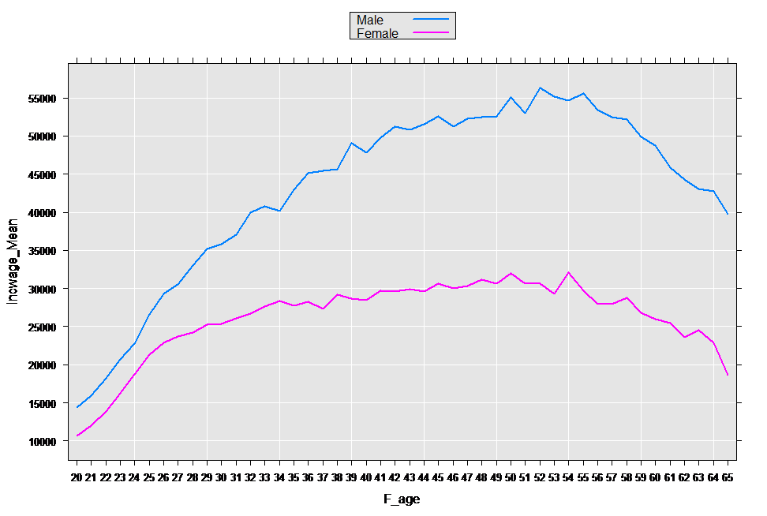
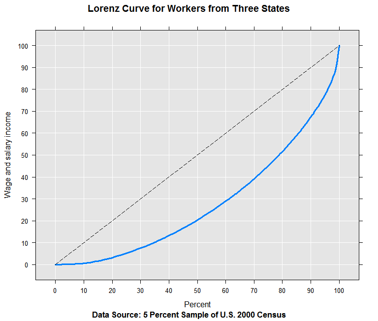

---

# required metadata
title: "RevoScaleR User's Guide--Data Summaries"
description: "Summarizing data in RevoScaleR."
keywords: ""
author: "richcalaway"
manager: "mblythe"
ms.date: "03/17/2016"
ms.topic: "get-started-article"
ms.prod: "rserver"
ms.service: ""
ms.assetid: ""

# optional metadata
ROBOTS: ""
audience: ""
ms.devlang: ""
ms.reviewer: ""
ms.suite: ""
ms.tgt_pltfrm: ""
ms.technology: ""
ms.custom: ""

---

# Data Summaries

In previous chapters, we’ve used the rxGetVarInfo and rxSummary functions to view summary information about data files and the data itself. In this chapter we explore the use of these functions in more detail, and also take a look at the rxLorenz function as a way of visually summarizing cumulative distributions of variables.

### Using Variable Information

The rxGetVarInfo function returns a list containing information about each variable in a .xdf file. For numeric data, this information includes Low/High values. These Low/High values do not necessarily indicate the minimum and maximum of a numeric or integer variable. Rather, they indicate the values RevoScaleR uses to establish the lowest and highest factor levels when treating the variable as a factor. For practical purposes, this is what you will want—for example, if you want to create histograms or hexbin plots, you want to treat the numerical data as categorical, with levels corresponding to the plotting bins. It is often convenient to cut off the highest and lowest data points, and the Low/High information allows you to do this.

For example, consider again the census data we manipulated in Chapter 3.

	######################################################## 
	# Chapter 6: Data Summaries
	#  Using Variable Information
	Ch6Start <- Sys.time()
	
	  
	readPath <- rxGetOption("sampleDataDir")
	censusWorkers <- file.path(readPath, "CensusWorkers.xdf")
	censusWorkerInfo <- rxGetVarInfo(censusWorkers)
	names(censusWorkerInfo)

This returns the following:

	  [1] "age" "incwage" "perwt" "sex" "wkswork1" "state"

We then drill down to examine the age component:

	names(censusWorkerInfo$age)

	  [1] "description" "varType" "storage" "low" "high"

We obtain the High value as follows:

	censusWorkerInfo$age$high

	  [1] 65

Similarly, the Low value is obtained as follows:

	censusWorkerInfo$age$low

	  [1] 20

If we are interested in workers between the ages of 30 and 50, we could create a copy of the data file in the working directory, set the High/Low fields as follows and then treat age as a factor in our subsequent analysis:

	outputDir <- rxGetOption("outDataPath")
	tempCensusWorkers <- file.path(outputDir, "tempCensusWorkers.xdf")
	file.copy(from = censusWorkers, to = tempCensusWorkers)
	censusWorkerInfo$age$low <- 35
	censusWorkerInfo$age$high <- 50
	rxSetVarInfo(censusWorkerInfo, tempCensusWorkers)
	rxSummary(~F(age), data = tempCensusWorkers)

The resulting output is restricted to the 35 to 50 age range:

	Call:
	rxSummary(formula = ~F(age), data = tempCensusWorkers)
	
	Summary Statistics Results for: ~F(age)
	File name:
	    C:\YourOutDir\tempCensusWorkers.xdf
	Number of valid observations: 351121 
	 
	
	Category Counts for F_age
	Number of categories: 16
	Number of valid observations: 158309
	Number of missing observations: 192812
	
	 F_age Counts
	 35     9743 
	 36     9888 
	 37     9860 
	 38    10211 
	 39    10378 
	 40    10756 
	 41    10503 
	 42    10511 
	 43    10296 
	 44    10122 
	 45    10074 
	 46     9703 
	 47     9527 
	 48     9093 
	 49     8776 
	 50     8868
	
To reset the low and high values, we use the same process with the original values:

	censusWorkerInfo$age$low <- 20
	censusWorkerInfo$age$high <- 65
	rxSetVarInfo(censusWorkerInfo, "tempCensusWorkers.xdf")

## Formulas for rxSummary

The *rxSummary* function provides descriptive statistics using a *formula* argument similar to that used in R’s modeling functions. With one exception, the formula given to *rxSummary* may not contain a response variable, so that *rxSummary* is generally given a formula of the form “~ predictors.” For example, returning to the CensusWorkers data file we used in Chapter 4, we can obtain a data summary of that file as follows:
of that file as follows:

	# Formulas in rxSummary
	  
	readPath <- rxGetOption("sampleDataDir")
	censusWorkers <- file.path(readPath, "CensusWorkers.xdf")
	rxSummary(~ age + incwage + perwt + sex + wkswork1, data = censusWorkers)

This gives the following output:

	Call:
	rxSummary(formula = ~age + incwage + perwt + sex + wkswork1, 
	    data = censusWorkers)
	
	Summary Statistics Results for: ~age + incwage + perwt + sex + wkswork1
	File name:
	    C:\Program Files\Microsoft\MRO-for-RRE\8.0\R-3.2.2\library\RevoScaleR\SampleData\CensusWorkers.xdf
	Number of valid observations: 351121 
	 
	 Name     Mean        StdDev       Min Max    ValidObs MissingObs
	 age         40.42814    11.385017 20      65 351121   0         
	 incwage  35333.83894 40444.544084  0  354000 351121   0         
	 perwt       20.34423     9.633100  2     168 351121   0         
	 wkswork1    48.62566     6.953843 21      52 351121   0         
	
	Category Counts for sex
	Number of valid observations: 351121
	Number of missing observations: 0
	
	 sex    Counts
	 Male   189344
	 Female 161777

For each term in the formula, the mean, standard deviation, minimum, maximum, and number of valid observations is shown. If *byTerm=FALSE*, observations (rows) containing missing values for any of the specified variables are omitted in calculating the summary. Cell counts for categorical variables are included.

## Computation of Summary Statistics by Group Using Interactions

If you specify an interaction between a numeric variable and a factor variable, you obtain a summary of the numeric variable for each level of the factor. For example, using the sample data set AirlineDemoSmall.xdf, we can use the following command to ask for a summary of arrival delay by day of week:

	rxSummary(~ ArrDelay:DayOfWeek, data = file.path(readPath, 
	    "AirlineDemoSmall.xdf")) 

The request produces the following output:
	
	Call:
	rxSummary(formula = ~ArrDelay:DayOfWeek, data = file.path(readPath, 
	    "AirlineDemoSmall.xdf"))
	
	Summary Statistics Results for: ~ArrDelay:DayOfWeek
	File name: C:\Program Files\Microsoft\MRO-for-RRE\8.0\R-3.2.2\library\ RevoScaleR\SampleData\AirlineDemoSmall.xdf
	Number of valid observations: 6e+05 
	 
	 Name               Mean     StdDev   Min Max  ValidObs MissingObs
	 ArrDelay:DayOfWeek 11.31794 40.68854 -86 1490 582628   17372     
	
	Statistics by category (7 categories):
	
	 Category                      DayOfWeek   Means    StdDev   Min Max  ValidObs
	 ArrDelay for DayOfWeek=Monday    Monday    12.025604 40.02463 -76 1017 95298   
	 ArrDelay for DayOfWeek=Tuesday   Tuesday   11.293808 43.66269 -70 1143 74011   
	 ArrDelay for DayOfWeek=Wednesday Wednesday 10.156539 39.58803 -81 1166 76786   
	 ArrDelay for DayOfWeek=Thursday  Thursday   8.658007 36.74724 -58 1053 79145   
	 ArrDelay for DayOfWeek=Friday    Friday    14.804335 41.79260 -78 1490 80142   
	 ArrDelay for DayOfWeek=Saturday  Saturday  11.875326 45.24540 -73 1370 83851   
	 ArrDelay for DayOfWeek=Sunday    Sunday    10.331806 37.33348 -86 1202 93395 

Interactions provide the one exception to the “responseless” formula mentioned above. If you want to obtain the interaction of a continuous variable with one or more factors, you can use a formula of the form y ~ x:z, where y is the continuous variable and x and z are factors. This has precisely the same effect as specifying the formula as ~y:x:z, but is more suggestive of the result—that is, summary statistics for y at every combination of levels of x and z.

## On-the-Fly Factors in Formulas

You can force RevoScaleR to treat a variable as a factor (with a level for each integer value from the low to high value) by wrapping it with the function call syntax *F()*. Returning to the CensusWorkers.xdf file, in the following example a factor level will temporarily be created for each age from 20 through 65:

	rxSummary(~ incwage:F(age), data = censusWorkers)

The results provide us not only summary statistics for wage income in the overall data set, but summary statistics on wage income for each age:

	Call:
	rxSummary(formula = ~incwage:F(age), data = censusWorkers)
	
	Summary Statistics Results for: ~incwage:F(age)
	File name:
	    C:\Program Files\Microsoft\MRO-for-RRE\8.0\R-3.2.2\library\RevoScaleR\SampleData\CensusWorkers.xdf
	Number of valid observations: 351121 
	 
	 Name           Mean     StdDev   Min Max    ValidObs MissingObs
	 incwage:F(age) 35333.84 40444.54 0   354000 351121   0         
	
	Statistics by category (46 categories):
	
	 Category              F_age Means    StdDev   Min Max    ValidObs
	 incwage for F(age)=20 20    12669.94 12396.99 0   336000  6500   
	 incwage for F(age)=21 21    14114.23 12107.81 0   336000  6479   
	 incwage for F(age)=22 22    15982.00 12374.14 0   336000  6676   
	 incwage for F(age)=23 23    18503.92 15093.53 0   336000  6884   
	 incwage for F(age)=24 24    20672.06 14315.67 0   354000  6931   
	 incwage for F(age)=25 25    23856.25 17319.42 0   336000  7273   
	 incwage for F(age)=26 26    25938.17 20707.39 0   354000  7116   
	 incwage for F(age)=27 27    26902.97 20608.09 0   354000  7584   
	 incwage for F(age)=28 28    28531.59 24185.48 0   354000  8184   
	 incwage for F(age)=29 29    30153.10 25715.94 0   354000  8889   
	 incwage for F(age)=30 30    30691.10 26955.27 0   354000  9055   
	 incwage for F(age)=31 31    31647.06 27331.38 0   354000  8670   
	 incwage for F(age)=32 32    33459.31 33405.36 0   354000  8459   
	 incwage for F(age)=33 33    34208.33 33497.33 0   354000  8574   
	 incwage for F(age)=34 34    34364.06 33874.67 0   354000  9058   
	 incwage for F(age)=35 35    35739.92 36549.20 0   354000  9743   
	 incwage for F(age)=36 36    36945.24 40035.96 0   354000  9888   
	 incwage for F(age)=37 37    36970.63 39981.26 0   354000  9860   
	 incwage for F(age)=38 38    37331.39 39574.54 0   354000 10211   
	 incwage for F(age)=39 39    38899.67 44190.88 0   354000 10378   
	 incwage for F(age)=40 40    38279.34 42388.61 0   354000 10756   
	 incwage for F(age)=41 41    39678.52 45528.92 0   354000 10503   
	 incwage for F(age)=42 42    40748.10 46685.33 0   354000 10511   
	 incwage for F(age)=43 43    39910.90 45446.32 0   354000 10296   
	 incwage for F(age)=44 44    40524.19 46282.94 0   354000 10122   
	 incwage for F(age)=45 45    41450.27 47370.00 0   354000 10074   
	 incwage for F(age)=46 46    40521.07 44746.48 0   354000  9703   
	 incwage for F(age)=47 47    41371.40 45954.91 0   354000  9527   
	 incwage for F(age)=48 48    42061.04 47094.85 0   354000  9093   
	 incwage for F(age)=49 49    41618.36 45835.39 0   354000  8776   
	 incwage for F(age)=50 50    42789.36 48414.56 0   354000  8868   
	 incwage for F(age)=51 51    41912.11 46185.42 0   354000  8506   
	 incwage for F(age)=52 52    43169.23 49483.34 0   354000  8690   
	 incwage for F(age)=53 53    41864.13 46522.74 0   354000  8362   
	 incwage for F(age)=54 54    42920.45 50279.99 0   354000  6275   
	 incwage for F(age)=55 55    42939.81 50010.80 0   354000  6171   
	 incwage for F(age)=56 56    41157.10 48345.51 0   354000  5915   
	 incwage for F(age)=57 57    40984.69 48426.82 0   354000  5881   
	 incwage for F(age)=58 58    40553.04 50305.92 0   354000  5047   
	 incwage for F(age)=59 59    38738.45 46745.03 0   354000  4512   
	 incwage for F(age)=60 60    37200.02 46858.16 0   354000  3775   
	 incwage for F(age)=61 61    35978.18 44335.98 0   354000  3704   
	 incwage for F(age)=62 62    35000.53 46405.31 0   354000  3206   
	 incwage for F(age)=63 63    34098.00 45353.94 0   354000  2563   
	 incwage for F(age)=64 64    32964.57 46318.27 0   354000  2248   
	 incwage for F(age)=65 65    31698.98 51777.97 0   354000  1625

If you include an interaction between two factors, the summary provides cell counts for all combinations of levels of the factors. Since the census data has probability weights, we can use the *pweights* argument to get weighted counts:

	rxSummary(~ sex:state, pweights = "perwt", data = censusWorkers)
	Call:
	rxSummary(formula = ~sex:state, data = censusWorkers, pweights = "perwt")
	
	Summary Statistics Results for: ~sex:state
	File name:
	    C:\Program Files\Microsoft\MRO-for-RRE\8.0\R-3.2.2\library\RevoScaleR\SampleData\CensusWorkers.xdf
	Probability weights: perwt
	Number of valid observations: 351121 
	 
	
	Category Counts for sex
	Number of categories: 6
	
	 sex    state       Counts 
	 Male   Connecticut  843736
	 Female Connecticut  755843
	 Male   Indiana     1517966
	 Female Indiana     1289412
	 Male   Washington  1504840
	 Female Washington  1231489

It is also possible to perform on-the-fly row selections. In the example below, we restrict the analysis to people ages 30 to 39. We can use the *low* and *high* arguments of the *F* function to restrict the creation of on-the-fly factor levels to the same range (the fourth argument to *F*, *exclude*, defaults to TRUE; this is reflected in the T that appears in the output variable name):

	rxSummary(~ sex:F(age, low = 30, high = 39), data = censusWorkers,
	      pweights="perwt", rowSelection = age >= 30 & age < 40)
	Call:
	rxSummary(formula = ~sex:F(age, low = 30, high = 39), data = censusWorkers, 
	    pweights = "perwt", rowSelection = age >= 30 & age < 40)
	
	Summary Statistics Results for: ~sex:F(age, low = 30, high = 39)
	File name:
	    C:\Program Files\Microsoft\MRO-for-RRE\8.0\R-3.2.2\library\RevoScaleR\SampleData\CensusWorkers.xdf
	Probability weights: perwt
	Number of valid observations: 93896 
	 
	
	Category Counts for sex
	Number of categories: 20
	
	 sex    F_age_30_39_T Counts
	 Male   30            103242
	 Female 30             84209
	 Male   31            100234
	 Female 31             77947
	 Male   32             96325
	 Female 32             75469
	 Male   33             97734
	 Female 33             77133
	 Male   34            103380
	 Female 34             81812
	 Male   35            110358
	 Female 35             89681
	 Male   36            113444
	 Female 36             91394
	 Male   37            110828
	 Female 37             91563
	 Male   38            113838
	 Female 38             95988
	 Male   39            115552
	 Female 39             97209

## Writing By-Group Summary Statistics to an .xdf File

By-group statistics are often computed for further analysis or plotting. It can be convenient to store these results in an .xdf file, especially if there are a large number of groups. For example, let’s compute the mean and standard deviation of wage income and number of weeks work for each year of age for both men and women using the CensusWorkers.xdf file with data from three states:

	# Writing By-Group Summary Statistics to an .xdf File
	  
	readPath <- rxGetOption("sampleDataDir")
	censusWorkers <- file.path(readPath, "CensusWorkers.xdf")
	rxSummary(~ incwage:F(age):sex + wkswork1:F(age):sex, data = censusWorkers,
		byGroupOutFile = "ByAge.xdf", 
		summaryStats = c("Mean", "StdDev", "SumOfWeights"), 
		pweights = "perwt", overwrite = TRUE)
	
	Call:
	rxSummary(formula = ~incwage:F(age):sex + wkswork1:F(age):sex, 
	    data = censusWorkers, byGroupOutFile = "ByAge.xdf", summaryStats = c("Mean", 
	        "StdDev", "SumOfWeights"), pweights = "perwt", overwrite = TRUE)
	
	Summary Statistics Results for: ~incwage:F(age):sex +
	    wkswork1:F(age):sex
	File name:
	    C:\Program Files\Microsoft\MRO-for-RRE\8.0\R-3.2.2\library\RevoScaleR\SampleData\CensusWorkers.xdf
	Probability weights: perwt
	Number of valid observations: 351121 
	 
	 Name               Mean       StdDev      SumOfWeights
	 incwage:F_age:sex  35788.4675 40605.12565 7143286     
	 wkswork1:F_age:sex    48.6373     6.94423 7143286     
	
	By-group statistics for incwage:F(age):sex contained in C:\YourDir\ByAge.xdf 
	By-group statistics for wkswork1:F(age):sex contained in C:\YourDir\ByAge.xdf

We can take a quick look at the first five rows in the data set to see that the first variables are the two factor variables determining the groups: F\_age and sex. The remaining variables are the computed by-group statistics.

rxGetInfo("ByAge.xdf", numRows = 5)

	File name: C:\YourDir\ByAge.xdf 
	Number of observations: 92 
	Number of variables: 8 
	Number of blocks: 1 
	Compression type: zlib
	Data (5 rows starting with row 1):
	  F_age  sex incwage_Mean incwage_StdDev incwage_SumOfWeights wkswork1_Mean
	1    20 Male     14437.68       14118.49                71089      44.29758
	2    21 Male     15981.48       13191.73                71150      45.27770
	3    22 Male     18258.04       13919.44                75979      46.07166
	4    23 Male     20739.91       16511.88                79663      46.75025
	5    24 Male     22737.17       15345.41                81412      47.51487
	  wkswork1_StdDev wkswork1_SumOfWeights
	1        9.755092                 71089
	2        9.110743                 71150
	3        8.903617                 75979
	4        8.451298                 79663
	5        7.942226                 81412

We can plot directly from the .xdf file to visualize our results:

	rxLinePlot(incwage_Mean~F_age, groups = sex, data = "ByAge.xdf")

### Transforming Data in rxSummary

You can use the *transforms* argument to modify your data set on the fly before computing a summary. When used in this way, the original data is unmodified and no permanent copy of the modified data is written to disk. The data summaries returned, however, reflect the modified data.

You can also transform data in the formula itself, by specifying simple functions of the original variables. For example, you can get a summary based on the natural logarithm of a variable as follows :
	
	#Transforming data in rxSummary
	
	rxSummary(~ log(incwage), data = censusWorkers)

This gives the following output:

	Call:
	rxSummary(formula = ~log(incwage), data = censusWorkers)
	
	Summary Statistics Results for: ~log(incwage)
	File name:
	    C:\Program Files\Microsoft\MRO-for-RRE\8.0\R-3.2.2\library\RevoScaleR\SampleData\CensusWorkers.xdf
	Number of valid observations: 351121 
	 
	 Name         Mean     StdDev    Min      Max      ValidObs MissingObs
	 log(incwage) 10.19694 0.8387598 1.386294 12.77705 331625   19496

### Using rxGetVarInfo and rxSummary with Wide Data

The functions *rxGetVarInfo* and *rxSummary* provide useful information for summarizing your data set, but these two functions may need to be used differently when the data contain many variables. You will find that building a better understanding of the distribution of each variable and the relationships between variables will allow you to make better decisions during the modeling phase. This is especially important for wide data that may contain hundreds if not thousands of variables. The main goal for your data exploration should be to find any outliers or influential data points, identify redundant variables or correlated variables and transform or combine any variables that seem appropriate.

Once you have your data imported to .xdf, the data type information can easily be accessed using the *rxGetVarInfo* function. However, since wide data has so many variables, printed output can be hard to read. As an alternative, try saving your variable information to an object that can serve as in informal data dictionary. We demonstrate this using the claims data from Chapter 2:

	# Using rxGetVarInfo and rxSummary with Wide Data
	  
	claimsWithColInfo <- "claimsWithColInfo.xdf"
	claimsDataDictionary <- rxGetVarInfo(claimsWithColInfo)

We can then obtain the information for an individual variable as follows:

	claimsDataDictionary$age

	 [1] 8 factor levels: 17-20 21-24 25-29 30-34 35-39 40-49 50-59 60+

The rxSummary function is a great way to look at the distribution of individual variables and identify outliers. With wide data you will want to store the results of this function into an object. This object will then contain a data frame with the results of the numeric variables, “sDataFrame”, and a list of data frames with the counts for each categorical variable,”categorical”:

	readPath <- rxGetOption("sampleDataDir") 
	censusWorkers <- file.path(readPath, "CensusWorkers.xdf") 
	censusSummary <- rxSummary(~ age + incwage + perwt + sex + wkswork1, 
	    data = censusWorkers)
	names(censusSummary)

	[1] "nobs.valid"       "nobs.missing"     "sDataFrame"       "categorical"     
	[5] "params"           "formula"          "call"             "categorical.type"

Printing the rxSummary results to the console wouldn’t be very useful with so many variables. Saving the results in an object allows us to not only access the summary results programmatically, but also to view the results separately for numeric and categorical variables. We access the sDataFrame (printed to show structure) as follows:
	
	censusSummary$sDataFrame
	      Name        Mean       StdDev Min    Max ValidObs MissingObs
	1      age    40.42814    11.385017  20     65   351121          0
	2  incwage 35333.83894 40444.544084   0 354000   351121          0
	3    perwt    20.34423     9.633100   2    168   351121          0
	4      sex          NA           NA  NA     NA   351121          0
	5 wkswork1    48.62566     6.953843  21     52   351121          0

To view the categorical variables, we access the categorical component:

	censusSummary$categorical
	[[1]]
	     sex Counts
	1   Male 189344
	2 Female 161777

Another key piece of data exploration for wide data is looking at the relationships between variables to find variables that are measuring the same information or variables that are correlated. With variables that are measuring the same information perhaps one stands out as being representative of the group. During data exploration, you will want to use your domain knowledge to group variables into related sets or prioritize variables that are important based on the field or industry. Paring the data set down to related sets will allow you to look more closely at redundancy and relatedness within each set. When looking for correlation between variables the function *rxCrosstabs* is extremely useful. In Chapter 7 you will see how to use rxCrosstabs and rxLinePlot to graph the relationship between two variables. Graphs allow for a really quick view of the relationship between two variables, which may come in handy when you have many variables to consider.

## Computing and Plotting Lorenz Curves

The Lorenz curves was originally developed to illustrate income inequality. For example, it can show us what percentage of total income is attributed to the lowest earning 10% of the population. The rxLorenz function provides a ‘big data’ version, using approximate quantiles to quickly compute the cumulative distribution by quantile in a single pass through the data.

The rxLorenz function requires an *orderVarName*, the name of the variable used to compute the quantiles. A separate *valueVarName* can also be specified. This is the name of the variable used to compute the mean values by quantile. By default, the same variable is used for both. We can continue to use the Census Workers data set as an example, computing a Lorenz curve for the distribution of income:

	lorenzOut <- rxLorenz(orderVarName = "incwage", data = censusWorkers,
		pweights = "perwt")
	head(lorenzOut)

	    cumVals  percents
	1 0.0000000  0.000000
	2 0.3642878  9.126934
	3 0.4005827  9.363072
	4 0.5368416 10.181295
	5 0.5666976 10.353428
	6 0.6241598 10.667766

The returned object contains the cumulative values and the percentages. Using the plot method for rxLorenz, we can get a visual representation of the income distribution and compare it with the horizontal line representing perfect equality:

	plot(lorenzOut)

The Gini coefficient is often used as a summary statistic for Lorenz curves. It is computed by estimating the ratio of the area between the line of equality and the Lorenz curve to the total area under the line of equality (using trapezoidal integration). The Gini coefficient can range from 0 to 1, with 0 representing perfect equality. We can compute it from using the output from rxLorenz:

	giniCoef <- rxGini(lorenzOut)
	giniCoef

	  [1] 0.4491421