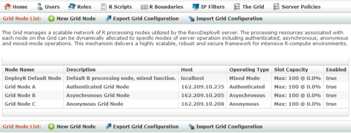
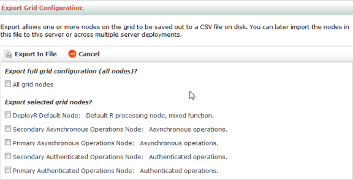

---

# required metadata
title: "DeployR Administration Console Help"
description: "Managing Grid Nodes in the DeployR Administration Console"
keywords: ""
author: "jmartens"
manager: "Paulette.McKay"
ms.date: "03/17/2016"
ms.topic: "article"
ms.prod: "deployr"
ms.service: ""
ms.assetid: ""

# optional metadata
ROBOTS: ""
audience: ""
ms.devlang: ""
ms.reviewer: ""
ms.suite: ""
ms.tgt_pltfrm: ""
ms.technology: ""
ms.custom: ""

---

# Managing the Grid

>Only the **DeployR Enterprise** supports an extensible grid framework, providing load balancing capabilities across a network of node resources. The **DeployR Open** supports a static grid framework of a single, local grid node with a fixed slot limit, **DeployR Default Node**. While most of the grid instructions apply only to DeployR Enterprise, most [node properties](#node-properties) apply to both editions and should still be [reviewed](#viewing-and-editing-nodes) and fine-tuned. For enterprise grade deployments, upgrade to DeployR Enterprise today.

Each node on the grid contributes its own processor, memory, and disk resources. These resources can be leveraged by the DeployR server to run R code as part of user authenticated, asynchronous, and anonymous operations.

With the **DeployR Enterprise**, you can dynamically scale the overall workload capacity by enabling and disabling the number of available grid nodes, and by designating these nodes to specific modes of operation. The grid can then automatically [distribute the workload](#grid-workload-distribution) across the set of enabled nodes. Or, you can [create custom node clusters](#named-clusters-workload-distribution) tuned for specific operation types and resource requirements.

When configuring the grid, you should begin by gaining an understanding of the anticipated workload for the grid. With that workload in mind, you can then scale the grid to handle the load. **DeployR Open** administrators can add additional resources to the single default grid node. **DeployR Enterprise** administrators can add additional resources to existing grid nodes or add additional grid nodes.

A well-configured grid maximizes throughput while minimizing resource contention. The server and grid deployment model is described as `Server[1] -> Node[1..N]` where `N` is defined as the total number of nodes on the grid. For more on planning and provisioning, see the *Scale & Throughput* documentation on the product website.

_Figure: Node List page_

  

## Node Operation Types

You must designate an operation type for each node on the grid. The following table describes the distinct types of operations recognized by the grid. 

|Operation Type|Supported Operations|
|---|---|
|`Authenticated`|Operations on projects requested by authenticated users|
|`Asynchronous`|Operations from asynchronous jobs executing in the background on behalf of authenticated users|
|`Anonymous`|Operations from users executing scripts anonymously Tip: By limiting anonymous operations to one or more specific nodes, you can maintain complete control of the resources allocated to unauthenticated users, which in turn helps protect the system from malicious attacks.|
|`Mixed mode`|Any operation. This mode is only used when the workload on the grid overflows or exhausts all of the nodes dedicated to the operation type requested.|

While a `mixed` mode exists, dedicating a node to a specific operation type provides a simple yet powerful mechanism that guarantees processing isolation between the distinct modes of operation being handled concurrently on the grid.

>**DeployR Open** includes only the local node, **DeployR Default Node**. Therefore, this node should generally remain designated to the `mixed mode`.

Once a node is dedicated to a specific operating type, the administrator can further tailor its configuration by provisioning processor, memory, and disk resources appropriate to the nature of the targeted operations.

Each operation type has a distinct set of [server policies](deployr-admin-managing-server-policies.md) that impact the time-out policy, IP filters, encryption, and so on.

## Grid Workload Distribution

>**DeployR Enterprise** supports an extensible grid framework, providing load balancing capabilities across a network of node resources. Since the **DeployR Open** supports a static grid framework of a single, local grid node with a fixed slot limit, the information in this topic does not apply.

There are two workload distribution models supported by the DeployR grid:

1.  [Operation-cluster model](#operation-clusters-workload-distribution)
2.  [Named-cluster model](#named-clusters-workload-distribution)

Each node on the grid is assigned an [operation type](#node-operation-types): authenticated, asynchronous, anonymous, or mixed mode. The operation type for a node indicates the types of operations that the node will accept at runtime. For example, a grid node configured for authenticated operations will only accept authenticated (project) operations at runtime and never accept asynchronous or anonymous operations. A grid node configured for 'mixed mode' accepts all types of operations.

The operation type assigned to a node and the cluster named for the request (if one was named) are the biggest determinants in how the workload is distributed. In the absence of a specified custom cluster name, the workload is automatically spread across nodes of the same operation type using the [operation-cluster model](#operation-clusters-workload-distribution). However, you can further optimize that distribution by allowing a custom cluster to be named for an operation, which then follows the [named-cluster](#named-clusters-workload-distribution) workload distribution model.

### Operation-Clusters Workload Distribution

The set of nodes dedicated to the same operation type are automatically members of the same operation-cluster. In this way, the operation-cluster workload distribution model provides a simple and automatic way to partition the workload on the grid. There are four operation-clusters, one for each type of operation (authenticated, asynchronous, or anonymous) and one for mixed mode nodes.
The specific manner in which an operation is allocated onto a node using the operation-cluster workload distribution model is a function of:

- The type of operation being requested (authenticated, asynchronous, or anonymous)
- The number of nodes on the grid that match the operation-cluster identity
- The current workload for those nodes

If a request does not name a custom cluster, the grid begins by determining the operation type for that request, then identifying all nodes configured for that type of operation, and finally sending the request to the node with the least burden to minimize resource contention and to maximize throughput.

When all of the nodes of a custom cluster are busy, any additional requests for that cluster will be rejected. Whenever an operation-cluster on the grid or the entire grid is operating a maximum capacity, any additional requests for authenticated or anonymous operations will be rejected and any additional requests for asynchronous operations will be queued.

For example, if the grid determines that a request is made for an asynchronous job, the grid will look for all nodes with the asynchronous type, and then send the request to the least busy node in that operation-cluster. However, if all nodes within the asynchronous operation-cluster are busy, then the request is funneled to the least burdened node of mixed mode type.

### Named-Clusters Workload Distribution

While the default [operation-cluster model](#operation-clusters-workload-distribution) works well in many cases, there are some limitations to that model when operations within a single operation-cluster do not share the exact same runtime characteristics. To address this situation, the named-cluster workload distribution model was introduced in DeployR 7.4 to allow administrators to assign [custom cluster names](#node-properties) to nodes.

As an example, it is not uncommon that authenticated operations that would otherwise execute on the same authenticated operation-cluster differ in need from one another. Some authenticated operations may require nodes that deliver fast processing power, while other authenticated operations may require nodes that deliver large amounts of memory. Named-cluster workload distribution solves this problem by allowing the administrator to designate a custom cluster name for an individual or groups of nodes on the grid that are intended for special purpose operations, such as "high-cpu" or "high-mem". Once a custom cluster has been designate to at least one node in the grid, individual operations can be targeted for execution within that named custom cluster, which ensures suitable runtime resources are available on the node where an operation eventually executes.

The specific manner in which an operation is allocated onto a node using this model is a function of:

- The custom cluster's identity specified as an API parameter for the operation being requested
- The number of nodes on the grid that match the name of the custom cluster
- The current workload for those nodes

Whenever a custom cluster has been named for the requested operation, the grid begins by identifying the nodes that fall within that cluster, then sends the request to the node within that cluster that has the least burden to minimize resource contention and to maximize throughput.

When all of the nodes of a custom cluster are busy, any additional requests for that cluster are funneled to a node configured for the mixed mode operation type, if one is available. Whenever a custom cluster on the grid or the entire grid is operating a maximum capacity, any additional requests for authenticated or anonymous operations will be rejected and any additional requests for asynchronous operations will be queued.

For example, if the grid determines that a request is made for an operation to use the "high-mem"cluster, the grid will look for all nodes within the "high-mem" cluster and then send the request to the least busy node within that cluster. However, if all nodes within the "high-mem" cluster are busy, then the request is funneled to the least burdened node of mixed mode type.

Any node can belong to a custom cluster if the administrator has assigned the node to a that cluster by entering its custom name in the **Cluster name**  [field](#node-properties). Custom cluster names are not case-sensitive.

## Node Validation and Errors

The Administration Console performs a verification of node configurations whenever you:

- Display the **Grid** tab
- Create or update a grid node configuration
- Import a grid node configuration (DeployR Enterprise only)

When you visit the **Grid** tab, any enabled nodes found to be unresponsive are highlighted to help you visually identify that these nodes are not operating properly.

When you attempt to create, update or import a node, the verification process is run. If an issue is detected, the following message appears: *“Grid node details provided failed to validate, please check your node configuration and try again.”* 

Common validation issues include:

- The configuration points to a grid node that is improperly installed or not yet installed.
- The configuration points to a grid node that is currently unresponsive for any number of reasons including the RServe process not running on that node.
- The node is behind a firewall or temporarily unreachable.
- The node’s configuration details are incomplete such as an empty name field when the name is required.

##Node Properties

 
**Basic Settings**

|Properties|Description|
|---|---|
|`Enabled`|If checked, the node is available for processing operations on the grid. (DeployR Enterprise only)|
|`Name`|This name is displayed in the node list in the Administration Console.|
|`Description`|This optional node description is visible only in the node list.|
|`Host`|This is the hostname or IP on which the node is configured. *Note:* For DeployR Open, the default node cannot be changed from localhost. Upgrade to DeployR Enterprise to configure remote grid nodes.|
|`Operating type`|This is the type of node operation mode: authenticated, anonymous, asynchronous, or mixed.|
|`Cluster name`|This field is optional. Specifies the name of the custom node cluster to which this node will be (or is already) assigned. Custom cluster names are not case-sensitive. Learn more about the [named-cluster workload distribution model](#grid-workload-distribution).|

 
**Runtime Constraints**

These constraints govern limits for processor and memory usage at runtime.

|Properties|Description|
|---|---|
|`Slot limit`|This property determines the maximum number of concurrent operations permitted on a given node. To illustrate a case for adjusting the slot limit, consider a node dedicated to memory intensive operations.  You may want to lower the slot limit to minimize the risk that concurrently executing operations on the node might exhaust the memory. *Note*: For DeployR Open, a fixed slot limit of 12 is imposed. Upgrade to DeployR Enterprise to unlock slot limits.|
|`R boundary`|This property specifies an R boundary that was created in this console. This R boundary is used to impose CPU usage limits for a given node.  The R boundary applies to each slot individually.|

 
**RServe Runtime and Security Configuration**

After a default installation of DeployR, it is highly unlikely that these settings require any editing under most operating conditions. However, if DeployR is in conflict with another application on the server machine or if you have made edits to the file `Rserv.conf`, you must mirror your changes here as well.

|Properties|Description|
|---|---|
|`Port`|This property lists the port defined during installation on which RServe is listening.|
|`Console output size limit`|This is the upper limit, expressed in bytes, imposed on the communication between DeployR server and the Rserve session.|
|`Username`|If a username was defined in Rserv.conf, enter it here.|
|`Password`|If a password was defined in Rserv.conf, enter it here.|

 
**External Directory Configuration (DeployR Enterprise Only)**

If the external data directories are properly configured across all grid nodes and an R script updates the data in the external directory, then those updates are automatically mirrored across all nodes without any manual or external intervention by the admin.

|Properties|Description|
|---|---|
|`Storage context`|This setting must reflect the full path on that node’s machine to the directory defined for external data usage. (DeployR Enterprise only)|

+ On **Linux**, update this path for each node as follows. If a node was installed by:
	-  The non-root user, deployr-user, then the full path is `/home/deployr-user/deployr/8.0.0/deployr/external/data`
	- `root`, then the full path is `/opt/deployr/8.0.0/deployr/external/data`

+ On **Windows** , update this path for each node to `C:/Revolution/DeployR-Node-8.0/deployr/external/data`

 
**Slots in Use**

You can see which slots are currently in use and how they are being used by a particular node in the **Slots In Use** section. For each slot, you can review the following details:

|Slot Details|Description|
|---|---|
|`Type`|Lists the slot’s operating mode, which is interesting for mixed-mode nodes|
|`Context`|Provides the name of project, job, or script being executed|
|`Started`|Specifies the time that has elapsed since execution commenced|
|`Owner` and `Owner address`|Lists the username of person or IP address who initiated the request|
|`HTTP Session`|Lists the unique id for this HTTP session|
|`Event Stream`|Provides a link to open the event console|

You can force the termination of a current operation on slot, by clicking the **Shutdown** link.

## Creating New Nodes

While many default node settings are preconfigured during the installation process, you still need to declare and configure each node individually in the Administration Console. For more information about installing, see the installation instructions for your server operating system.

>**DeployR Enterprise** supports an extensible grid framework, providing load balancing capabilities across a network of node resources. Since the **DeployR Open** supports a static grid framework of a single, local grid node with a fixed slot limit, the information in this topic does not apply.

**To create a new node (DeployR Enterprise only):**

1.  From the main menu, click **The Grid**.

2.  From the Grid Node List page, click the **New Grid Node** link in the menu bar.
	
	_Figure: New Node page_

	  

3. In the **New Grid Node** page, define the applicable [properties for the node](#node-operation-types), such as the **Name**, **Host**, **Operating Type**, and **Storage Context**.

4. Enter a name in the **Name** field.

5. Enter an IP address in the **Host** field. Hostname or IP on which the node is configured. The DeployR Default Node is configured on localhost.

6. Specify the **Operating Type**. The [operating mode](#node-operation-types) you define for a grid node has an impact on the operations you can perform on that node.

7. Under **External directory** configuration, set the [**Storage Context**](deployr-admin-managing-server-policies.md#server-policy-properties) to reflect the full path to the external data directory on that node’s machine. The default path is:
	-  For Windows: C:\Program Files\Microsoft\DeployR-8.0\deployr/external/data
	-  For Linux (user deployr-user): /home/deployr-user/deployr/8.0.0/deployr/external/data`

8.  Click **Create** to save the new node.  The node configuration is [validated](#node-validation-and-errors). If the configuration works, then it is saved. If not, an [error message](#node-validation-and-errors) will appear.

## Viewing and Editing Nodes

**To view and edit a node:**

1. From the main menu, click **The Grid**.
	- **DeployR Open**: The **Grid Node Details** page for the **Default Grid Node** appears.
	- **DeployR Enterprise**: In the **Grid Node List**, click the node you want to view or edit. The **Grid Node Details** page appears.

2.  Click **Edit**.

3. Make your changes.

4. Click **Update** to save the changes.  The node configuration is validated. If the configuration works, then it is saved. If not, an error message will appear.

## Enabling or Disabling Nodes

You can choose whether or not a configured node will be active in the grid or inactive using the **Enable** checkbox in the **Grid Node Details** page. When disabled, the node is no longer available to process any requests from DeployR and it will appear highlighted in the main grid node list.
 
>**DeployR Enterprise** supports an extensible grid framework, providing load balancing capabilities across a network of node resources. Since the **DeployR Open** supports a static grid framework of a single, local grid node with a fixed slot limit, the information in this topic does not apply.

**To enable or disable a node (DeployR Enterprise Only):**

1. From the main menu, click **The Grid**. The **Grid Node List** page appears.

2. Click the node you want to edit. The **Grid Node Details** page appears.

3. Click **Edit**.

4. Select the **Enable** checkbox to activate the node, or unselect it to disable the node.

5. Click **Update** to save the changes.

## Viewing or Stopping Slot Activity

In the **Grid Node Details** page, you can review the slot activity.

Additionally, you can shut down slots in order to terminate activity.This is a last resort for unwanted activity on the server.

>This list is not updated in real-time. Refresh your page to see the latest activity.

To review the slot activity for a node and shutdown slots:

1. From the main menu, click **The Grid**. The **Grid Node List** page appears.
	- **DeployR Open**: The **Grid Node Details** page for the **Default Grid Node** appears.
	- **DeployR Enterprise**: In the **Grid Node List**, click the node whose slot activity you want to monitor. The **Grid Node Details** page appears.

2. Look at the **Slots in Use** section at the bottom. Click a slot link to see details about a particular slot.

3. To terminate all of the activity on the selected node, click **Shutdown** in the toolbar to terminate all R sessions.

4. To terminate the activity on a specific slot, do the following:
	- In the **Grid Node Details** page, click the slot whose activity you want to see and terminate.
	- In the **Slot Details** page, click **Shutdown** to terminate the activity and release the slot.

## Deleting Nodes

>**DeployR Enterprise** supports an extensible grid framework, providing load balancing capabilities across a network of node resources. Since the **DeployR Open** supports a static grid framework of a single, local grid node with a fixed slot limit, the information in this topic does not apply.

To delete a node (DeployR Enterprise Only):

1. From the main menu, click **The Grid**. The **Grid Node List** page appears.

2. Click the name of the node you want to delete. The **Grid Node Details** page appears.

3. Click **Delete**. The node is removed.

## Exporting Node Configurations

You can export one or more node configurations into one CSV file. Exporting can be used to copy the basic node configurations to another machine or to preserve them as a backup. 
 
>**DeployR Enterprise** supports an extensible grid framework, providing load balancing capabilities across a network of node resources. Since the **DeployR Open** supports a static grid framework of a single, local grid node with a fixed slot limit, the information in this topic does not apply.

_Figure: Export Grid Configuration page_

  

**To export node configurations (DeployR Enterprise Only):**

1. From the main menu, click **The Grid**. The **Grid Node List** page appears.

2. Click **Export Grid Configuration**.

3. Select individual node configurations or all nodes to be exported.

4. Click **Export to File** and save the file.

## Importing Node Configurations

You can import node configurations into the server from a CSV file you previously exported. You can import the contents of this file to same server from which it was exported or across multiple server deployments.
 
>**DeployR Enterprise** supports an extensible grid framework, providing load balancing capabilities across a network of node resources. Since the **DeployR Open** supports a static grid framework of a single, local grid node with a fixed slot limit, the information in this topic does not apply.

Grid node configurations are [validated](#node-validation-and-errors) upon import. If the configuration works, then the node configuration is imported. If not, an [error message](#node-validation-and-errors) will appear.

>You can only import these configurations into a server instance matching the same DeployR version from which they were exported.

**To import (DeployR Enterprise Only):**

1. From the main menu, click **The Grid**. The **Grid Node List** page appears.

2. Click **Import Grid Configurations**.

3. Click **Browse** and select the CSV file to be imported.

4. Click **Load**.

	_Figure: Choose Grid Nodes to Import page_

	  

5. To disable grid nodes upon import so that you can individually enable them at a later time, select the **Disable grid nodes** option. You can always enable/disable grid nodes one at a time later. Enabled nodes are activated immediately in the grid and available for load balancing.

6. Choose the nodes to import.

7. Click **Import**. If a node by the same name already exists, the incoming node configuration is skipped. The node configuration settings are [validated](#node-validation-and-errors). If the configuration works, then it is saved. If not, an error message will appear.
