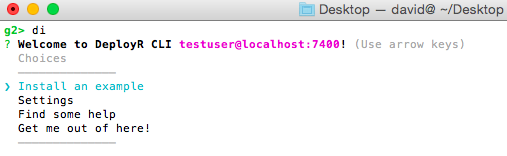
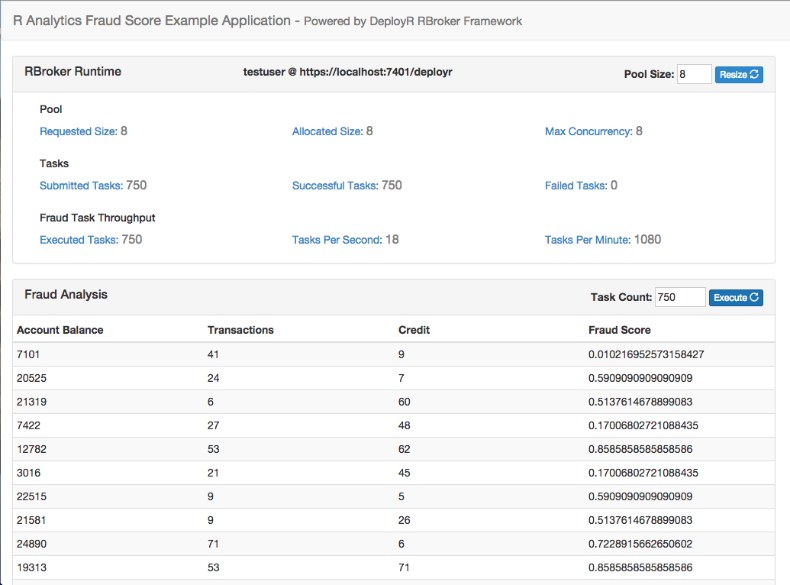

---

# required metadata
title: "Getting Started with DeployR for Application Developers"
description: "Getting started for Application Developers: high level introduction to DeployR for Application Developers"
keywords: "Application Developers, r programmer, DeployR"
author: "j-martens"
manager: "Paulette.McKay"
ms.date: "03/17/2016"
ms.topic: "get-started-article"
ms.prod: "deployr"
ms.service: ""
ms.assetid: ""

# optional metadata
ROBOTS: ""
audience: ""
ms.devlang: ""
ms.reviewer: ""
ms.suite: ""
ms.tgt_pltfrm: ""
ms.technology: ""
ms.custom: ""

---

# Getting Started - Application Developers

## Introduction

This guide for application developers introduces DeployR, the *R Integration Server*. If you are an application developer or a systems integrator, then this guide explains what DeployR can do for you.

DeployR exists to solve a number of fundamental integration problems faced by application developers. For example, have you ever wondered how you might execute an R script from within a Web-based dashboard, an Excel spreadsheet, an enterprise middleware solution, or a mobile application? DeployR makes it simple:

    // Define task for execution based on R script, predict.R.
    RTask rTask = RTaskFactory.discreteTask("predict.R",
                    "demo-dir", "george", version, taskOptions);

    // Submit task for execution on DeployR.
    rBroker.submit(rTask);

In fact, DeployR makes it simple for **any application** developed in **any language** to:

1.  Provision one or more dedicated R sessions on demand
2.  Execute R scripts on those R sessions
3.  Pass inputs (data, files, and so on) when executing those R scripts
4.  Retrieve outputs (data, files, plots, and so on) following the execution of those R scripts

DeployR offers these features and many more through a set of [Analytics Web Services](#analytics-web-services). These Web service interfaces isolate the application developer and the application itself from R code, from the underlying R sessions, and in fact from all the complexities typically associated with R integration.

As an application developer, you typically leave R coding and model building to the [data scientists](deployr-data-scientist-getting-started.md). And now with DeployR, you can also leave all aspects of R session management to the DeployR server. This frees you up to focus on simple integrations with DeployR services that deliver the [phenomenal power of R](http://go.microsoft.com/fwlink/?LinkID=698301/documents/getting-started/) directly within your applications.

The sections that follow explain [Analytics Web Services](#webservices) in greater detail and also introduce the set of [developer tools](#developer-tools) that make it simple to consume these services within your applications. This document also presents a series of [tutorials](#tutorials) with sample source code and introduces a complete [example application](#real-world-example). This example gives a concrete demonstration of building a classic application, an R analytics realtime scoring engine.

>[!NOTE]
>For a general introduction to DeployR, read the [About DeployR](deployr-about.md) document.

## Analytics Web Services

The DeployR R Integration server exposes a rich set of services to application developers through a public Web services API. These services are collectively known as DeployR Analytics Web services.

While the complete technical specification for all available services can be found [here](deployr-api-reference.md), this *Getting Started* guide for application developers focuses on introducing the core services.

### R Session Services

Perhaps not surprisingly, one of the core services provided by DeployR is the ability for any application to create one or more R sessions on demand.

Once an application has created an R session, it can:

-   Pass data into the session
-   Execute R scripts and code on the session
-   Retrieve data, files and plots from the session

For example:

    // Request a dedicated pool of 10 R sessions on DeployR.
    PooledBrokerConfig config = new PooledBrokerConfig(serverEndpoint, rAuth, 10);
    RBroker rBroker = RBrokerFactory.pooledTaskBroker(config);

    // Your appliction now has access to a dedicated pool of 10 R sessions
    // on which your application can immediately start executing R tasks.
    rBroker.submit(task);

DeployR typically refers to R sessions as `projects`. You can read more about projects in the [API Reference Guide](deployr-api-reference.md).

Depending on the specific needs of your application, the R sessions created by your application can be:

-   Stateless, meaning they exist for the duration of a single R script execution request
-   Temporary, meaning they exist for a single user session in your application
-   Persistent, meaning they exist across multiple user sessions in your application

Your application can also request the activation of an R session at a scheduled time in order to execute an R script or block of R code based on some schedule that befits your application.

A key takeaway here is that DeployR is very flexible in the services that it offers, which makes it a compelling R integration solution for just about any application you can imagine.

### Repository Services

Having access to on-demand R sessions within your application is only useful if you have access to the R scripts, models, and data you want to manipulate within those sessions. For this reason, DeployR exposes a comprehensive set of file and directory management services known as DeployR repository services. Read more about these [repository services](https://deployr.revolutionanalytics.com/documents/dev/api-doc/guide/introduction.html#introrepository) in the API Reference Guide.

You can think of the DeployR repository as a file system that is owned and managed by the DeployR server. As an application developer, you can:

-   Store files of any type in the repository
-   Create and manage custom directories for those files in the repository:

For example:

    RRepositoryDirectory dir = rUser.createDirectory("demo");
    List<RRepositoryFile> files = rUser.listFiles(RSCRIPT, dir);

These services are available on the [API](https://deployr.revolutionanalytics.com/documents/dev/api-doc/guide/workingrepository.html) and also through the Web-based [Repository Manager](deployr-repository-manager/deployr-repository-manager-about.md), which ships with DeployR.

It is also simple for your application to request files be moved from the repository to your R sessions and from your R sessions back into the repository. Perhaps most importantly, any R script stored in the repository is automatically exposed as a live, executable Analytics Web service. This means your R scripts can be executed on request by your application just by referencing that script by name.

For example:

    // Define task for execution based on a repository-managed R script, predict.R.
    RTask rTask = RTaskFactory.discreteTask("predict.R",
                                            "demo", "george", version, taskOptions);

    // Submit task for execution on DeployR.
    rBroker.submit(rTask);

### Auth Services

The fact that repository-managed R scripts are automatically exposed as live, executable Web services raises an important question:

*"How can you enforce access controls on this type of Web service?"*

The answer is simple. DeployR supports a broad set of access controls ranging from [user authentication and authorization](https://deployr.revolutionanalytics.com/documents/dev/api-doc/guide/introduction.html#introusers) to a set of [access controls enforced on a file-by-file basis](deployr-repository-manager/deployr-repository-manager-files.md#about-file-properties) in the repository. The access control options available on repository files are:

-   `Private`, allows access only to the file's owner.
-   `Restricted`, allows access only to those users who were granted at least one of the associated roles
-   `Shared`, allows access only to authenticated users
-   `Public`, allows access to any authenticated or anonymous user

These repository access controls can be manipulated directly by the file owner on the [API](https://deployr.revolutionanalytics.com/documents/dev/api-doc/guide/workingrepository.html) or by using the Web-based [Repository Manager](deployr-repository-manager/deployr-repository-manager-about.md) that ships with DeployR.

## Developer Tools

It's time to move from theory into practice. And for an application developer, that means writing code.

The best place to begin is with the [RBroker Framework](deployr-rbroker-framework.md). This framework exposes a simple yet powerful integration model that requires only a little code in order to deliver significant analytics capabilities within your application.

### RBroker Framework

*What is the RBroker Framework?* Let's start with a small code snippet that delivers big results.

    // An instance of RBroker is your application's handle to DeployR services.
    // On application startup, request a dedicated pool of 10 R sessions on DeployR.
    PooledBrokerConfig config = new PooledBrokerConfig(serverEndpoint, rAuth, 10);
    RBroker rBroker = RBrokerFactory.pooledTaskBroker(config);

    // Your application now has access to a dedicated pool of 10 R sessions
    // on which your application can immediately start executing R tasks.

    // Register your application listener for task completion and error events.
    rBroker.addTaskListener(appTaskListener);

    // Start building tasks in your application. Your tasks identify the R scripts
    // and associated data inputs and outputs of interest to your application.
    RTask rTask = RTaskFactory.discreteTask("predict.R",
                    "demo", "george", version, taskOptions);

    // Submit tasks on the broker for execution on DeployR.
    rBroker.submit(task);

The above snippet demonstrates how, in just a few lines of code, your application can create one or more R sessions on which it can immediately start executing R tasks.

The framework handles all of the low-level details, including:

-   R session provisioning
-   Client-side task queuing
-   Server-side task execution
-   Asynchronous callbacks to your application on task completion

If you are a Java, JavaScript or .NET developer, start with the official [RBroker Framework tutorial](deployr-rbroker-framework.md). It introduces everything you need to know to get up and running, including framework download links. If developing in another language, go directly [here](#api-specification).

### Client Library

*What if the [RBroker Framework](#rbroker-framework) doesn't give me everything I need?*

They may be times when you need direct access to some of the lower-level services on DeployR, which are not exposed by the RBroker Framework. In such cases, if you are a Java, JavaScript or .NET developer, then you can work directly with the DeployR client libraries. Learn more in the official [Client Library tutorial](deployr-client-library.md), which introduces everything you need to know to get up and running, including library download links. If developing in another language, go directly [here](#api-specification).

### API Specification

*What if I'm not a Java, JavaScript or .NET developer?*

*What if I simply want to understand more about what's going on 'under the hood'?*

Then, the answer is the [underlying technical specification](https://deployr.revolutionanalytics.com/documents/dev/api-doc/) for DeployR. That specification details every API call, associated call parameters, encodings, error handling, and more on the DeployR API.

As long as your development environment can establish HTTP(S) connections and consumes either JSON or XML, then you can integrate directly with DeployR services using the public [API](https://deployr.revolutionanalytics.com/documents/dev/api-doc/).

## Tutorials

In the [Developer Tools](#developer-tools) section, you began your move from theory into practice through the introduction of the core tools and some initial fragments of sample code. To further bootstrap the learning process, we've written some more code for you. In fact, we've written a lot of code for you in the form of tutorials with which you can see the key concepts put into practice.

To run these tutorials, you will need access to a live instance of the DeployR server. To download and install DeployR, see [here](https://deployr.revolutionanalytics.com/download/).

### RBroker Framework Tutorials

The following tutorials are available:

-   The [RBroker Framework Basics](https://github.com/deployr?utf8=%E2%9C%93&query=rbroker-basics) code tutorial demonstrates the basic programming model and capabilities of the RBroker Framework. Each code example brings to life the ideas introduced by the basic [RBroker Tutorial](deployr-rbroker-framework.md).

-   The [RBroker Framework Data I/O](https://github.com/deployr?utf8=%E2%9C%93&query=rbroker-data-io) code tutorial demonstrates how different types of data inputs and outputs can be sent to and retrieved from DeployR-managed R sessions when you execute tasks using the framework.

### Client Library Tutorials

The following tutorials are available:

-   The [Client Library Basics](https://github.com/deployr?utf8=%E2%9C%93&query=client-basics) code tutorial demonstrates a wide range of basic functionalities available on the DeployR client library. Each code example brings to life the ideas introduced by the basic [Client Library Tutorial](deployr-client-library.md).

-   The [Client Library Data I/O](https://github.com/deployr?utf8=%E2%9C%93&query=client-data-io) code tutorial demonstrates how different types of data inputs and outputs can be sent to and retrieved from DeployR-managed R sessions when you execute R scripts or code using the client library.

### Command Line Interface

While each of the DeployR code tutorials found on github provide their own complete set of instructions for downloading and running the code, we also provide the [DeployR CLI](https://github.com/deployr/deployr-cli) to make running these tutorials even easier. The DeployR CLI is a [Command Line Tool (CLI)](http://en.wikipedia.org/wiki/Command-line_interface) for running useful DeployR utilities, such as the automated installation and execution of any [DeployR code tutorial](#tutorials) found on github.

Install and use the CLI as follows:

1.  Install the CLI using [npm](https://www.npmjs.com/). At your terminal prompt, type:

        npm install -g deployr-cli

    You now have the `di` command in your system path, thereby allowing the CLI to be run from any location.

2.  Start the CLI. At your terminal prompt, type:

        di

    

3.  From the CLI main menu, choose **Install an example** to see the complete list of available examples, including all of the latest DeployR code tutorials found on github.

4.  Select the example to install. That example is automatically downloaded, installed and launched in your terminal window.

## Real World Example

The [Developer Tools](#developer-tools) section introduced the available tool set and some initial fragments of sample code. In the [Tutorials](#tutorials) section, you were introduced to more complete sample code that highlighted some important design patterns when working with DeployR. In this section you will be introduced to a complete sample application that demonstrates one approach to building an end-to-end solution using DeployR.

The sample application is a classic application in the analytics space, a realtime scoring engine powered by DeployR. The example scenario mimics a real world application where employees at a fictitious bank can request fraud scores for one or more bank account records on-demand in order to help detect fraudulent account activity:

Note, as this is a sample application the Web browser UI component has been implemented to display profiling information on the [RBroker's realtime performance](deployr-rbroker-framework.md#client-application-profiling). This functionality is provided as an aid to application developers, but is not something that would typically be included in a true production application.

In keeping with the recommended approach to building DeployR-enabled solutions, a data scientist developed the scoring function and predictive model used by this application [data scientist](deployr-data-scientist-getting-started.md) and an application developer wrote the application itself.

The application design overview, source code in both Java and JavaScript, and the associated instructions needed to run the fraud score application can be found [on github](https://github.com/deployr?utf8=%E2%9C%93&query=example-fraud-score). Check it out, and post any questions you have directly to the [DeployR Forum](http://go.microsoft.com/fwlink/?LinkID=708535).

## Further Reading

This section provides a quick summary of useful links for application developers working with DeployR.

### DeployR Introduction & Download

-   [About DeployR](deployr-about.md)
-   [DeployR Server Download](https://deployr.revolutionanalytics.com/download/)
-   [Installation Guide](deployr-installing-configuring.md)
-   [Getting Started for Application Developers](deployr-application-developer-getting-started.md)

### Tools Download

-   [RBroker Framework Download](deployr-tools-and-samples.md)
-   [Client Library Download](deployr-tools-and-samples.md)
-   [API Reference Guide](deployr-api-reference.md)

### Helper Tools

-   [DeployR Command Line Tool (CLI)](https://github.com/deployr/deployr-cli)
-   [Repository Manager](deployr-repository-manager/deployr-repository-manager-about.md), available on the DeployR landing page following an install.
-   [API Interactive Explorer](https://deployr.revolutionanalytics.com/documents/dev/api-doc/guide/explorer.html), available on the DeployR landing page following an install.

### Tutorials & Sample Code on Github

-   [RBroker Framework Basics Tutorial](deployr-rbroker-framework.md)
-   [RBroker Framework Basics Sample Code](https://github.com/deployr?utf8=%E2%9C%93&query=rbroker-basics)
-   [RBroker Framework Data I/O Sample Code](https://github.com/deployr?utf8=%E2%9C%93&query=rbroker-data-io)
-   [Client Library Basics Tutorial](deployr-client-library.md)
-   [Client Library Basics Sample Code](https://github.com/deployr?utf8=%E2%9C%93&query=client-basics)
-   [Client Library Data I/O Sample Code](https://github.com/deployr?utf8=%E2%9C%93&query=client-data-io)
-   [Fraud Score Example Application](https://github.com/deployr?utf8=%E2%9C%93&query=example-fraud-score)

### Other Getting Started Guides

-   [For Data Scientists](deployr-data-scientist-getting-started.md)
-   [For Administrators](deployr-administrator-getting-started.md)

### Support Channels

-   [DeployR Forum](http://go.microsoft.com/fwlink/?LinkID=708535)

