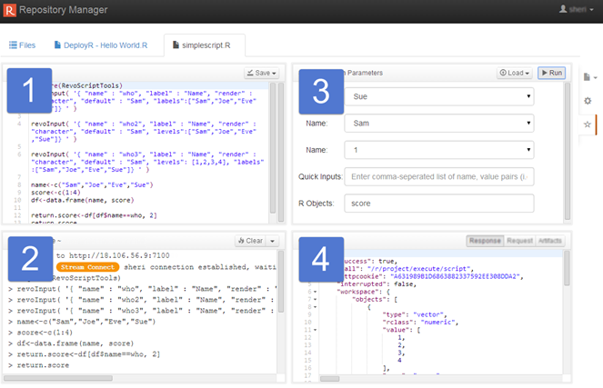
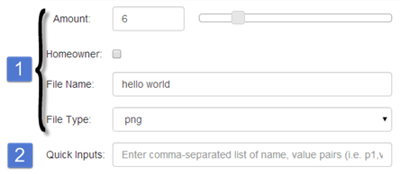
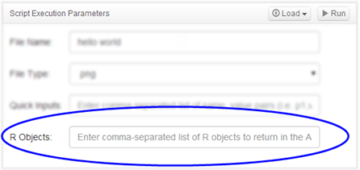

---

# required metadata
title: "DeployR Repository Manager Help"
description: "Testing and Debugging the DeployR Repository Manager"
keywords: ""
author: "j-martens"
manager: "Paulette.McKay"
ms.date: "03/17/2016"
ms.topic: "article"
ms.prod: "deployr"
ms.service: ""
ms.assetid: ""

# optional metadata
ROBOTS: ""
audience: ""
ms.devlang: ""
ms.reviewer: ""
ms.suite: ""
ms.tgt_pltfrm: ""
ms.technology: ""
ms.custom: ""

---

#Testing and Debugging Scripts

For tips and guidance on how to develop portable R code using the deployrUtils package, see the [Writing Portable R Code](../deployr-data-scientist-write-portable-r-code.md) guide on the DeployR website.

Use the **Test** page to do the following to repository-managed scripts:

- Test and verify the functioning of scripts you own
- Debug and fix the functioning of scripts you own
- Test and verify the functioning of scripts to which you have access rights
- Debug the functioning of scripts to which you have [access rights](deployr-repository-manager-files.md#about-file-properties)

##Test Page Panes

The **Test** page is divided into four panes:

+ **Source** pane (1):  displays the actual R [source code](deployr-repository-manager-testing-debugging-scripts.md#inspecting-the-source-code) contained in the script file

+ **Debug Console Output** pane (2): displays the R session [console output](deployr-repository-manager-testing-debugging-scripts.md#reviewing-debug-console-output) generated during the execution of a script

+ **Script Execution Parameters** pane (3): allows you to interact with the [inputs](deployr-repository-manager-testing-debugging-scripts.md#supplying-input-values) defined in the code and define simple [inputs on-the-fly](deployr-repository-manager-testing-debugging-scripts.md#quick-on-the-fly-inputs).

+ **Artifacts** pane (4): allows you to see the [files and plots](deployr-repository-manager-testing-debugging-scripts.md#reviewing-execution-artifacts) produced when the code was last executed as well as inspect the API [request and response](deployr-repository-manager-testing-debugging-scripts.md#reviewing-execution-artifacts) markup.

 

## Opening the Test Page

**To access the Test page:**

-  Open a script and click the **Test** button on the right of the **File Properties** page. The **Test** page opens.

>Each time you log into the Repository Manager, you are automatically allocated a dedicated R session, which supports all of your R script testing and debugging within the Repository Manager. This R session lives for the duration of your HTTP session, until you logout or timeout, at which point it is released. You can [load data ](deployr-repository-manager-testing-debugging-scripts.md#loading-data-into-the-r-session)into the R session as well as [clear the workspace and working directory](deployr-repository-manager-testing-debugging-scripts.md#clearing-the-r-session-working-directory-or-workspace).

## Inspecting the Source Code

The **Source** pane presents the script’s R code. The extent to which you can interact with the source code depends entirely on [permissions and policies](deployr-repository-manager-about.md#permissions-policies).
Viewing R Code

###Viewing R Code

In this pane, you can view and scroll through the source code of the R script. Code elements are color-coded for your convenience.

>If you do not own this file and cannot see the code in the **Source** pane, then a [server policy](deployr-repository-manager-about.md#policies) was changed by your administrator. An onscreen alert will also appear.

###Editing R Code

Only the owners of a file can edit the source code of the [*Latest*](deployr-repository-manager-files.md#working-with-historical-versions) version of a script. This pane is not meant to be used to write scripts or make major changes to your scripts. It is not a substitute for your favorite IDE for R. However, to facilitate the debugging process, the owners of a file can use this pane to make small changes, save those changes to the repository, and test them out.

**To edit the R code:**

1. Find the code you want to change in the **Source** pane or position your cursor where you want to write new code.

1. Type your edits directly into the pane.

1. [Save](deployr-repository-manager-testing-debugging-scripts.md#saving-script-changes) your script and [run it](deployr-repository-manager-testing-debugging-scripts.md#running-scripts-in-test-page) to test the changes.

>Only file owners who were assigned the [**POWER_USER**](deployr-repository-manager-about.md#permissions-policies) role by the administrator have the permissions to run snippets of code in the **Source** pane. If you are a file owner assigned the **POWER_USER** role, you can select and run snippets from the **Source** pane and inspect the workspace in the **Debug Console Output** pane to see the R objects within and their values.

## Running Scripts in Test Page

Any DeployR user who can access a script can also test that script by running the script, changing the [input values](deployr-repository-manager-testing-debugging-scripts.md#supplying-input-values), and then running it again in the **Test** page.

>When debugging a script, you may need to [interrupt an execution](deployr-repository-manager-testing-debugging-scripts.md#interrupting-code-executions).

### Running Entire Scripts with Default Inputs or No Inputs

You can run a script in the **Test** page using the script's source code as-is regardless of whether or not any inputs were defined using [deployrInput()](deployr-repository-manager-testing-debugging-scripts.md).

**To run a script with the default values and inputs:**

1. [Open](deployr-repository-manager-files.md#opening-files) the script and go to the [**Test** page](deployr-repository-manager-testing-debugging-scripts.md).

1. Make no changes in the **Script Execution Parameters** pane.

1. Click **Run** in the toolbar. This script is run in its entirety. Any [artifacts](deployr-repository-manager-testing-debugging-scripts.md#reviewing-execution-artifacts) are then displayed in the Artifacts pane.

 
### Running Entire Scripts with Modified Inputs

You can supply new and modified input values for a script, and then pass those inputs those inputs values when executing the script.

Supply new input values in the following ways:

- Defining temporary [primitive input values](deployr-repository-manager-testing-debugging-scripts.md#quick-on-the-fly-inputs) on-the-fly

- Modifying the value of any [deployrInput()](deployr-repository-manager-testing-debugging-scripts.md#r-code-inputs-deployrinput-) widgets

- Editing the [source code](deployr-repository-manager-testing-debugging-scripts.md#inspecting-the-source-code) to add, remove, or update any deployrInput() functions (available to script-owners only)

For tips and guidance on how to develop portable R code using the deployrInput function from the deployrUtils package, see the [Writing Portable R Code](../deployr-data-scientist-write-portable-r-code.md) guide on the DeployR website.

**To run a script new and modified input values:**

1. [Open](deployr-repository-manager-files.md#opening-files) the script.

1. Go to the [**Test** page](deployr-repository-manager-testing-debugging-scripts.md).

1. [Supply input values](deployr-repository-manager-testing-debugging-scripts.md#supplying-input-values).

1. In the **Script Execution Parameters** pane, click **Run** in the toolbar. The input values are passed along from this pane, and the script is run in its entirety.

 
### Running Snippets of Code

If you own the script and have [**POWER_USER**](deployr-repository-manager-about.md#permissions-policies) permissions, you can run a snippet of code directly from the **Source** pane. In this way, you can make small changes to your R code and run only the lines you want to test. You can even select a variable name, for example, and run that to see its contents.

>Running code from the Source pane will run the selected code as-is without taking into account any modified values or **Quick Inputs** defined in the **Script Execution Parameters** pane.

**To run code selections:**

1. [Open](deployr-repository-manager-files.md#opening-files) the script

1. Go to the [**Test** page](deployr-repository-manager-testing-debugging-scripts.md).

1. In the **Source** pane, select the code that you want to run. If no code is selected, the current line is used.

1. Press `Ctrl-Enter` on Windows/Linux or `Command-Enter` on MAC. The code is executed on the server and the response is displayed in the **Debug Console Output** and **Artifacts** panes.

## Reviewing Debug Console Output

In the **Debug Console Output** pane, you can see all of the R session console output generated during the execution of the code on the DeployR server. Each time code is executed in this **Test** page, this pane is automatically populated for you.

While this pane bears some resemblance to R's console, the **Debug Console Output** pane in Repository Manager is designed to help you learn more about your script's behavior for the purposes of debugging the script, not act as your primary development environment. This **Debug Console Output** pane executes code exclusively on the server and does not have the same capabilities as a full R console.

If you are an owner assigned the **POWER_USER** role, you can select and run elements from the **Source** pane and inspect the workspace here to see the objects and their values.

Although you cannot type anything into the console, you can still [clear the pane, the working directory, or the workspace](#manipulating-the-underlying-r-session).

## Reviewing Execution Artifacts

The **Files & Plots** section of the **Artifacts** pane presents the files and plots produced when code was last executed in the **Test** page:

- Any unnamed or named graphical files generated by the R graphics device, which are visually rendered in the pane
- Non-image files written to the working directory, such as .CSV files, binary files, and so on, which appear as clickable links in the pane

These **API Request and API Response** sections of the **Artifacts** pane present the execution at the API level. This information is particularly interesting to DeployR **client application developers** since it provides critical details they can use when building their client applications.

- **API Request** presents the complete set of parameters sent along to the DeployR server on the script execution API call.
- **API Response** presents the complete response markup sent back by the DeployR server on the script execution API call.

>Upon each code execution, the **Artifacts** pane is cleared and repopulated.

## Manipulating the Underlying R Session

Each time you log into the Repository Manager, you are automatically allocated a dedicated R session, which supports all of your R script testing and debugging within the Repository Manager. This R session lives for the duration of your HTTP session, until you logout or timeout, at which point it is released.

To help you test and debug your scripts, you can manipulate this underlying R session by:

- [Loading](deployr-repository-manager-testing-debugging-scripts.md#loading-data-into-the-r-session) and moving data into the R session to be used by one or more of the scripts you are debugging
- [Clearing](deployr-repository-manager-testing-debugging-scripts.md#clearing-the-r-session-working-directory-or-workspace) the working directory or workspace of that underlying R session
- [Retrieving DeployR-encoded R objects](deployr-repository-manager-testing-debugging-scripts.md#retrieving-r-objects) from the workspace

 
### Loading Data into the R Session

You can load data into the underlying R session from the **Test** page of any open script. Any type of data file can be loaded into the working directory of the underlying R session. For example, you could load a .CSV file that will be read by your script. However, only files containing binary R objects, typically with a .rData file extension, can be loaded directly into the workspace from this page.

You choose to load data files and binary R objects from the repository or from your local machine. You can always load your files; however, your ability to load data files that you do not own from the repository is determined by [server policies](deployr-repository-manager-about.md#policies).

**To load data into the underlying R session:**

1.  In the **Test** page of the open script, click the **Load** button in the **Script Execution Parameters** pane toolbar.

	-  To load a file that already exists in the repository, choose **Load File from Repository**.
	-  To load a file from your machine, choose **Load File from Local Machine**.

1.  In the dialog, select the directory and file containing the data to be loaded.

1.  Specify whether the data should be loaded into the working directory or workspace:
	-  If you are loading a data file, choose **Working directory**.
	-  If you are loading a binary R object, choose **Workspace**. If necessary, first save your model or other object outside of DeployR as an .rData file, and then load it here.

1. Click **Load** to load the data.

>If you have loaded data files or R objects into this R session, clearing the workspace and working directory, or even timing out of your user session, will delete the files, data, and R objects you loaded. If that data is still needed, you must reload it.

### Clearing the R Session Working Directory or Workspace

You can clear the working directory and/or the workspace on the underlying R session using the menu in the **Debug Console Output** pane toolbar. When you clear the working directory, all data files in your work directory are deleted, including those files output to the working directory by code executions as well as any files you loaded into the working directory. Likewise, if you clear the workspace, all binary R objects and data models are cleared from the underlying R session workspace including those generated by code executions and those loaded into the workspace.

>If your user session times out, the underlying R session is released.

To clear the pane, workspace or working directory:

1.  Click the arrow next to the **Clear** button in the **Debug Console Output** pane toolbar to see the **Clear** submenu options.

1.  Select one of the following options:

	-  **Clear Pane** to clear the output visible on the pane without affecting on the underlying R session.
	-  **Clear Workspace** to clear **all** binary R objects or models from the workspace on the underlying R session regardless of whether they were generate during code execution or loaded into the session.
	-  **Clear Working Directory** to clear **all** files from the working directory on the underlying R session.
	-  **Clear Both** to clear all binary R objects from the workspace and all files from the working directory on the underlying R session.

## Supplying Input Values

There are two kinds of inputs to your script. They are:

1.  The values for the [`deployrInput()`](../deployr-data-scientist-write-portable-r-code.md) widgets
2.  Primitive name-value pairs in the **Quick Inputs** field

  

To help you test your script, you can supply temporary input values in the **Script Execution Parameters** pane in the upper right. You can then pass these values along during the next execution of your R script in this user session. You can:

-  Change any values displayed in the `deployrInput()` widgets
-  Define some primitive values on-the-fly
-  [Run](deployr-repository-manager-testing-debugging-scripts.md#running-scripts-in-test-page) the entire script with the values and quick inputs shown in this pane

>You can also [load data](deployr-repository-manager-testing-debugging-scripts.md#loading-data-into-the-r-session) into the underlying R session to be used by any script. For example, you might create a model, save that in an .rData file, and then load it into the workspace so your script can use the model to score new data.

### R Code Inputs (deployrInput)

Any inputs defined in the R code using the deployrInput() function, and their default values, appear at the top in this pane. The default values defined in the R code are preselected here for you. You can change the value of an input here, run to test your code using the new value, and then evaluate the outcome.

For tips and guidance on how to develop portable R code using this function from the deployrUtils package, see the [Writing Portable R Code](../deployr-data-scientist-write-portable-r-code.md) guide on the DeployR website.
Refer to the deployrUtils package help for more details and examples.

>If you do not own this file and cannot see the R code in the **Source** pane, then the deployrInput() functions [cannot be rendered](deployr-repository-manager-about.md#permissions-policies) either.

By default, if you can access this file in the Repository Manager, then you are permitted to see any `deployrInput` widgets in this pane regardless of whether you own the file or not. However, if you do not own this file but know there are `deployrInput` declarations in the code and cannot see them here, it may be due a change in the server configuration [policies](deployr-repository-manager-about.md#permissions-policies) by the DeployR administrator that prohibits the loading and downloading of files that may contain code into an R session.

### Quick 'on-the-fly' Inputs

You can define some temporary basic inputs on-the-fly to help you test your script. Only primitive values (real, integer, string) are accepted. To define one, enter each input as a comma-separated name-value pair in the **Quick Inputs** field.

Each input is defined as a comma-separated, name-value pair using the following syntax: 

	InputName_1, Value_1, InputName_2, Value_2

For example: 

	Title, "Sales Report", Month, 12

>The **Quick Inputs** field is designed to support primitive inputs, but not complex inputs. **Quick Inputs** cannot be saved. For those, we recommend defining them in your code using the deployrInput()function. **Quick Inputs** cannot be saved with the script.

## Retrieving R Objects

On the **Test** page, you can retrieve and inspect DeployR encoding for R objects in the underlying workspace. Since DeployR encodings are used to encode R object data on the DeployR API, the **R Objects** feature is of particular interest to client application developers.

The following kinds of artifacts might be present after you execute code:

-  Unnamed and named [plots](deployr-repository-manager-testing-debugging-scripts.md#reviewing-execution-artifacts) from the R graphics device and non-image files that were written to the working directory
-  DeployR encodings of R objects from the workspace

You can use the **R Objects** field to request that R object(s) in the workspace be returned as a DeployR-encoded object(s) in the [response](deployr-repository-manager-testing-debugging-scripts.md#reviewing-execution-artifacts) markup.

>To learn more about DeployR encoded objects, refer to the [DeployR API Reference Guide](deployr-api-reference.md) chapter on data encodings.

The following is an example a DeployR encoding of an R vector object returned in the API Response tab of the Artifacts pane for the "workspace" property:

	{
	   ...
	   workspace": {
	      "objects": [
	         {
	            "name": "x",
	            "type": "vector",
	            "rclass": "numeric",
	            "value": [
	               10,
	               11,
	               12,
	               13,
	               14,
	               15,
	            ]  
	         }
	      ]
	   }
	   ...
	}

>The type property indicates how you can decode the encapsulated data for use within his or her client application.

**To retrieve R objects from the workspace:**

1. In the **Script Execution Parameters** pane, enter the name of an R object that is currently in your workspace or one you expect to be generated from the execution into the **R Objects** field.

1. Enter any additional R object names as a comma-separated list, such as `ObjectName1, ObjectName2, ObjectName3, etc.`

1. Run the script in this **Test** page.

1. Once the execution has completed, click **API Response** in the toolbar of the **Artifacts** pane.

1. Search for the "workspace" property to find the DeployR encodings of the named objects in the response markup.
 
>You cannot save the list of object names you enter in the **R Objects** field. This is a temporary field used only to retrieve the DeployR encoding of one or more R objects on-the-fly.

## Interrupting Code Executions

Whenever you run code from anywhere in the **Test** page, you can interrupt the execution of that code. Since the console output is shown in the **Debug Console Output** pane, this is also where you can interrupt an execution in progress.

**To interrupt a code execution:**

1.  During an execution, find the red icon in the **Debug Console Output** pane toolbar.

1.  Click the red icon on the toolbar to interrupt and terminate the execution.

## Saving Script Changes

The changes you make to the source code of your own scripts in the Repository Manager are not saved automatically. If you want to keep any of the changes you make in the **Source** pane, you must explicitly save them.

>Changes you make in the **Script Execution Parameters** pane to test and debug your script are temporary and cannot be saved.

**To save from the Source pane:**

1.  After you have made changes to the source code in the **Test** page, click **Save** in the **Source** pane toolbar.

1.  In the submenu, choose one of the following:
	-  **Overwrite Latest version** to replace in the current working copy of the script.
	-  **Save as new version** to save the changes as the [*Latest* version](deployr-repository-manager-files.md#working-with-historical-versions) with an optional comment, and to preserve what was previously the *Latest* version in the file's history.

	>`Ctrl-S` on Windows/Linux or `Command-S` on MAC will save and overwrite the *Latest* version.
