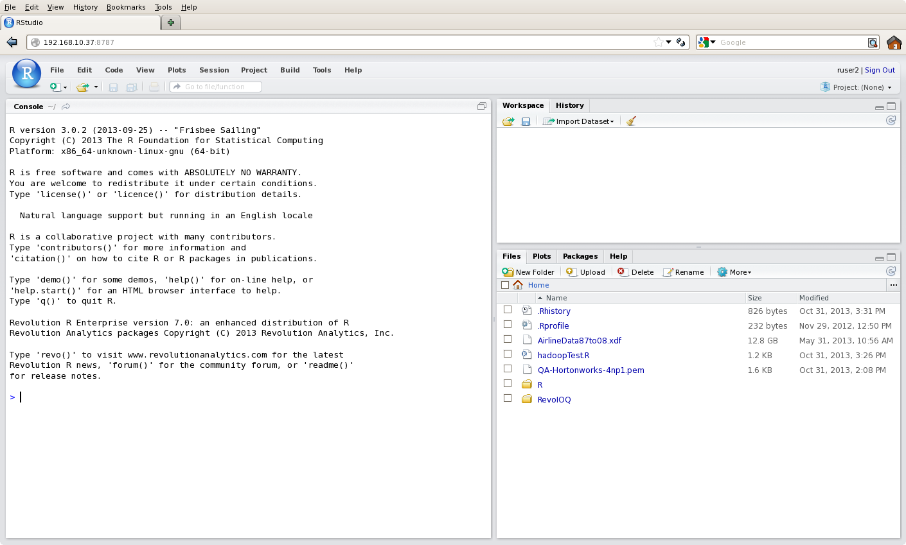

---

# required metadata
title: "R Server Linux Server Install Guide"
description: "Microsoft R Server Linux installation."
keywords: ""
author: "richcalaway"
manager: "mblythe"
ms.date: "03/17/2016"
ms.topic: "get-started-article"
ms.prod: "rserver"
ms.service: ""
ms.assetid: ""

# optional metadata
ROBOTS: ""
audience: ""
ms.devlang: ""
ms.reviewer: ""
ms.suite: ""
ms.tgt_pltfrm: ""
ms.technology: ""
ms.custom: ""

---

# R Services Installation Guide for Linux System

## Quick Overview

This section describes a quick install process that assumes the following:

-   Your system has Internet access
-   Your system is configured to use your platform’s package manager (yum for RHEL systems, zypper for SLES systems)
-   You are installing as root.

If any of these conditions does not hold, you should first verify that your system meets the system requirements and satisfies the package prerequisites described in [Prerequisites and Dependencies](#prerequisites-and-dependencies), then follow the more detailed installation instructions described in [Managing Your Microsoft R Server Installation](#managing-your-microsoft-r-server-installation).

Installation of Microsoft R Server consists of two distinct steps:

1.  Install Microsoft R Open for Microsoft R Server 2016.

2.  Install Microsoft R Server 2016.

To download and install Microsoft R Server:

1.  Log in as root or a user with sudo privileges. If the latter, precede commands requiring root privileges with sudo. (If you do not have root access or sudo privileges, you can install as a non-root user. See [Non-Root Installs](#non-root-installs) for details.)

2.  Download [Microsoft R Open for Microsoft R Server 2016](http://go.microsoft.com/fwlink/?LinkID=699383&clcid=0x409).

3.  Install Microsoft R Open according to the [online instructions](http://go.microsoft.com/fwlink/?LinkID=699383&clcid=0x409) for your platform.

4.  Download and unpack the Microsoft R Server 2016 distribution, which will either be a DVD img file (if you obtained Microsoft R Server via Microsoft Volume Licensing) or a gzipped tar file (if you obtained Microsoft R Server via MSDN). The distribution file includes one or more Microsoft R Server installers, along with installers for DeployR, an optional additional component.

5.  If you have an img file, you must first mount the file. The following commands create a mount point and mount the file to that mount point:

	    mkdir /mnt/mrsimage
	    mount –o loop <filename> /mnt/mrsimage

		[for RHEL/CENTOS systems]
		tar zxvf MRS80RHEL.tar.gz

		[for SLES systems]
		tar zxvf MRS80SLES.tar.gz

6.  In either case, you will then want to copy the installer gzipped tar file to a writable directory, such as /tmp:

		[From the mounted img file]
		cp /mnt/mrsimage/Microsoft-R-Server-*.tar.gz /tmp

		[From the unpacked tar file]
		cp /tmp/MRS80*/Microsoft-R-Server-*.tar.gz /tmp

7.  Unpack the tar file and run the installer script, as follows:

		cd /tmp
		tar xvzf Microsoft-R-Server-8.0.0-<OS>.tar.gz
		pushd rrent
		./install.sh

	The installer prompts you for the following:

	a. the location of your R installation—if you installed Microsoft R Open for Microsoft R Server to the default location, you can simply press Enter and continue.

	b.  where you would like to install additional Microsoft R Server files; these are files that are not part of specific R packages, such as documentation, licenses, and scripts.

	c.  if you would like to load the rpart and lattice packages by default; these packages are recommended as they enhance some RevoScaleR operations.

	d.  to agree to the Microsoft R Server software license.

8.  Once you have agreed to the license, the installation completes. Type the following to return to your original directory:

		popd

On Linux systems with Hadoop installed, the install.sh script also tries to configure Microsoft R Server for use with Hadoop. On such systems, the install.sh script runs a Python script that queries the Hadoop environment for certain environment variables and searches the Hadoop installation for certain files, writing a set of Hadoop environment variables required by Microsoft R Server to a file in the RRE installation directories. For complete details on Hadoop configuration, including troubleshooting when the automated configuration is incomplete or inaccurate, see the [Microsoft R Server Hadoop Configuration Guide](rserver-install-hadoop.md).

If you receive messages about uninstalled dependencies, see [Prerequisites and Dependencies](#prerequisites-and-dependencies).

## Prerequisites and Dependencies

This section describes the minimum and recommended system requirements for Microsoft R Server, and also lists all known package dependencies.

### System Requirements

Microsoft R Server for Linux has the following system requirements:

**Processor:** 64-bit processor with x86-compatible architecture (variously known as AMD64, Intel64, x86-64, IA-32e, EM64T, or x64 chips). Itanium-architecture chips (also known as IA-64) are not supported. Multiple-core chips are recommended.

**Operating System:** Red Hat Enterprise Linux 5.4, 5.5, 5.6, 5.7, 5.8, 5.9, 5.10, 5.11, 6.0, 6.1, 6.2, 6.3, 6.4, 6.5, or 6.6, or SUSE Linux Enterprise Server 11 SP1, SP2, or SP3. (SUSE Linux Enterprise Server installs require the libgfortran43 package; to our knowledge this is distributed only with SP1, but can be installed into later Service Packs. The required ISO images can be found at <https://download.suse.com/>.) Only 64-bit operating systems are supported.

**Memory:** A minimum of 2GB of RAM is required; 8GB or more are recommended.

**Disk Space:** A minimum of 500MB of disk space is required.

Package Dependencies
--------------------

Microsoft R Server, like most Linux applications, depends upon a number of Linux packages. If your system is not Internet-connected or not configured to use a package manager, you must ensure that these dependencies are installed by hand. Most of these, listed in Table 1 for RHEL systems and Table 2 for SLES 11 systems, are explicitly required by Microsoft R Server, either to build R itself or as a prerequisite for an additional Microsoft package. The remainder are in turn required by these dependencies. These are automatically installed while the automated script is running. These are listed in Table 3 for RHEL systems and Table 4 for SLES 11 systems. These dependency lists are based on default installs of RHEL 6 and SLES11; if you use a minimal install, additional packages may be required.

Table 1. Packages Explicitly Required by Microsoft R Server on RHEL Systems

|||
|-------------------|-----------------|
| ed                | cairo-devel     |
| tk-devel          | make            |
| gcc-objc          | gcc-c++         |
| readline-devel    | libtiff-devel   |
| ncurses-devel     | pango-devel     |
| perl              | texinfo         |
| libgfortran       | pango           |
| libicu            | libjpeg\*-devel |
| ghostscript-fonts | gcc-gfortran    |
| libSM-devel       | libicu-devel    |
| libXmu-devel      | bzip2-devel     |

Table 2. Packages Explicitly Required by Microsoft R Server on SLES 11 Systems

|||
|-------------------|-----------------|
| ed                   | cairo-devel           |
| tk-devel             | make                  |
| gcc-objc             | gcc-c++               |
| readline-devel       | libtiff-devel         |
| ncurses-devel        | pango-devel           |
| perl                 | texinfo               |
| libjpeg-devel        | ghostscript-fonts-std |
| libgfortran43        | gcc-fortran           |
| xorg-x11-libSM-devel | xorg-x11-libXmu-devel |
| libpng-devel         |                       |

Table 3. Secondary Dependencies Installed for Microsoft R Server on RHEL Systems

|||
|-------------------|-----------------|
| cloog-ppl         | cpp                      |
| font-config-devel | freetype                 |
| freetype-devel    | gcc                      |
| glib2-devel       | libICE-devel             |
| libobjc           | libpng-devel             |
| libstdc++-devel   | libX11-devel             |
| libXau-devel      | libxcb-devel             |
| libXext-devel     | libXft-devel             |
| libXmu            | libXrender-devel         |
| libXt-devel       | mpfr                     |
| pixman-devel      | ppl glibc-headers        |
| tcl gmp           | tcl-devel kernel-headers |
| tk                | xorg-x11-proto-devel     |
| zlib-devel        |                          |

Table 4. Secondary Dependencies Installed for Microsoft R Server on SLES 11 Systems

|||
|-------------------|-----------------|
| cpp43                     | fontconfig-devel             |
| freetype2-devel           | gcc                          |
| gcc43 libX11              | gcc43-c++                    |
| gcc43-fortran             | gcc43-objc                   |
| glib2-devel               | glibc-devel                  |
| libobjc43 tcl             | libpciaccess0                |
| libpciaccess0-devel       | libpixman-1-0-devel          |
| libstdc++-devel           | libstdc++43-devel            |
| libuuid-devel gmp         | linux-kernel-headers         |
| pkg-config                | tack                         |
| tcl-devel                 | xorg-x11-devel               |
| xorg-x11-fonts-devel      | xorg-x11-libICE-devel        |
| xorg-x11-libX11-devel     | xorg-x11-libXau-devel        |
| xorg-x11-libXdmcp-devel   | xorg-x11-libXext-devel       |
| xorg-x11-libXfixes-devel  | xorg-x11-libXp-devel         |
| xorg-x11-libXpm-devel     | xorg-x11-libXprintUtil-devel |
| xorg-x11-libXrender-devel | xorg-x11-libXt-devel         |
| xorg-x11-libXv-devel      | xorg-x11-libfontenc-devel    |
| xorg-x11-libxcb-devel     | xorg-x11-libxkbfile-devel    |
| xorg-x11-proto-devel      | xorg-x11-util-devel          |
| xorg-x11-xtrans-devel     | zlib-devel                   |

## Managing Your Microsoft R Server Installation

In this section, we discuss file management for your Microsoft R Server installation, including file ownership, file permissions, and so on.

### File Ownership

If you use the Quick Install steps, the installed files are all owned by root. For single-user workstations where the user has either sudo privileges or access to the root password, this is normally fine. In enterprise environments, however, it is often desirable to have third-party applications such as Microsoft R Server installed into an account owned by a non-root user; this can make maintenance easier and reduce security concerns. In such an environment, you may wish to create an “RUser” account, and change ownership of the files to that user. You can do that as follows:

1.  Install Microsoft R Server as root, as usual.
2.  Create the “RUser” account if it does not already exist. Assign this user to a suitable group, if desired.
3.  Use the chown command to change ownership of the files (in the example below, we assume RUser has been made a member of the dev group; this command requires root privileges):

		chown -R RUser:dev /usr/lib64/MRO-for-MRS-8.0.0

	(Here we show the default path /usr/lib64/MRO-for-MRS-8.0.03; if you have specified an alternate installation path, use that in this command as well.)

You can also run the installer as a non-root user, even without sudo privileges. For details, see [Non-Root Installs](#non-root-installs).

### Non-Root Installs

You can run the installer as a non-root user without sudo privileges. You can run either a complete install or simply extract the files to a directory for subsequent installation using your own install scripts. For a complete install to succeed, however, the following conditions must be met:

-   You must have all the prerequisite packages installed on your computer.
-   You must have write permission to the specified base installation directory.

The installer will check that the prerequisite packages are installed and inform you of any that are missing. The prerequisite packages typically do require superuser priviliges to install, so if you do not have sudo privileges, you will probably need to consult your system administrator in order to install them.

If all the prerequisites are installed, you complete the installation as follows:

1.  Download [Microsoft R Open for Microsoft R Server 2016](http://go.microsoft.com/fwlink/?LinkID=699383&clcid=0x409).

2.  Run the following commands to install the rpm file:

		mkdir $HOME/localmrsrpmdb
		rpm --initdb --dbpath $HOME/localmrsrpmdb
		export MRS_RPM_DBPATH=$HOME/localmrsrpmdb && \
		    rpm --dbpath $MRS_RPM_DBPATH --prefix $HOME \
		        --nodeps -i MRO-for-MRS-*.rpm
		
3.  Download and unpack the Microsoft R Server tarball, then run the installer script, as follows (the tarball name may include an operating system ID; the complete name of the tarball will be in your download letter):

		tar xvzf Microsoft-R-Server-8.0.0-*.tar.gz
		pushd rrent
		./install.sh

	At this point you are asked for the location of your R installation—be sure to use the same location you provided as the --prefix argument in step 2. You are also asked where you would like to install additional Microsoft R Server files; these are files that are not part of specific R packages, such as documentation, licenses, and scripts.

	You are then asked if you would like to load the rpart and lattice packages by default; these packages are recommended as they enhance some RevoScaleR operations.

	Finally, you are asked to agree to the Microsoft R Server software license. Once you have agreed to the license, the installation completes. Type the following to return to your original directory:

		popd

The R installation is owned by the user who completed the installation; subsequent updates and uninstalls must be performed by the same user. In particular, multiple users can perform non-root installations–as long as the installations specify separate base installation directories, they will be completely independent. Non-root installations can be performed on systems that have had Microsoft R Server installed as root, and vice versa.

In general, non-root installs require you to specify the complete path to the Revo64 script once installation is complete. To avoid this, add the path to the directory containing your Revo64 script to your PATH environment variable, for example, by adding the following to the end of your .bash\_profile file:

	export PATH=/home/$USER/Revo-7.4/R-3.1.3/bin:$PATH

### Unattended Installs

You can bypass the interactive install steps of the Microsoft R Server install script with the -y flag (“yes” or “accept default” to all prompts except that you also agree to the license agreement). Additional flags can be used to specify which of the usual install options you want, as follows:

| Option  | Description                                                                              |
|---------|------------------------------------------------------------------------------------------|
| -p PATH | base path of the desired R installation directory                                        |
| -h      | usage information                                                                        |
| -a      | load rpart and lattice packages by default (default is no)                               |
| -e PATH | base path of the desired Microsoft R Server installation directory (the location for Microsoft R Server documentation, license, and script files)  |

For a standard unattended install, install Microsoft R Open for Microsoft R Server using the commands in the previous section, and then run the Microsoft R Server install script in succession as follows (this assumes you have already extracted the rrent directory from its associated tarball. We also recommend loading rpart and lattice by default, so we pass the –a flag to install.sh):

	pushd rrent
	./install.sh –a –y
	popd

### File Permissions

Normally, ordinary Microsoft R Server files are installed with read/write permission for owner and read-only permission for group and world. Directories are installed with execute permission as well, to permit them to be traversed. You can modify these permissions using the chmod command. (For files owned by root, this command requires root privileges.)

### Installing to a Read-Only File System

In enterprise environments, it is common for enterprise utilities to be mounted as read-only file systems, so that ordinary operations cannot corrupt the tools. Obviously, new applications can be added to such systems only by first unmounting them, then re-mounting them for read/write, installing the software, and then re-mounting as read-only. This must be done by a system administrator.

## Setting Up a Package Repository

One of the strengths of the R language is the thousands of third-party packages that have been made publicly available via CRAN, the Comprehensive R Archive Network. R includes a number of functions that make it easy to download and install these packages. However, in many enterprise environments, access to the Internet is limited or non-existent. In such environments, it is useful to create a local package repository that users can access from within the corporate firewall.

Your local repository may contain source packages, binary packages, or both. If some or all of your users will be working on Windows systems, you should include Windows binaries in your repository. Windows binaries are R-version-specific; if you are running R 3.2.2, you need Windows binaries built under R 3.2. These versioned binaries are available from CRAN and other public repositories. If some or all of your users will be working on Linux systems, you must include source packages in your repository.

The Microsoft Managed R Archive Network (MRAN) provides daily snapshots of all of CRAN, and together with the Microsoft-developed open-source package miniCRAN can be used to easily build a local package repository containing source packages, binary packages, or both.

There are two ways to create the package repository: either copy all the packages from a given MRAN snapshot, or create a new repository and populate it with just those packages you want to be available to your users. We will describe both procedures using MRAN and miniCRAN.

**Note:** The miniCRAN package itself is dependent on 18 other CRAN packages, among which is the RCurl package, which has a system dependency on the curl-devel package. Similarly, package XML has a dependency on libxml2-devel. We recommend, therefore, that you build your local repository initially on a machine with full Internet access, so that you can easily satisfy all these dependencies. Once created, you can either move the repository to a different location within your firewall, or simply disable the machine’s Internet access.

### Installing miniCRAN

On a system with Internet access, the easiest way to install the miniCRAN package (or any R package) is to start R and use the install.packages function:

	install.packages("miniCRAN", dependencies=TRUE)

If your system already contains all the system prerequisites, this will normally download and install all of miniCRAN’s R package dependencies as well as miniCRAN itself. If a system dependency is missing, compilation of the first package that needs that dependency will fail, typically with a specific but not particularly helpful message. In our testing, we have found that an error about curl-config not being found indicates that the curl-devel package is missing, and an error about libxml2 indicates the libxml2-devel package is missing. If you get such an error, exit R, use yum or zypper to install the missing package, then restart R and retry the install.packages command.

### Creating a Repository from an MRAN Snapshot

Creating a repository from an MRAN snapshot is very straightforward:

1.  Choose a location for your repository somewhere on your local network. If you have a corporate intranet, this is usually a good choice, provided URLs have the prefix http:// and not https://. Any file system that is mounted for all users can be used; file-based URLs of the form file:// are supported by the R functions. In this example, we suppose the file system /local is mounted on all systems and we will create our repository in the directory /local/repos.

2.  Start R and load the miniCRAN package:

		library(miniCRAN)

3.  Specify an MRAN snaphot:

		CRAN <- "http://mran.revolutionanalytics.com/snapshot/2015-11-30"

4.  Set your MRAN snapshot as your CRAN repo:

		r <- getOption("repos")
		r["CRAN"] <- CRAN
		options(repos=r)

5.  Use miniCRAN’s pkgAvail function to obtain a list of (source) packages in your MRAN snapshot:

		pkgs <- pkgAvail()[,1]

6.  Use miniCRAN’s makeRepo function to create a repository of these packages in your /local/repos directory:

		makeRepo(pkgs, "/local/repos", type="source")

### Creating a Custom Repository

As mentioned above, a custom repository gives you complete control over which packages are available to your users. Here, too, you have two basic choices in terms of populating your repository: you can either use makeRepo to select specific packages from an existing MRAN snapshot, or you can combine your own locally developed packages with packages from other sources. The latter option gives you the greatest control, but typically means you need to manage the contents using home-grown tools.

#### Creating a Custom Package Directory

Your custom package directory can contain source packages, binary packages, or both. Windows binary packages should have a path of the form

	/local/repos/bin/windows/contrib/3.2

while source packages should have a path of the form:

	local/repos/src/contrib

Windows binary packages should be built with your current R version. Windows binary files will be zip files, package source files will be tar.gz files. Move the desired packages to the appropriate directories, then run the R function write\_PACKAGES in the tools package to create the PACKAGES and PACKAGES.gz index files:

	tools:::write_PACKAGES("/local/repos")

### Configuring R to Use Your Local Repository

To make your local repository available to your R users:

1.  Open the file Rprofile.site in the /etc directory of your installed R (if you installed to the default /usr prefix, the path is /usr/lib64/MRO-for-MRS-8.0.0/R-3.2.2/lib64/R/etc/Rprofile.site).

2.  Find the following line in the Rprofile.site file:

		r <- c(REVO=RevoUtils::getRevoRepos())

3.  Add your repository as follows:

		r <- c(REVO=RevoUtils::getRevoRepos(),
			LOCAL="file:///local/repos")

	 If you added more than one repository and used R version numbers, add multiple lines of the form LOCAL\_VER="file:///local/repos/VER", for example:

		r <- c(REVO=RevoUtils::getRevoRepos(),
		       LOCAL_3.2="file:///local/repos/3.2",
		       LOCAL_3.1="file:///local/repos/3.1",
		       LOCAL_3.0="file:///local/repos/3.0")

4.  Save the file and your repository is ready for use.

If you are in a locked-down environment without access to the standard Microsoft repository, *replace* the Revo repository with your local repository (or repositories).

## Removing Microsoft R Server

To remove Microsoft R Server from your computer, delete the directory containing the additional Microsoft R Server file from your computer:

	rm –rf /usr/lib64/MRS-8.0

To remove Microsoft R Open, follow the [instructions online](http://go.microsoft.com/fwlink/?LinkID=698527&clcid=0x409).

## Managing Multiple R Installations

You can install the latest Microsoft R Server side-by-side with an existing Microsoft R Server. In this section, we discuss maintaining multiple versions of Microsoft R Server, together with instructions for maintaining Microsoft R Server alongside versions of R obtained from CRAN or third-party repositories such as <http://dl.fedoraproject.org/pub/epel>. (Note, however, that patch releases such as Microsoft R Server 7.4.1 are intended to replace their associated main release, not live side by side with it. You must uninstall and reinstall such releases.)

### Using Microsoft R Server with Other R Installations

If you have an installed R script in your /usr/bin directory and then install Microsoft R Server, the automated installer detects that R exists and does not prompt you to link R to Revo64. In this case, you can use both versions of R simply by calling them by their respective script names, “R” and “Revo64”. To have Microsoft R Server become your default R, do the following:

1.  Rename the R script by appending the R version, for example 3.2.2:

		mv /usr/bin/R /usr/bin/R-3.2.2

2.  Create a symbolic link from the Revo64 script to R:

		ln -s /usr/bin/Revo64 /usr/bin/R

If you have installed Microsoft R Server and then install base R, again there should be no conflict; R and Revo64 point to their respective installations, as usual. You can use the above procedure to make Microsoft R Server your default version of R.

## Using Microsoft R Server with a Third-Party IDE

Many Linux R users find that their productivity is greatly increased by the use of integrated development environments such as RStudio or Eclipse with the StatET plug-in. These environments can be used with Microsoft R Server, although some care is needed to ensure that you are using compatible versions of the software. This section describes running RStudio and StatET with Microsoft R Server.

### Running Microsoft R Server with RStudio

RStudio (<http://www.rstudio.com/ide>) is an open-source, cross-platform integrated development environment for R. RStudio for Linux comes in both desktop and server versions. The server version, in turn, comes in both free and professional versions. For local computations (by which we mean computations on a single computer, as opposed to distributed computation across several computers), both the free and professional versions of RStudio Server work just fine. The free version can also be used as a client for launching distributed computing jobs on a Hadoop cluster. For distributed computing involving IBM Platform LSF, however, you must have the professional version of RStudio Server installed on one of the nodes of your LSF compute cluster. We recommend the professional version; we have also tested the free server version 0.98.1103 for use on both RHEL5 and RHEL6 systems. (We have found the desktop version incompatible with RHEL5 as it requires newer development libraries than are available in the standard RHEL5 repositories.) The server version, however, will run “out-of-the-box” on both RHEL5 and RHEL6 systems.

#### Installing RStudio Server

To install and start the free version of RStudio Server, run the following commands at a shell prompt after installing Microsoft R Server:

	# RHEL 6 only
	sudo yum install openssl098e 
	# on both RHEL5 and RHEL6
	wget http://download2.rstudio.org/rstudio-server-0.98.1103-x86_64.rpm
	sudo yum install --nogpgcheck rstudio-server-0.98.1103-x86_64.rpm

(If you purchase the professional version, you will obtain your download link directly from RStudio. If you are installing RStudio Server to a cluster managed by Cloudera Manager, add the *--no-deps* flag to the rpm command above.)

You should see the following message when the installation completes:

	Starting rstudio-server: [ OK ]

#### Accessing RStudio Server

To get started using RStudio Server, open a browser and navigate to the following URL:

	http://<IP-of-server>:8787

You will be prompted for a username and password. RStudio uses the default authentication on your server to verify users, so it is possible you will need to add users via the standard Linux useradd command for successful authentication. Once you have successfully logged in to RStudio, you will see the IDE as shown below:

RStudio includes online documentation that discusses its features in detail.

#### Running Microsoft R Server with StatET

Eclipse (<http://www.eclipse.org>) is a Java-based, open-source, cross-platform integrated development environment with base support for a number of programming languages, including Java, C, and C++.

StatET (<http://www.walware.de/?page=/it/statet/index.mframe>) is an Eclipse plug-in providing support for the R language.

To run Microsoft R Server with StatET, you must install a Java JDK (1.6 or later), an Eclipse IDE (StatET’s developers recommend the Eclipse IDE for Java Developers; these instructions were developed using the Eclipse IDE forC/C++ Developers), Microsoft R Server, and the two R packages rj and rj.gd available from the Walware web site. We will assume in what follows that you or your system administrator have installed the appropriate Java JDK on your system, and that you have already installed Microsoft R Server.

### Installing Eclipse

To install Eclipse, first download the desired 64-bit base IDE from <http://www.eclipse.org/downloads>. You should have a file with a name of the form

	eclipse-<lang>-juno-SR1-linux-gtk-x86_64.tar.gz

where \<lang\> is one of cpp or java. The following commands should install and start Eclipse on your Linux system:
	
	tar zxvf eclipse-<lang>-luna-SR2-linux-gtk-x86_64.tar.gz
	cd eclipse
	./eclipse &

#### Installing StatET

Before installing StatET, review the requirements at <http://www.walware.de/?page=/it/statet/installation.mframe>. Install the required packages rj and rj.gd by starting Microsoft R Server and calling install.packages as follows:
	
	install.packages(c("rj", "rj.gd"),
		repos="http://download.walware.de/rj-2.0",
		lib="/usr/lib64/MRO-for-MRS-8.0.0/R-3.2.2/lib64/R/library")

With some Java installations, it may be necessary to run R CMD javareconf before installing the rj package. (You may also need to install the java-1.7.0-openjkd-devel package before running R CMD javareconf.) If you see a message about being unable to load libjvm.so during the installation of rj.gd, you may need to create a symbolic link from your installed version of libjvm.so to the system library, such as the following:

	ln -s /path/to/libjvm.so /usr/lib/libjvm.so

Once you have successfully installed the two prerequisite R packages, you install StatET as follows:

1.  From the Eclipse IDE, select **Install New Software** from the **Help** menu. The **Install** dialog box appears.
2.  To the right of the text box labeled **Work with:**, click **Add**. The **Add Repository** dialog box appears.
3.  In the **Name** textbox, type **StatET**.
4.  In the **Location** textbox, type or paste in the URL <http://download.walware.de/eclipse-4.4>.
5.  Click **OK**. The available WalWare downloads should appear.
6.  Click **Select All** to select all available WalWare downloads.
7.  Click **Next**.
8.  Review the items to be installed and click **Next**.
9.  Agree to the license terms and click Finish. The Eclipse installer will download and install the StatET plug-in.

Once StatET is installed, define an R environment for Microsoft R Server as follows:

1.  From the Eclipse IDE, select **Preferences** from the **Window** menu. The **Preferences** dialog box appears.
2.  In the left navigation panel, expand **StatET**, and then expand **Run/Debug**.
3.  Click **R Environments**.
4.  In the right pane, click **Add**. (You may have to scroll to make this button visible.) The **Add R Environment Configuration** dialog box appears.
5.  In the text box labeled Location (R HOME), enter the full path to your Microsoft R Server installation, typically /usr/lib64/MRO-for-MRS-8.0.0/R-3.2.2/lib64/R. If you do not know this path, you can obtain it from a shell prompt using the following command:

		Revo64 RHOME

6.  Click OK.

Next, set up a run configuration to use your R environment as follows:

1.  From the Eclipse IDE, select **Run Configurations. . .** from the **Run** menu. The **Run Configurations** dialog box appears.
2.  Click **R Console** in the left navigation pane.
3.  In the **Name** text box, enter a name for this configuration, such as “Microsoft R Server 8.0.”
4.  Click the R Config tab.
5.  Select the configuration you created in the previous procedure, and then click **Apply**.
6.  Click **Run**. You should see an R console appear in your Eclipse window, as shown below.

