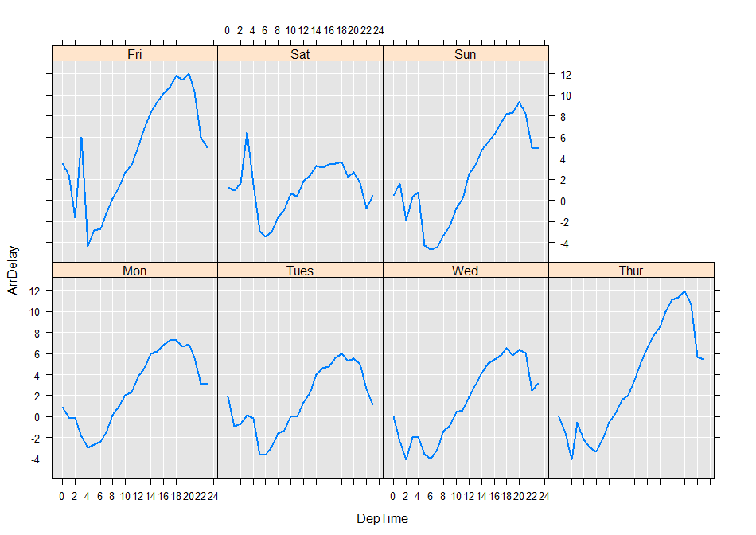

---

# required metadata
title: "RevoScaleR Distributed Computing Guide"
description: "Microsoft R Server in-database and cluster computing."
keywords: ""
author: "richcalaway"
manager: "mblythe"
ms.date: "03/17/2016"
ms.topic: "get-started-article"
ms.prod: "rserver"
ms.service: ""
ms.assetid: ""

# optional metadata
ROBOTS: ""
audience: ""
ms.devlang: ""
ms.reviewer: ""
ms.suite: ""
ms.tgt_pltfrm: ""
ms.technology: ""
ms.custom: ""

---

# RevoScaleR Distributed Computing Guide

## Introduction 

*Parallel computing* is the process of breaking a given job into computationally independent components and running those independent components on separate threads, cores, or computers and then combining the results into a single returned result. Since its first release, **RevoScaleR** has performed parallel computing on any computer with multiple computing cores. *Distributed computing* is often used as a synonym for parallel computing, but in **RevoScaleR** we make the following distinction: *distributed computing* always refers to computations distributed over more than one computer, while *parallel computing* can occur on one computer or many.

With **RevoScaleR** 2.0-0 and later, distributed computing capabilities are built in. This means that you can develop complex analysis scripts on your local computer, create one or more *compute contexts* for use with distributed computing resources, and then seamlessly move between executing scripts on the local computer and in a distributed context. We call this flexibility *Write Once, Deploy Anywhere*, or *WODA*. In practice, because some distributed platforms have specialized data handling requirements, you may also have to specify a context-specific *data source* along with the compute context, but the bulk of your analysis scripts can then proceed with no further changes.

**RevoScaleR**’s distributed computing capabilities vary by platform and the details for creating a compute context vary depending upon the specific framework used to support those distributed computing capabilities. However, once you have established a computing context, you can use the same **RevoScaleR** commands to manage your data, analyze data, and control computations in all frameworks.

>**Important!** Microsoft R Client has several limitations to consider:
>
>1. There are a maximum of three available cores -- one thread for reading and two for processing RevoScaleR HPA functions. 
>
>2. Since Microsoft R Client is in-memory bound, chunking is not supported. When run locally with R Client, the `blocksPerRead` argument is ignored and all data must be read into memory. When working with Big Data, this may result in memory exhaustion. You can work around this limitation when you push the compute context to a Microsoft R Server instance. You can also upgrade to a SQL Server license with R Server (standalone). 

### Distributed Computing: A Primer 

Distributed computing is everywhere these days, with much buzz in the media about “cloud computing,” distributed file systems such as Hadoop, and distributed databases such as the Teradata data warehouse. As enterprises attempt to extract business intelligence from ever growing data sources, distributed computing provides the best hope for successfully harnessing adequate computing power to perform the necessary analyses.

The essence of distributed computing, and parallel computing in general, is finding a way to break down a complicated computation into pieces that can be performed independently, while maintaining a framework that allows for the results of those independent computations to be put together to create the final result. Over the past thirty years, a number of mechanisms for distributed computing have been proposed and implemented, including PVM (Parallel Virtual Machine), MPI (Message-Passing Interface), and Linda (an example of a shared virtual memory model). Most such mechanisms were optimized to share tasks among the various computing resources, but could be slowed if large amounts of data needed to be transferred. These mechanisms are frequently discussed together under the general term *high-performance computing (HPC)*. HPC mechanisms are CPU-centric, involving tremendous amounts of processing on relatively small amounts of data. Common tasks tackled with HPC mechanisms include the family of *embarrassingly parallel* problems, such as element-by-element computations on arrays, or computation of membership in the Mandelbrot set. This family of problems also includes many types of simulation, where each individual run is independent of any others being computed.

To effectively deal with large data, a different paradigm is required. *High-performance analytics (HPA)* typically require less processing on a given chunk of data but focus on efficiently feeding data to the cores by means of efficient disk I/O, threading, and data management in memory. Instead of passing large amounts of data from node to node, the computations are distributed to the data. **RevoScaleR**, which is designed to process large data a chunk at a time, was built from the ground up so that each chunk of data could be processed independently, and so the extension to distributed computing is completely natural. **RevoScaleR** also provides a mechanism for processing distributed data, so that each computing resource needs access only to that portion of the total data source required for its particular computation.

### Distributed Computing with RevoScaleR 

**RevoScaleR** provides two main approaches for distributed computing. The first, the *master node* path, exemplifies the high-performance analytics approach: by simply establishing a distributed computing context object which specifies your distributed computing resources, you can call any of the following **RevoScaleR** analysis functions and have the computation proceed in parallel on the specified computing resources and return the answer to you:

- rxSummary
- rxLinMod
- rxLogit
- rxGlm
- rxCovCor (and its convenience functions, rxCov, rxCor, and rxSSCP)
- rxCube and rxCrossTabs
- rxKmeans
- rxDTree
- rxDForest
- rxBTrees
- rxNaiveBayes

In the master node approach, you submit a job by calling a **RevoScaleR** analysis function (we will also call these functions *HPA functions*). One of your available computing resources takes the job, thereby becoming the master node for that job. The master node distributes the computation to itself and the other computing nodes; gathers the results of the independent, parallel computations; and finalizes and returns the results. Examples of using the master node approach can be found in Chapter 3 and Chapter 4.

The second approach is via the **RevoScaleR** function rxExec, which allows you to run arbitrary R functions in a distributed fashion, using available nodes (computers) or available cores (the maximum of which is the sum over all available nodes of the processing cores on each node). The rxExec approach exemplifies the tradition high-performance computing approach: when using rxExec, you largely control how the computational tasks are distributed and you are responsible for any aggregation and final processing of results. Examples of this approach can be found in Chapter 6.

## About Compute Contexts 

A *compute context object*, or more briefly a *compute context*, is the key to distributed computing with **RevoScaleR**. The default compute context tells **RevoScaleR** to compute on the local computer. In the default compute context, high-performance analytics (HPA) functions such as *rxLinMod* are distributed only to the local cores, if there is more than one, and high-performance computations (HPC) submitted via *rxExec* are done sequentially. If you have supported distributed computing resources available to you, you can create a compute context object for those distributed computing resources, set your compute context using *rxOptions*, and then use those distributed computing resources in subsequent calls to **RevoScaleR**. You can create multiple compute context objects, and switch between them easily. You can also easily update existing compute context objects, for example, to add new computers as they come online.

The principal compute contexts are the following:

- RxLocalSeq: the default compute context described above. This compute context is available on all platforms.

- RxHadoopMR: the compute context used to distribute computations on a Hadoop cluster. This compute context can be used on a node (including an edge node) of a Cloudera (CDH4) or Hortonworks (HDP 1.3) cluster with a RHEL operating system, or a client with an SSH connection to such a cluster. For details on creating and using RxHadoopMR compute contexts, see the [*RevoScaleR Hadoop Getting Started Guide*](rserver-scaler-hadoop-getting-started.md).

- RxInTeradata: the compute context used to distribute computations in a Teradata appliance. For details on creating and using RxInTeradata compute contexts, see the [*RevoScaleR Teradata Getting Started Guide*](rserver-scaler-teradata-getting-started.md).

The RxInSqlServer compute context is a special case—it is similar to RxInTeradata in that it runs computations in-database, but it runs on only a single database node, so the computation is parallel, but not distributed. For details on creating and using RxInSqlServer compute contexts, see the [*RevoScaleR Sql Server Getting Started Guide*](rserver-scaler-sql-server-getting-started.md).

Two other specialized compute contexts, both of which are relevant only in HPC computations via *rxExec*, are discussed in ["Parallel Computing with rxExec"](#parallel-computing-with-rxexec).

### Compute Contexts and Data Sources 

In the local compute context, all of RevoScaleR’s supported data sources are available to you. In a distributed compute context, however, your choice of data sources may be severely limited. The most extreme case is the RxInTeradata compute context, which supports only the RxTeradata data source—this makes sense, as the computations are being performed on data inside the Teradata database. The following table shows the available combinations of compute contexts and data sources (x indicates available):

| Data Source | RxLocalSeq | RxHadoopMR | RxInTeraData | RxInSqlServer |
|-------------|------------|------------|--------------|---------------|
| Delimited Text (RxTextdata) | X | X |   |   |
| Fixed-Format Text (RxTextData) | X |   |   |   |
| .xdf data files (RxXdfData) | X | X |   |   |
| SAS data files (RxSasData) | X |   |   |   |
| SPSS data files (RxSpssData) | X |   |   |   |
| ODBC data (RxOdbcData) | X |   |   |   |
| Teradata database (RxTeradata) | X |   | X |   |
| SQL Server database (RxSqlServerData) |   |   |   | X |

Even when using a single data source type, however, there may be some differences depending on the file system type and compute context. For example, the .xdf files created on the Hadoop File System are somewhat different from .xdf files created in a non-distributed file system. (See the [*RevoScaleR Hadoop Getting Started Guide*](rserver-scaler-hadoop-getting-started.md) for details.) Similarly, prediction in a distributed compute context requires that the data be split across the available nodes. (See ["Managing Distributed Data"](#managing-distributed-data) for details.)

### Waiting and Non-waiting Compute Contexts 

By default, compute contexts are *waiting* (or *blocking*), that is, your R session waits for results from the job before returning control to you. For most RevoScaleR jobs, which return in a few seconds to perhaps a minute for a large data logistic regression, this is an appropriate choice. However, when running a big job (several minutes to several hours) on a cluster, it is often useful to send the job off to the cluster and then to be able to continue working in your local R session.  In this case, you can specify the compute context to be *non-waiting* (or *non-blocking*), in which case an object containing information about the pending job is returned and can be used to retrieve results later. To set the compute context object to run “no wait” jobs, set the argument *wait* to *FALSE*. For more information on non-waiting jobs, see ["Non-Waiting Jobs"](#non-waiting-jobs).

Another use for non-waiting compute contexts is for massively parallel jobs involving multiple clusters; you define a non-waiting compute context on each cluster, launch all your jobs, then aggregate the results from  all the jobs.

### Automatically Retrieving Cluster Console Output 

If you would like the console output from each of the cluster R processes to be printed to your user console, specify *consoleOutput=TRUE* in your compute context.

### Updating a Compute Context 

Once you have created a compute context object, you can modify it easily by using the same function you used to originally create it. Pass the name of the original object as its first argument, and then specify only those arguments you wish to modify as additional arguments. For example, if you want to change only the wait parameter of an HPC Server compute context *myCluster* from TRUE to FALSE, you can do that easily as follows:

	myCluster <- RxHpcServer(myCluster, wait=FALSE)

To obtain a list of the parameters available to change and their default values, use the args function with the name of the compute context constructor, for example:

	args(RxHpcServer)

which gives the following output:

	function (object, headNode = "", revoPath = NULL, shareDir = "", 
	    workingDir = NULL, dataPath = NULL, wait = TRUE, consoleOutput = FALSE, 
	    configFile = NULL, nodes = NULL, computeOnHeadNode = FALSE, 
	    minElems = -1, maxElems = -1, priority = 2, exclusive = FALSE, 
	    autoCleanup = TRUE, dataDistType = "all", packagesToLoad = NULL, 
	    email = NULL, resultsTimeout = 15, groups = "ComputeNodes") 

You can modify an existing compute context and set the modified context as the current compute context by calling *rxSetComputeContext*. For example, if you have defined *myCluster* to be a waiting cluster and want to set the current compute context to be non-waiting, you can call *rxSetComputeContext* as follows:

	rxSetComputeContext(myCluster, wait=FALSE)

The *rxSetComputeContext* function returns the previous compute context, so it can be used in constructions like the following:

    oldContext <- rxSetComputeContext(myCluster, wait=FALSE)
    …
    # do some computing with a non-waiting compute context
    …
    # restore previous compute context
    rxSetComputeContext(oldContext)

You can specify the compute context by name, as we have done here, but you can also specify it by calling a compute context constructor in the call to *rxSetComputeContext*. For example, to return to the local sequential compute context after using a cluster context, you can call *rxSetComputeContext* as follows:

	rxSetComputeContext(RxLocalSeq())

In this case, you can also use the descriptive string “local” to do the same thing:

	rxSetComputeContext("local")

### Creating Additional Compute Contexts 

For a given set of distributed computing resources, you may find it convenient to have multiple compute context objects. For example, you might have one compute context for waiting or blocking jobs and one for no-wait or non-blocking jobs. Or you might define one that uses all available nodes and another that specifies a particular set of nodes. Because the initial specification of a compute context can be somewhat tedious, it is usually simplest to create additional compute contexts by modifying an existing compute context, in precisely the same way as we updated a compute context in the previous section. For example, suppose instead of simply modifying our existing compute context from *wait=TRUE* to *wait=FALSE*, we create a new compute context for non-waiting jobs:

	myNoWaitCluster <- RxHpcServer(myCluster, wait=FALSE)

You may find it convenient to store your most commonly used compute context objects in an R script, or add their definitions to an R startup file.

## Running Distributed Analyses 

Once you have registered a distributed compute context, any of the following functions can be used to perform distributed computations:

- rxSummary
- rxLinMod
- rxLogit
- rxGlm
- rxCovCor (and its convenience functions, rxCov, rxCor, and rxSSCP)
- rxCube and rxCrossTabs
- rxKmeans
- rxDTree
- rxDForest
- rxBTrees
- rxNaiveBayes
- rxExec

We refer, here and elsewhere, to these functions (except *rxExec*) as the **RevoScaleR** *high-performance analytics*, or HPA functions. The exception, *rxExec*, is used to execute an arbitrary function on specified nodes (or cores) of your compute context; it can be used for traditional high-performance computing functions. The *rxExec* function offers great flexibility in how arguments are passed, so that you can specify that all nodes receive the same arguments, or provide different arguments to each node. We defer further discussion of *rxExec* until the Chapter 6.

Another class of distributed computing functions is the informational functions, such as *rxGetInfo* and *rxGetVarInfo*. Before beginning our data analysis, we first want to check to make sure that the data set we will be using is available on the compute resources. As a very simple example, we will ask each node for basic information about our data set using the *rxGetInfo* function. (In this chapter, we assume a simple compute context that takes default values for everything except the five site- and user-specific parameters; in particular, this makes all jobs waiting jobs, that is, the R prompt does not return until the job is completed.) 

We begin with the data source we created in our getting started guide, airData. We call *rxGetInfo* as follows:

	rxGetInfo(data=airData)

(If you have not just come from working through a getting started guide, you can define airData as follows:

	airData <- RxXdfData("AirOnTime2012.xdf")

where we assume AirOntime2012.xdf is in your dataPath. This file, together with a number of other large data files, is available from the [data set download site](http://packages.revolutionanalytics.com/datasets).)

On a five-node HPC Server cluster, the call to *rxGetInfo* returns the following:

    $CLUSTER_HEAD2
    File name: C:\data-RevoScaleR-AcceptanceTest\AirOnTime2012.xdf 
    Number of observations: 6096762 
    Number of variables: 46 
    Number of blocks: 31 
    Compression type: zlib 
    
    $COMPUTE10
    File name: C:\data-RevoScaleR-AcceptanceTest\AirOnTime2012.xdf 
    Number of observations: 6096762 
    Number of variables: 46 
    Number of blocks: 31 
    Compression type: zlib 
    
    $COMPUTE11
    File name: C:\data-RevoScaleR-AcceptanceTest\AirOnTime2012.xdf 
    Number of observations: 6096762 
    Number of variables: 46 
    Number of blocks: 31 
    Compression type: zlib 
    
    $COMPUTE12
    File name: C:\data-RevoScaleR-AcceptanceTest\AirOnTime2012.xdf 
    Number of observations: 6096762 
    Number of variables: 46 
    Number of blocks: 31 
    Compression type: zlib 
    
    $COMPUTE13
    File name: C:\data-RevoScaleR-AcceptanceTest\AirOnTime2012.xdf 
    Number of observations: 6096762 
    Number of variables: 46 
    Number of blocks: 31 
    Compression type: zlib

This confirms that our data set is in fact available on all nodes of our cluster. 

### Obtaining A Data Summary 

When you run one of **RevoScaleR**’s HPA functions in a distributed compute context, it automatically distributes the computation among the available compute resources and coordinates the returned values to create the final return value. Again, in the simplest case, the job is considered *blocking*, so that control is not returned until the computation is complete. We assume that the airline data has been copied to the appropriate data directory on all the computing resources and its location specified by the airData data source object.

>The `blocksPerRead` argument is ignored if run locally using R Client. [Learn more...](#chunking)

For example, we start by taking a summary of three variables from the airline data:

	rxSummary(~ ArrDelay + CRSDepTime + DayOfWeek, data=airData, 
		blocksPerRead=30)

We get the following results (identical to what we would have gotten from the same command in a local compute context):

	Call:
	rxSummary(formula = ~ArrDelay + CRSDepTime + DayOfWeek, data = airData, 
	    blocksPerRead = 30)

	Summary Statistics Results for: ~ArrDelay + CRSDepTime + DayOfWeek
	Data: airData (RxXdfData Data Source)
	File name: /var/RevoShare/v7alpha/aot12
	Number of valid observations: 6096762 
 
	 Name       Mean      StdDev    Min           Max        ValidObs MissingObs
	 ArrDelay    3.155596 35.510870 -411.00000000 1823.00000 6005381  91381     
	 CRSDepTime 13.457386  4.707193    0.01666667   23.98333 6096761      1     

	Category Counts for DayOfWeek
	Number of categories: 7
	Number of valid observations: 6096762
	Number of missing observations: 0

	 DayOfWeek Counts
	 Mon       916747
	 Tues      871412
	 Wed       883207
	 Thur      905827
	 Fri       910135
	 Sat       740232
	 Sun       869202

### Computing Average Arrival Delay Using rxCube 

We can perform an rxCube computation using the same data set to compute the average arrival delay for departures for each hour of the day for each day of the week. Again, the code is identical to the code used when performing the computations on a single computer, as are the results.

	delayArrCube <- rxCube(ArrDelay ~ F(CRSDepTime):DayOfWeek, 
		data=airData, blocksPerRead=30) 

>The `blocksPerRead` argument is ignored if run locally using R Client. [Learn more...](#chunking)

Notice that in this case we have returned an *rxCube* object.  We can use this object locally to, for example, extract a data frame and plot the results:

    plotData <- rxResultsDF( delayArrCube )
    names(plotData)[1] <- "DepTime"
    rxLinePlot(ArrDelay~DepTime|DayOfWeek, data=plotData)

### Cross-Tabulating Arrival Delay 

The rxCrossTabs function provides essentially the same computations as rxCube, but presents the results in a more traditional cross-tabulation. Here we look at late flights (those whose arrival delay is 15 or greater) by late departure and day of week:

	crossTabs <- rxCrossTabs(formula = ArrDel15 ~ F(DepDel15):DayOfWeek, 
	                         data = airData, means = TRUE)
	crossTabs

which yields:

	Call:
	rxCrossTabs(formula = ArrDel15 ~ F(DepDel15):DayOfWeek, data = airData, 
	    means = TRUE)

	Cross Tabulation Results for: ArrDel15 ~ F(DepDel15):DayOfWeek
	Data: airData (RxXdfData Data Source)
	File name: /var/RevoShare/v7alpha/AirlineOnTime2012
	Dependent variable(s): ArrDel15
	Number of valid observations: 6005381
	Number of missing observations: 91381 
	Statistic: means 
 
	ArrDel15 (means):
	          DayOfWeek
	F_DepDel15        Mon       Tues        Wed       Thur        Fri        Sat
	         0 0.04722548 0.04376271 0.04291565 0.05006577 0.05152312 0.04057934
	         1 0.79423651 0.78904905 0.79409615 0.80540551 0.81086142 0.76329539
	          DayOfWeek
	F_DepDel15        Sun
	         0 0.04435956
	         1 0.79111488

### Computing a Covariance or Correlation Matrix 

The rxCovCor function is used to compute covariance and correlation matrices; the convenience functions rxCov, rxCor, and rxSSCP all depend upon it and are usually used in practical situations. (See the [*RevoScaleR User’s Guide*](rserver-scaler-user-guide-15-covcor.md) for examples.) The following example shows how the main function can be used directly:

    covForm <- ~ DepDelayMinutes + ArrDelayMinutes + AirTime
    cov <- rxCovCor(formula = covForm, data = airData, type = "Cov")
    cor <- rxCovCor(formula = covForm, data = airData, type = "Cor")
    cov   # covariance matrix
    Call:
    rxCovCor(formula = ~DepDelayMinutes + ArrDelayMinutes + AirTime, 
	    data = <S4 object of class structure("RxXdfData", package = "RevoScaleR")>, 
	    type = "Cov")

	Data: <S4 object of class structure("RxXdfData", package = "RevoScaleR")> (RxXdfData Data Source)
	File name: /var/RevoShare/v7alpha/AirlineOnTime2012
	Number of valid observations: 6005381
	Number of missing observations: 91381 
	Statistic: COV 
 
	                DepDelayMinutes ArrDelayMinutes    AirTime
	DepDelayMinutes      1035.09355       996.88898   39.60668
	ArrDelayMinutes       996.88898      1029.07742   59.77224
	AirTime                39.60668        59.77224 4906.02279
	cor   # correlation matrix
	Call:
	rxCovCor(formula = ~DepDelayMinutes + ArrDelayMinutes + AirTime, 
	    data = <S4 object of class structure("RxXdfData", package = "RevoScaleR")>, 
	    type = "Cor")

	Data: <S4 object of class structure("RxXdfData", package = "RevoScaleR")> (RxXdfData Data Source)
	File name: /var/RevoShare/v7alpha/AirlineOnTime2012
	Number of valid observations: 6005381
	Number of missing observations: 91381 
	Statistic: COR 
 
	                DepDelayMinutes ArrDelayMinutes    AirTime
	DepDelayMinutes      1.00000000      0.96590179 0.01757575
	ArrDelayMinutes      0.96590179      1.00000000 0.02660178
	AirTime              0.01757575      0.02660178 1.00000000

### Computing a Linear Model 

We can model the arrival delay as a function of day of the week, departure time, and flight distance as follows:

	linModObj <- rxLinMod(ArrDelay~ DayOfWeek + F(CRSDepTime) + Distance, 
	    data = airData)

We can then view a summary of the results as follows:

	summary(linModObj)
	Call:
	rxLinMod(formula = ArrDelay ~ DayOfWeek + F(CRSDepTime) + Distance, 
	    data = airData)

	Linear Regression Results for: ArrDelay ~ DayOfWeek + F(CRSDepTime) +
	    Distance
	Data: airData (RxXdfData Data Source)
	File name: /var/RevoShare/v7alpha/AirlineOnTime2012
	Dependent variable(s): ArrDelay
	Total independent variables: 33 (Including number dropped: 2)
	Number of valid observations: 6005380
	Number of missing observations: 91382 
 
	Coefficients: (2 not defined because of singularities)
	                  Estimate Std. Error t value Pr(>|t|)    
	(Intercept)      3.570e+00  2.053e-01  17.389 2.22e-16 ***
	DayOfWeek=Mon    1.014e+00  5.320e-02  19.061 2.22e-16 ***
	DayOfWeek=Tues  -7.077e-01  5.389e-02 -13.131 2.22e-16 ***
	DayOfWeek=Wed   -3.503e-01  5.369e-02  -6.524 6.85e-11 ***
	DayOfWeek=Thur   2.122e+00  5.334e-02  39.782 2.22e-16 ***
	DayOfWeek=Fri    3.089e+00  5.327e-02  57.976 2.22e-16 ***
	DayOfWeek=Sat   -1.343e+00  5.615e-02 -23.925 2.22e-16 ***
	DayOfWeek=Sun      Dropped    Dropped Dropped  Dropped    
	F_CRSDepTime=0  -2.283e+00  4.548e-01  -5.020 5.17e-07 ***
	F_CRSDepTime=1  -3.277e+00  6.035e-01  -5.429 5.65e-08 ***
	F_CRSDepTime=2  -4.926e+00  1.223e+00  -4.028 5.63e-05 ***
	F_CRSDepTime=3  -2.316e+00  1.525e+00  -1.519 0.128881    
	F_CRSDepTime=4  -5.063e+00  1.388e+00  -3.648 0.000265 ***
	F_CRSDepTime=5  -7.178e+00  2.377e-01 -30.197 2.22e-16 ***
	F_CRSDepTime=6  -7.317e+00  2.065e-01 -35.441 2.22e-16 ***
	F_CRSDepTime=7  -6.397e+00  2.065e-01 -30.976 2.22e-16 ***
	F_CRSDepTime=8  -4.907e+00  2.061e-01 -23.812 2.22e-16 ***
	F_CRSDepTime=9  -4.211e+00  2.074e-01 -20.307 2.22e-16 ***
	F_CRSDepTime=10 -2.857e+00  2.070e-01 -13.803 2.22e-16 ***
	F_CRSDepTime=11 -2.537e+00  2.069e-01 -12.262 2.22e-16 ***
	F_CRSDepTime=12 -9.556e-01  2.073e-01  -4.609 4.05e-06 ***
	F_CRSDepTime=13  1.180e-01  2.070e-01   0.570 0.568599    
	F_CRSDepTime=14  1.470e+00  2.073e-01   7.090 2.22e-16 ***
	F_CRSDepTime=15  2.147e+00  2.076e-01  10.343 2.22e-16 ***
	F_CRSDepTime=16  2.701e+00  2.074e-01  13.023 2.22e-16 ***
	F_CRSDepTime=17  3.447e+00  2.065e-01  16.688 2.22e-16 ***
	F_CRSDepTime=18  4.080e+00  2.080e-01  19.614 2.22e-16 ***
	F_CRSDepTime=19  3.649e+00  2.079e-01  17.553 2.22e-16 ***
	F_CRSDepTime=20  4.216e+00  2.119e-01  19.895 2.22e-16 ***
	F_CRSDepTime=21  3.276e+00  2.151e-01  15.225 2.22e-16 ***
	F_CRSDepTime=22 -1.729e-01  2.284e-01  -0.757 0.449026    
	F_CRSDepTime=23    Dropped    Dropped Dropped  Dropped    
	Distance        -4.220e-04  2.476e-05 -17.043 2.22e-16 ***
	---
	Signif. codes:  0 ‘***’ 0.001 ‘***’ 0.01 ‘*’ 0.05 ‘.’ 0.1 ‘ ’ 1

	Residual standard error: 35.27 on 6005349 degrees of freedom
	Multiple R-squared: 0.01372 
	Adjusted R-squared: 0.01372 
	F-statistic:  2785 on 30 and 6005349 DF,  p-value: < 2.2e-16 
	Condition number: 442.0146

### Computing a Logistic Regression 

We can compute a similar logistic regression using the logical variable ArrDel15 as the response. This variable specifies whether a flight’s arrival delay was 15 minutes or greater:

	logitObj <- rxLogit(ArrDel15~DayOfWeek + F(CRSDepTime) + Distance, 
	    data = airData)
	summary(logitObj)

	Call:
	rxLogit(formula = ArrDel15 ~ DayOfWeek + F(CRSDepTime) + Distance, 
	    data = airData)

	Logistic Regression Results for: ArrDel15 ~ DayOfWeek + F(CRSDepTime) +
	    Distance
	Data: airData (RxXdfData Data Source)
	File name: /var/RevoShare/v7alpha/AirlineOnTime2012
	Dependent variable(s): ArrDel15
	Total independent variables: 33 (Including number dropped: 2)
	Number of valid observations: 6005380 
	-2*LogLikelihood: 5320489.0684 (Residual deviance on 6005349 degrees of freedom)
	 
	Coefficients:
	                  Estimate Std. Error  z value Pr(>|z|)    
	(Intercept)     -1.740e+00  1.492e-02 -116.602 2.22e-16 ***
	DayOfWeek=Mon    7.852e-02  4.060e-03   19.341 2.22e-16 ***
	DayOfWeek=Tues  -5.222e-02  4.202e-03  -12.428 2.22e-16 ***
	DayOfWeek=Wed   -4.431e-02  4.178e-03  -10.606 2.22e-16 ***
	DayOfWeek=Thur   1.593e-01  4.023e-03   39.596 2.22e-16 ***
	DayOfWeek=Fri    2.225e-01  3.981e-03   55.875 2.22e-16 ***
	DayOfWeek=Sat   -8.336e-02  4.425e-03  -18.839 2.22e-16 ***
	DayOfWeek=Sun      Dropped    Dropped  Dropped  Dropped    
	F_CRSDepTime=0  -2.537e-01  3.555e-02   -7.138 2.22e-16 ***
	F_CRSDepTime=1  -3.852e-01  4.916e-02   -7.836 2.22e-16 ***
	F_CRSDepTime=2  -4.118e-01  1.032e-01   -3.989 6.63e-05 ***
	F_CRSDepTime=3  -1.046e-01  1.169e-01   -0.895 0.370940    
	F_CRSDepTime=4  -4.402e-01  1.202e-01   -3.662 0.000251 ***
	F_CRSDepTime=5  -9.115e-01  2.008e-02  -45.395 2.22e-16 ***
	F_CRSDepTime=6  -8.934e-01  1.553e-02  -57.510 2.22e-16 ***
	F_CRSDepTime=7  -6.559e-01  1.536e-02  -42.716 2.22e-16 ***
	F_CRSDepTime=8  -4.608e-01  1.518e-02  -30.364 2.22e-16 ***
	F_CRSDepTime=9  -3.657e-01  1.525e-02  -23.975 2.22e-16 ***
	F_CRSDepTime=10 -2.305e-01  1.514e-02  -15.220 2.22e-16 ***
	F_CRSDepTime=11 -1.868e-01  1.512e-02  -12.359 2.22e-16 ***
	F_CRSDepTime=12 -6.100e-02  1.509e-02   -4.041 5.32e-05 ***
	F_CRSDepTime=13  4.476e-02  1.503e-02    2.979 0.002896 ***
	F_CRSDepTime=14  1.573e-01  1.501e-02   10.480 2.22e-16 ***
	F_CRSDepTime=15  2.218e-01  1.500e-02   14.786 2.22e-16 ***
	F_CRSDepTime=16  2.718e-01  1.498e-02   18.144 2.22e-16 ***
	F_CRSDepTime=17  3.468e-01  1.489e-02   23.284 2.22e-16 ***
	F_CRSDepTime=18  4.008e-01  1.498e-02   26.762 2.22e-16 ***
	F_CRSDepTime=19  4.023e-01  1.497e-02   26.875 2.22e-16 ***
	F_CRSDepTime=20  4.484e-01  1.520e-02   29.489 2.22e-16 ***
	F_CRSDepTime=21  3.767e-01  1.543e-02   24.419 2.22e-16 ***
	F_CRSDepTime=22  8.995e-02  1.656e-02    5.433 5.55e-08 ***
	F_CRSDepTime=23    Dropped    Dropped  Dropped  Dropped    
	Distance         1.336e-04  1.829e-06   73.057 2.22e-16 ***
	---
	Signif. codes:  0 ‘***’ 0.001 ‘***’ 0.01 ‘*’ 0.05 ‘.’ 0.1 ‘ ’ 1
	
	Condition number of final variance-covariance matrix: 445.2487 
	Number of iterations: 5

### Viewing Console Output 

You may notice when running distributed computations that you get virtually no feedback while running waiting jobs. Since the computations are in general not running on the same computer as your R Console, the “usual” feedback is not returned by default. However, you can set the *consoleOutput* parameter in your compute context to TRUE to enable return of console output from all the nodes. For example, here we update our compute context *myCluster* to include *consoleOutput=TRUE*:

>The `blocksPerRead` argument is ignored if run locally using R Client. [Learn more...](#chunking)

	myCluster <- RxHpcServer(myCluster, consoleOutput=TRUE)
	rxOptions(computeContext=myCluster)

Then, rerunning our previous example results in much more verbose output:

	delayArrCube <- rxCube(ArrDelay ~ F(CRSDepTime):DayOfWeek, 
		data="AirlineData87to08.xdf", blocksPerRead=30)  

	======  CLUSTER-HEAD2  ( process  1 ) has started run at 
	Thu Aug 11 15:56:10 2011  ====== 
	**********************************************************************  
	Worker Node 'COMPUTE10' has received a task from Master Node 'CLUSTER-HEAD2'.... Thu Aug 11 15:56:10.791 2011 
	**********************************************************************  
	Worker Node 'COMPUTE11' has received a task from Master Node 'CLUSTER-HEAD2'.... Thu Aug 11 15:56:10.757 2011 
	**********************************************************************  
	Worker Node 'COMPUTE12' has received a task from Master Node 'CLUSTER-HEAD2'.... Thu Aug 11 15:56:10.769 2011 
	**********************************************************************  
	Worker Node 'COMPUTE13' has received a task from Master Node 'CLUSTER-HEAD2'.... Thu Aug 11 15:56:10.889 2011 
	 
	 
	 
	 
	COMPUTE13: Rows Read: 4440596, Total Rows Processed: 4440596, Total Chunk Time: 0.031 seconds 
	COMPUTE11: Rows Read: 4361843, Total Rows Processed: 4361843, Total Chunk Time: 0.031 seconds 
	COMPUTE12: Rows Read: 4467780, Total Rows Processed: 4467780, Total Chunk Time: 0.031 seconds 
	COMPUTE10: Rows Read: 4492157, Total Rows Processed: 4492157, Total Chunk Time: 0.047 seconds 
	COMPUTE13: Rows Read: 4500000, Total Rows Processed: 8940596, Total Chunk Time: 0.062 seconds 
	COMPUTE12: Rows Read: 4371359, Total Rows Processed: 8839139, Total Chunk Time: 0.078 seconds 
	COMPUTE10: Rows Read: 4470501, Total Rows Processed: 8962658, Total Chunk Time: 0.062 seconds 
	COMPUTE11: Rows Read: 4500000, Total Rows Processed: 8861843, Total Chunk Time: 0.078 seconds 
	COMPUTE13: Rows Read: 4441922, Total Rows Processed: 13382518, Total Chunk Time: 0.078 seconds 
	COMPUTE10: Rows Read: 4430048, Total Rows Processed: 13392706, Total Chunk Time: 0.078 seconds 
	COMPUTE12: Rows Read: 4500000, Total Rows Processed: 13339139, Total Chunk Time: 0.062 seconds 
	COMPUTE11: Rows Read: 4484721, Total Rows Processed: 13346564, Total Chunk Time: 0.062 seconds 
	COMPUTE13: Rows Read: 4500000, Total Rows Processed: 17882518, Total Chunk Time: 0.063 seconds 
	COMPUTE12: Rows Read: 4388540, Total Rows Processed: 17727679, Total Chunk Time: 0.078 seconds 
	COMPUTE10: Rows Read: 4500000, Total Rows Processed: 17892706, Total Chunk Time: 0.078 seconds 
	COMPUTE11: Rows Read: 4477884, Total Rows Processed: 17824448, Total Chunk Time: 0.078 seconds 
	COMPUTE13: Rows Read: 4453215, Total Rows Processed: 22335733, Total Chunk Time: 0.078 seconds 
	COMPUTE12: Rows Read: 4429270, Total Rows Processed: 22156949, Total Chunk Time: 0.063 seconds 
	COMPUTE10: Rows Read: 4427435, Total Rows Processed: 22320141, Total Chunk Time: 0.063 seconds 
	COMPUTE11: Rows Read: 4483047, Total Rows Processed: 22307495, Total Chunk Time: 0.078 seconds 
	COMPUTE13: Rows Read: 2659728, Total Rows Processed: 24995461, Total Chunk Time: 0.062 seconds 
	COMPUTE12: Rows Read: 2400000, Total Rows Processed: 24556949, Total Chunk Time: 0.078 seconds 
	Worker Node 'COMPUTE13' has completed its task successfully. Thu Aug 11 15:56:11.341 2011 
	Elapsed time: 0.453 secs. 
	**********************************************************************  
	 
	Worker Node 'COMPUTE12' has completed its task successfully. Thu Aug 11 15:56:11.221 2011 
	Elapsed time: 0.453 secs. 
	**********************************************************************  
	 
	COMPUTE10: Rows Read: 2351983, Total Rows Processed: 24672124, Total Chunk Time: 0.078 seconds 
	COMPUTE11: Rows Read: 2400000, Total Rows Processed: 24707495, Total Chunk Time: 0.078 seconds 
	Worker Node 'COMPUTE10' has completed its task successfully. Thu Aug 11 15:56:11.244 2011 
	Elapsed time: 0.453 secs. 
	**********************************************************************  
	 
	Worker Node 'COMPUTE11' has completed its task successfully. Thu Aug 11 15:56:11.209 2011 
	Elapsed time: 0.453 secs. 
	**********************************************************************  
	 
	**********************************************************************  
	Master node [CLUSTER-HEAD2] is starting a task.... Thu Aug 11 15:56:10.961 2011 
	CLUSTER-HEAD2: Rows Read: 4461826, Total Rows Processed: 4461826, Total Chunk Time: 0.038 seconds 
	CLUSTER-HEAD2: Rows Read: 4452096, Total Rows Processed: 8913922, Total Chunk Time: 0.071 seconds 
	CLUSTER-HEAD2: Rows Read: 4441200, Total Rows Processed: 13355122, Total Chunk Time: 0.075 seconds 
	CLUSTER-HEAD2: Rows Read: 4370893, Total Rows Processed: 17726015, Total Chunk Time: 0.074 seconds 
	CLUSTER-HEAD2: Rows Read: 4476925, Total Rows Processed: 22202940, Total Chunk Time: 0.071 seconds 
	CLUSTER-HEAD2: Rows Read: 2400000, Total Rows Processed: 24602940, Total Chunk Time: 0.072 seconds 
	Master node [CLUSTER-HEAD2] has completed its task successfully. Thu Aug 11 15:56:11.410 2011 
	Elapsed time: 0.449 secs. 
	**********************************************************************  
	Time to compute summary on all servers: 0.461 secs. 
	Processing results on client ... 
	Computation time: 0.471 seconds. 
	======  CLUSTER-HEAD2  ( process  1 ) has completed run at  Thu Aug 11 15:56:11 2011  ======

### Converting a Waiting Job to a Non-Waiting Job and Cancelling a Job 

Suppose you submit a job a “waiting” job, and then realize that you’d prefer to be able to work in your R session on the local computer while it is running.  In Windows, simply pressing the Esc will return the cursor to your screen. Depending on how quickly you press Esc, your job will either be canceled (if it has not yet been accepted by the job scheduler), or will continue to run on the cluster. For all jobs that run on the cluster, the object *rxgLastPendingJob* is automatically created.  Similarly, on Red Hat Enterprise Linux, pressing Ctrl-C will return the cursor to your screen, and either cancel the job or convert it to a non-waiting job.

You can use the *rxgLastPendingJob* object to retrieve your results later or to cancel the job.  (See Chapter 4 on Non-Waiting Jobs for more information.)

## Non-Waiting Jobs 

In the previous chapter, we focused exclusively on *waiting* or *blocking* jobs. In this chapter we concentrate on *non-waiting* or *non-blocking* jobs, which allow you to send time-intensive jobs to your distributed compute context where they can proceed on their own while you continue to work on your R Console for the duration of the computation. This can be useful, for example, if you expect the distributed computations to take a significant amount of time, and when such computations are managed by a job scheduler.

### Creating Non-Blocking Jobs 

To create non-waiting jobs, you simply set wait=FALSE in your compute context object:

	myNoWaitCluster <-  RxHpcServer(
		headNode="cluster-head2",
		shareDir="\\AllShare\\myName", 
		revoPath="C:\\Program Files\\Microsoft\\MRO-for-RRE\\8.0\\R-3.2.2\\bin\\x64\\",
		dataPath="C:\\data",
		computeOnHeadNode= TRUE,
		wait=FALSE)
	rxOptions(computeContext=myNoWaitCluster)

When *wait* is set to *FALSE*, a job information object rather than a job results object is returned from the submitted job. You should always *assign* this result so that you can use it to obtain job status while the job is running and obtain the job results when the job completes. For example, returning to our initial waiting job example, calling *rxExec* to get data set information, in the non-blocking case we augment our call to *rxExec* with an assignment, and then use the assigned object as input to the *rxGetJobStatus* and *rxGetJobResults* functions:

	airData <- "AirlineData87to08.xdf"
	job1 <- rxExec(rxGetInfo, data=airData)
	rxGetJobStatus(job1)

If you call rxGetJobStatus quickly, it may show us that the job is "running", but if called after a few seconds (or longer if another job of higher priority is ahead in the queue) it should report "finished", at which point we can ask for the results:

	rxGetJobResults(job1)

As in the case of the waiting job, we obtain the following results from our five-node HPC Server cluster (note that the name of the head node is mangled here to be an R syntactic name):

	$CLUSTER_HEAD2
	File name: C:\data\AirlineData87to08.xdf 
	Number of observations: 123534969 
	Number of variables: 30 
	Number of blocks: 832 
	
	$COMPUTE10
	File name: C:\data\AirlineData87to08.xdf 
	Number of observations: 123534969 
	Number of variables: 30 
	Number of blocks: 832 
	
	$COMPUTE11
	File name: C:\data\AirlineData87to08.xdf 
	Number of observations: 123534969 
	Number of variables: 30 
	Number of blocks: 832 
	
	$COMPUTE12
	File name: C:\data\AirlineData87to08.xdf 
	Number of observations: 123534969 
	Number of variables: 30 
	Number of blocks: 832 
	
	$COMPUTE13
	File name: C:\data\AirlineData87to08.xdf 
	Number of observations: 123534969 
	Number of variables: 30 
	Number of blocks: 832

Running a linear model on the airline data is more likely to show us the "running" status:

	delayArrJobInfo <- rxLinMod(ArrDelay ~ DayOfWeek, 
		data=airData,  cube=TRUE, blocksPerRead=30)
	rxGetJobStatus(delayArrJobInfo)

This shows us the following:

	[1] "running"

Calling rxGetJobStatus again a few seconds later shows us that the job has completed:

	rxGetJobStatus(delayArrJobInfo)
	
	[1] "finished" 

If we are using our R Productivity Environment, we can view the job status by clicking on the object’s name in the Object Browser:

>[!IMPORTANT]
> The R Productivity Environment (RPE) is available only for version 8.0.0 of Revolution R Enterprise 2016. It does not apply to Microsoft R Server 2016 or Microsoft R Client.
 
We can then call rxGetJobResults to obtain the actual computation results:

	delayArr <- rxGetJobResults(delayArrJobInfo)
	delayArr

As in the blocking case, this gives the following results:

	Call:
	rxLinMod(formula = ArrDelay ~ DayOfWeek, data = "AirlineData87to08.xdf", 
	    cube = TRUE, blocksPerRead = 30)
	
	Cube Linear Regression Results for: ArrDelay ~ DayOfWeek
	File name: C:\data\AirlineData87to08.xdf
	Dependent variable(s): ArrDelay
	Total independent variables: 7 
	Number of valid observations: 120947440
	Number of missing observations: 2587529 
	 
	Coefficients:
	                    ArrDelay
	DayOfWeek=Monday    6.669515
	DayOfWeek=Tuesday   5.960421
	DayOfWeek=Wednesday 7.091502
	DayOfWeek=Thursday  8.945047
	DayOfWeek=Friday    9.606953
	DayOfWeek=Saturday  4.187419
	DayOfWeek=Sunday    6.525040

### Capturing the Job Information 

If you forget to assign the job information object when you first submit your job, don’t panic. **RevoScaleR** saves the job information for the last pending job as the object *rxgLastPendingJob*. You can assign this value to a more specific name at any time until you submit another non-blocking job.
 
	rxOptions(computeContext=myNoWaitCluster)
	rxLinMod(ArrDelay ~ DayOfWeek, data="AirlineData87to08.xdf",  
		cube=TRUE, blocksPerRead=30)
	delayArrJobInfo <- rxgLastPendingJob
	rxGetJobStatus(delayArrJobInfo)

>The `blocksPerRead` argument is ignored if run locally using R Client. [Learn more...](#chunking)

Also, as in all R sessions, the last value returned can be accessed as *.Last.value;* if you remember immediately that you forgot to assign the result, you can simply assign *.Last.value* to your desired job name and be done. 

For jobs older than the last pending job, you can use *rxGetJobs* to obtain all the jobs associated with a given compute context. More details on *rxGetJobs* can be found in the next chapter.

### Canceling a Non-Waiting Job 

Suppose you submit a job and realize you’ve mis-specified the formula. In the non-waiting case, it is easy to cancel your job simply by calling *rxCancelJob* with the job information object you saved when you submitted the job:

	rxCancelJob(job1)

### Non-Waiting Logistic Regression 

Logistic regression uses an iteratively re-weighted least squares algorithm, and thus in general requires multiple passes through the data for successive iterations. This makes it a logical candidate for non-waiting distributed computing. For example, we replicated the large airline data set 8 times to create a data set with about one billion observations. We also added a variable Late to indicate which flights were at least fifteen minutes late. To find the probability of a late flight by day of week, we perform the following logistic regression:

	job2 <- rxLogit(Late ~ DayOfWeek, data = "AirlineData87to08Rep8.xdf")

This immediately returns control back to our R Console, and we can do some other things while this 1-billion observation logistic regression completes on our distributed computing resources. (Although even with one billion observations, the logistic regression completes in less than a minute.)

We verify that the job is finished and retrieve the results as follows:

	rxGetJobStatus(job2)
	logitResults <- rxGetJobResults(job2)
	summary(logitResults)

We obtain the following results:

	Call:
	rxLogit(formula = Late ~ DayOfWeek, data = "AirlineData87to08Rep8.xdf")
	
	Logistic Regression Results for: Late ~ DayOfWeek
	File name: C:\data\AirlineData87to08Rep8.xdf
	Dependent variable(s): Late
	Total independent variables: 8 (Including number dropped: 1)
	Number of valid observations: 967579520
	Number of missing observations: 20700232 
	-2*LogLikelihood: 947605223.9911 (Residual deviance on 967579513 degrees of freedom)
	 
	Coefficients:
	                      Estimate Std. Error  t value Pr(>|t|)    
	(Intercept)         -1.4691555  0.0002209 -6651.17 2.22e-16 ***
	DayOfWeek=Monday    -0.0083930  0.0003088   -27.18 2.22e-16 ***
	DayOfWeek=Tuesday   -0.0559740  0.0003115  -179.67 2.22e-16 ***
	DayOfWeek=Wednesday  0.0386048  0.0003068   125.82 2.22e-16 ***
	DayOfWeek=Thursday   0.1862203  0.0003006   619.41 2.22e-16 ***
	DayOfWeek=Friday     0.2388796  0.0002985   800.14 2.22e-16 ***
	DayOfWeek=Saturday  -0.1785315  0.0003285  -543.45 2.22e-16 ***
	DayOfWeek=Sunday       Dropped    Dropped  Dropped  Dropped    
	---
	Signif. codes:  0 '***' 0.001 '***' 0.01 '*' 0.05 '.' 0.1 ' ' 1 
	
	Condition number of final variance-covariance matrix: 78.6309 
	Number of iterations: 2

## Cleaning Up after Distributed Computing 

Normally, whenever a waiting job completes or whenever you call *rxGetJobResults* to obtain the results of a non-waiting job, any artifacts created during the distributed computation are automatically removed. (This is controlled by the *autoCleanup* flag to the compute context constructor, which defaults to *TRUE*.) However, if a waiting job fails to complete for some reason, or you do not collect all the results from your non-waiting jobs, you may begin to accumulate artifacts on your distributed computing resources. Eventually, this could fill the storage space on these resources, causing system slowdown or malfunction. It is therefore a best practice to make sure you clean up your distributed computing resources from time to time. One way to do this is to simply use standard operating system tools to delete files from the various shared and working directories you specified in your compute context objects. But **RevoScaleR** also supplies a number of tools to help you remove any accumulated artifacts.

The first of these, *rxGetJobs*, allows you to get a list of all the jobs associated with a given compute context. By default, it matches just the head node (if available) and shared directory specified in the compute context; if you re-use these two specifications, ALL the jobs associated with that head node and shared directory are returned:

	myJobs <- rxGetJobs(myNoWaitCluster)

To restrict the matching to only those jobs associated with that specific compute context, specify *exactMatch=TRUE* when calling *rxGetJobs*.

	myJobs <- rxGetJobs(myNoWaitCluster, exactMatch=TRUE)

To obtain the jobs from a specified range of times, use the *startTime* and *endTime* arguments. For example, to obtain a list of jobs for a particular day, you could use something like the following:

	myJobs <- rxGetJobs(myNoWaitCluster, 
		startTime=as.POSIXct("2013/01/16 0:00"), 
		endTime=as.POSIXct("2013/01/16 23:59"))	

Once you’ve obtained the list of jobs, you can try to clean them up using *rxCleanupJobs*:

	rxCleanupJobs(myJobs)

If any of the jobs is in a "finished" state, *rxCleanupJobs* will not clean up that job but instead warn you that the job is finished and that you can access the results with *rxGetJobResults*. This helps prevent data loss. You can, however, force the cleanup by specifying *force=TRUE* in the call to *rxCleanupJobs*:

	rxCleanupJobs(myJobs, force=TRUE)

You can also use *rxCleanupJobs* to clean up individual jobs:

	rxCleanupJobs(job1)

## Parallel Computing with rxExec 

While the **RevoScaleR** HPA functions are engineered to work in parallel automatically, other R functions always run sequentially. As we have seen, the *rxExec* function allows you to take an arbitrary function and run it in parallel on your distributed computing resources. This in turn allows you to tackle a large variety of parallel computing problems, in particular those of the *high-performance computing class* described in Chapter 1. In this chapter, we will use parallel computations to simulate a dice-rolling game, determine the probability that any two persons in a given group size share a birthday, create a plot of the Mandelbrot set, and perform naive k-means clustering. 

In general, the only required arguments to rxExec are the function to be run and any required arguments of that function. Additional arguments can be used to control the computation. Most of these are introduced in the examples of this chapter, and the remainder are discussed in Section 6.10. The rxExec help file discusses all of these arguments in detail.

>[!IMPORTANT]
> Before trying the examples in this chapter, set your compute context to one of the following: RxLocalParallel, RxHpcServer, RxHadoopMR, or RxInTeradata (depending on the compute resources available to you) and be sure that your compute context has the option *wait=TRUE* if available; later in the chapter we will show how some of the examples can be rewritten to work in a non-blocking compute context, but start with the simpler, blocking case.

### Playing Dice: A Simulation 

A familiar casino game consists of rolling a pair of dice. If you roll a 7 or 11 on your initial roll, you win. If you roll 2, 3, or 12, you lose. If you roll a 4, 5, 6, 8, 9, or 10, that number becomes your *point* and you continue rolling until you either roll your point again (in which case you win) or roll a 7, in which case you lose. The game is easily simulated in R using the following function:

	playDice <- function()
	{
		result <- NULL
		point <- NULL
		count <- 1
		while (is.null(result))
		{
			roll <- sum(sample(6, 2, replace=TRUE))
			
			if (is.null(point))
			{
				point <- roll
			}
			if (count == 1 && (roll == 7 || roll == 11))
			{ 
				result <- "Win"
			}
	 		else if (count == 1 && (roll == 2 || roll == 3 || roll == 12)) 
			{
				result <- "Loss"
			} 
			else if (count > 1 && roll == 7 )
			{
				result <- "Loss"
			} 
			else if (count > 1 && point == roll)
			{
				result <- "Win"
			} 
			else
			{
				count <- count + 1
			}
		}
		result
	}

We will now use rxExec to play thousands of games to help determine the probability of a win. Using a five-node HPC Server cluster, we play the game 10000 times, 2000 times on each node:

	z <- rxExec(playDice, timesToRun=10000, taskChunkSize=2000)
	table(unlist(z))	
	
	Loss  Win 
	5087 4913

We expect approximately 4929 wins in 10000 trials, and our result of 4913 wins is pretty close.

### The Birthday Problem 

The birthday problem is an old standby in introductory statistics classes because its result seems counterintuitive. In a group of about 25 people, the chances are better than 50-50 that at least two people in the room will share a birthday. Put 50 people in a room and you are practically guaranteed there will be a birthday-sharing pair. Since 50 is so much less than 365, most people are surprised by this result.

We can use the following function to estimate the probability of at least one birthday-sharing pair in groups of various sizes (the first line of the function is what allows us to obtain results for more than one value at a time; the remaining calculations are for a single n):

	"pbirthday" <- function(n, ntests=5000)
	{   
		if (length(n) > 1L) return(sapply(n, pbirthday, ntests = ntests))
	
		daysInYear <- seq.int(365)
		anydup <- function(i)
		{
			any(duplicated(sample(daysInYear, size = n, replace = TRUE)))
		}
		   
		prob <- sum(sapply(seq.int(ntests), anydup)) / ntests
		names(prob) <- n
		prob
	}

We can test that it works in a sequential setting, estimating the probability for group sizes 3, 25, and 50 as follows:

	pbirthday(c(3,25,50))

For each group size, 5000 random tests were performed. For this run, the following results were returned:

	     3     25     50 
	0.0078 0.5710 0.9726

Make sure your compute context is set to a “waiting” context.  Then distribute this computation for groups of 2 to 100 using *rxExec* as follows, using *rxElemArg* to specify a different argument for each call to pbirthday, and then using the *taskChunkSize* argument to pass these arguments to the nodes in chunks of 20:

	z <- rxExec(pbirthday, n=rxElemArg(2:100), taskChunkSize=20)

The results will be returned in a list, with one element for each node. We can use *unlist* to convert the results into a single vector:

	probSameBD <- unlist(z)

We can make a colorful plot of the results by constructing variables for the party sizes and the nodes where each computation was performed:

	partySize <- 2:100
	nodes <- as.factor( rep(1:5, each=20)[2:100])
	levels(nodes) <- paste("Node", levels(nodes))
	birthdayData <- data.frame(probSameBD, partySize, nodes)
	
	rxLinePlot( probSameBD~partySize, groups = nodes, data=birthdayData, 
		type = "p", 
		xTitle = "Party Size",
		yTitle = "Probability of Same Birthday",
		title = "Our Rockin Soiree!")

The resulting plot is shown below:

### Plotting the Mandelbrot Set 

Computing the Mandelbrot set is a popular parallel computing example because it involves a simple computation performed independently on an array of points in the complex plane. For any point *z=x+yi* in the complex plane, *z* belongs to the Mandelbrot set if and only if *z* remains bounded under the iteration *z_(n+1)=z_n^2+z_n*. If we are associating a point (*x_0,y_0*) in the plane with a pixel on a computer screen, the following R function returns the number of iterations before the point becomes unbounded, or the maximum number of iterations. If the maximum number of iterations is returned, the point is assumed to be in the set:

	mandelbrot <- function(x0,y0,lim)
	{
		x <- x0; y <- y0
		iter <- 0
		while (x^2 + y^2 < 4 && iter < lim)
		{
			xtemp <- x^2 - y^2 + x0
			y <- 2 * x * y + y0
			x <- xtemp
			iter <- iter + 1
		}
		iter
	}

The following function retains the basic computation but returns a vector of results for a given y value:

	vmandelbrot <- function(xvec, y0, lim)
	{
		unlist(lapply(xvec, mandelbrot, y0=y0, lim=lim))
	}

We can then distribute this computation by computing several rows at a time on each compute resource. In the following, we create an input x vector of length 240, a y vector of length 240, and specify the iteration limit as 100. We then call *rxExec* with our *vmandelbrot* function, giving 1/5 of the y vector to each computational node in our five node HPC Server cluster. This should be done in a compute context with *wait=TRUE*. Finally, we put the results into a 240x240 matrix and create an image plot that shows the familiar Mandelbrot set:

	x.in <- seq(-2.0, 0.6, length.out=240)
	y.in <- seq(-1.3, 1.3, length.out=240)	
	m <- 100
	z <- rxExec(vmandelbrot, x.in,y0=rxElemArg(y.in), m, taskChunkSize=48, 
			execObjects="mandelbrot")	
	z <- matrix(unlist(z), ncol=240)
	image(x.in, y.in, z, col=c(rainbow(m), '#000000'), useRaster=TRUE)

The resulting plot is shown below (not all graphics devices support the useRaster argument; if your plot is empty, try omitting that argument):

### Naïve Parallel k-Means Clustering 

**RevoScaleR** has a built-in analysis function, *rxKmeans*, to perform distributed k-means, but in this section we see how the regular R kmeans function can be put to use in a distributed context. 

The kmeans function implements several *iterative relocation* algorithms for clustering. An iterative relocation algorithm starts from an initial classification and then iteratively moves data points from one cluster to another to reduce sums of squares. One possible starting point is to simply pick cluster centers at random and then assign points to each cluster so that the sum of squares is minimized. If this procedure is repeated many times for different sets of centers, the set with the smallest error can be chosen.

We can do this with the ordinary kmeans function, which has a parameter *nstart* that tells it how many times to pick the starting centers, and also to pick the set of centers that returns a result with smallest error:

	x <- matrix(rnorm(250000), nrow = 5000, ncol = 50)
	system.time(kmeans(x, centers=10, iter.max = 35, nstart = 400))

On a Dell XPS laptop with 8GB of RAM, this takes about a minute and a half. 

To parallelize this efficiently, we should do the following:

- Pass the data to a specified number of computing resources just once.
- Split the work into smaller tasks for passing to each computing resource.
- Combine the results from all the computing resources so the best result is returned.

In the case of *kmeans*, we can ask for the computations to be done by *cores*, rather than by *nodes*. (Currently, the *elemType* argument is honored only for *RxHpcServer* compute contexts. See the *rxExec* help file for details.) And because we are distributing the computation, we can do fewer repetitions (*nstarts*) on each compute element. We can do all of this with the following function (again, this should be run with a compute context for which *wait=TRUE*):

	kMeansRSR <- function(x, centers=5, iter.max=10, nstart=1)
	{
		numTimes <- 20
		results <- rxExec(FUN = kmeans, x=x, centers=centers, iter.max=iter.max, 
			nstart=nstart, elemType="cores", timesToRun=numTimes)	
		best <- 1
		bestSS <- sum(results[[1]]$withinss)
		for (j in 1:numTimes)
		{
		      jSS <- sum(results[[j]]$withinss)
		      if (bestSS > jSS)
		      {
		              best <- j
		             bestSS <- jSS
			  }
		}
		results[[best]]	
	}	

Notice that in our *kMeansRSR* function we are letting the underlying *kmeans* function find nstart sets of centers per call and the choice of “best” is done in our function after we have called *kmeans numTimes*. No parallelization is done to *kmeans* itself.
  
With our *kMeansRSR* function, we can then repeat the computation from before:

	system.time(kMeansRSR(x, 10, 35, 20))	

With our 5-node HPC Server cluster, this reduces the time from a minute and a half to about 15 seconds.

### Parallel Random Number Generation 

When generating random numbers in parallel computation, a frequent problem is the possibility of highly correlated random number streams. High quality parallel random number generators avoid this problem. RevoScaleR includes several high quality parallel random number generators and these can be used with rxExec to improve the quality of your parallel simulations. 

By default, a parallel version of the Mersenne-Twister random number generator is used that supports 6024 separate substreams. We can set it to work on our dice example by setting a non-null seed:

	z <- rxExec(playDice, timesToRun=10000, taskChunkSize=2000, RNGseed=777)
	table(unlist(z))

This makes our simulation repeatable:

	Loss  Win 
	5104 4896
	
	z <- rxExec(playDice, timesToRun=10000, taskChunkSize=2000, RNGseed=777)
	table(unlist(z))
	
	Loss  Win 
	5104 4896

This random number generator can be asked for explicitly by specifying RNGkind="MT2203":

	z <- rxExec(playDice, timesToRun=10000, taskChunkSize=2000, RNGseed=777,
	    RNGkind="MT2203")
	table(unlist(z))

	Loss  Win 
	5104 4896

We can build reproducibility into our naïve k-means example as follows:

	kMeansRSR <- function(x, centers=5, iter.max=10, nstart=1, numTimes = 20, seed = NULL)
	{
		results <- rxExec(FUN = kmeans, x=x, centers=centers, iter.max=iter.max, 
			nstart=nstart, elemType="cores", timesToRun=numTimes, RNGseed = seed)	
		best <- 1
		bestSS <- sum(results[[1]]$withinss)
		for (j in 1:numTimes)
		{
		      jSS <- sum(results[[j]]$withinss)
		      if (bestSS > jSS)
		      {
		              best <- j
		             bestSS <- jSS
			  }
		}
		results[[best]]	
	}	
	km1 <- kMeansRSR(x, 10, 35, 20, seed=777)
	km2 <- kMeansRSR(x, 10, 35, 20, seed=777)
	all.equal(km1, km2)
	
	  [1] TRUE

To obtain the default random number generators without setting a seed, specify "auto" as the argument to either RNGseed or RNGkind:

	x3 <- rxExec(runif, 500, timesToRun=5, RNGkind="auto")
	x4 <- rxExec(runif, 500, timesToRun=5, RNGseed="auto")

To verify that we are actually getting uncorrelated streams, we can use runif within rxExec to generate a list of vectors of random vectors, then use the cor function to measure the correlation between vectors:

	x <- rxExec(runif, 500, timesToRun=5, RNGkind="MT2203")
	x.df <- data.frame(x)
	corx <- cor(x.df)
	diag(corx) <- 0
	any(abs(corx)> 0.3)

None of the correlations is above 0.3; in repeated runs of the code, the maximum correlation seldom exceeded 0.1.
 
Because the MT2203 generator offers such a rich array of substreams, we recommend its use. You can, however, use several other generators, all from Intel’s Vector Statistical Library, a component of the Intel Math Kernel Library. The available generators are as follows: "MCG31", "R250", "MRG32K3A", "MCG59", "MT19937", "MT2203", "SFMT19937" (all of which are pseudo-random number generators which can be used to generate uncorrelated random number streams) plus "SOBOL" and "NIEDERR", which are quasi-random number generators that do not generate uncorrelated random number streams. Detailed descriptions of the available generators can be found in the [Vector Statistical Library Notes](http://software.intel.com/sites/products/documentation/doclib/mkl_sa/11/vslnotes/vslnotes.pdf). 

#### A Note on Reproducibility 

For distributed compute contexts, rxExec starts the random number streams on a per-worker basis; if there are more tasks than workers, you may not obtain completely reproducible results because different tasks may be performed by randomly chosen workers. If you need completely reproducible results, you can use the taskChunkSize argument to force the number of task *chunks* to be less than or equal to the number of workers—this will ensure that each chunk of tasks is performed on a single random number stream. You can also define a custom function that includes random number generation control within it; this moves the random number control into each task. See the help file for rxRngNewStream for details.

### Working with Results from Non-Blocking Jobs 

So far in this chapter, all of our examples have required a blocking, or waiting, compute context so that we could make immediate use of the results returned by rxExec. But as we saw in the chapter on non-blocking jobs, some computations will be so time consuming that it is not practical to wait on the results. In such cases, it is probably best to divide your analysis into two or more pieces, one of which can be structured as a non-blocking job, and then use the pending job (or more usefully, the job results, when available) as input to the remaining pieces.

For example, let’s return to the birthday example, and see how to restructure our analysis to use a non-blocking job for the distributed computations. The pbirthday function itself requires no changes, and our variable specifying the number of ntests can be used as is:

	"pbirthday" <- function(n, ntests=5000)
	{   
		if (length(n) > 1L) return(sapply(n, pbirthday, ntests = ntests))
	
		daysInYear <- seq.int(365)
		anydup <- function(i)
		{
			any(duplicated(sample(daysInYear, size = n, replace = TRUE)))
		}
		   
		prob <- sum(sapply(seq.int(ntests), anydup)) / ntests
		names(prob) <- n
		prob
	}
	ntests <- 2000

However, when we call rxExec, the return object will no longer be the results list, but a jobInfo object:

	z <- rxExec(pbirthday, n=rxElemArg(2:100), ntests=ntests, taskChunkSize=20)

We check the job status:

	rxGetJobStatus(z)
	
	  [1] "finished"

We can then proceed almost as before:

	probSameBD <- unlist(rxGetJobResults(z))
	partySize <- 2:100
	nodes = as.factor( rep(1:5, each=20)[2:100])
	levels(nodes) <- paste("Node", levels(nodes))
	birthdayData <- data.frame(probSameBD, partySize, nodes)
	
	rxLinePlot( probSameBD~partySize, groups = nodes, data=birthdayData, 
		type = "p", 
		xTitle = "Party Size",
		yTitle = "Probability of Same Birthday",
		title = "Our Rockin Soiree!")

The other examples are a bit trickier, in that the result of the calls to rxExec were embedded in functions. But again, dividing the computations into distributed and non-distributed components can help—the distributed computations can be non-blocking, and the non-distributed portions can then be applied to the results. Thus the kmeans example can be rewritten thus:

	genKmeansClusters <- function(x, centers=5, iter.max=10, nstart=1)
	{
		numTimes <- 20
		rxExec(FUN = kmeans, x=x, centers=centers, iter.max=iter.max, 
			nstart=nstart, elemType="cores", timesToRun=numTimes)
	}
	
	findKmeansBest <- function(results){
		numTimes <- length(results)
		best <- 1
		bestSS <- sum(results[[1]]$withinss)
		for (j in 1:numTimes)
		{
		      jSS <- sum(results[[j]]$withinss)
		      if (bestSS > jSS)
		      {
		              best <- j
		             bestSS <- jSS
			  }
		}
		results[[best]]	
	}	
	
To run this in our non-blocking cluster context, we do the following:

	x <- matrix(rnorm(250000), nrow = 5000, ncol = 50)	
	z <- genKmeansClusters(x, 10, 35, 20)

Once we see that z’s job status is “finished”, we can run findKmeansBest on the results:

	findKmeansBest(rxGetJobResults(z))

### Calling HPA Functions from rxExec 

To this point, none of the functions we have called with rxExec has been a RevoScaleR function, because our intent has been to show how rxExec can be used to address the large class of traditional high-performance computing problems. However, there is no inherent reason why rxExec cannot be used with RevoScaleR’s HPA functions, and many times it can be extremely useful to do so. For example, if you are running a cluster on which every node has two or more cores, you can use rxExec to start an independent analysis on each node, and each of those analyses can take advantage of the multiple cores on its node. The following simulation simulates data from a Poisson distribution and then fits a generalized linear model to the simulated data:

	"SimAndEstimatePoisson" <- function(nobs, trials)
	{
	    "SimulatePoissonData" <- function(nobs)
	    {
		    x1 <- log(runif(nobs, min=.5, max=1.5))
		    x2 <- log(runif(nobs, min=.5, max=1.5))
	
		    b0 <- 0
		    b1 <- 1
		    b2 <- 2
		    lambda <- exp(b0 + b1*x1 + b2*x2)
	        count <- rpois(nobs,lambda)
			pSim <- data.frame(count=count, x1=x1, x2=x2)
	    }
	 
	    cf <- NULL
	    rxOptions(reportProgress = 0)
	    for (i in 1:trials)
	    {
			simData <- SimulatePoissonData(nobs)
			result1 <- rxGlm(count~x1+x2,data=simData,family=poisson())
		    cf <- rbind(cf,as.double(coefficients(result1)))
	    }
	    cf       
	}

If we call the above function with rxExec on a five-node cluster compute context, we get five simulations running simultaneously, and can easily produce 1000 simulations as follows:

	rxExec(SimAndEstimatePoisson, nobs=50000, trials=10, elemType = "nodes", 
	    taskChunkSize=5, timesToRun=100)

It is important to recognize the distinction between running an HPA function with a distributed compute context, and calling an HPA function using rxExec with a distributed compute context. In the former case, we are fitting just one model, using the distributed compute context to farm out portions of the computations, but ultimately returning just one model object. In the latter case, we are calculating one model per task, the tasks being farmed out to the various nodes or cores as desired, and a list of models is returned.

### Using rxExec in the Local Compute Context 

By default, if you call *rxExec* in the local compute context, your computation is run sequentially on your local machine. However, you can incorporate parallel computing on your local machine using the special compute context RxLocalParallel as follows:

	rxSetComputeContext(RxLocalParallel())

This allows the ParallelR package doParallel to distribute the computation among the available cores of your computer.

If you are using random numbers in the local parallel context, be aware that rxExec chooses a number of workers based on the number of tasks and the current value of rxGetOption(“numCoresToUse”). If you want to guarantee that each task is run with a separate random number stream, set rxOptions(numCoresToUse) equal to the number of tasks, and explicitly set timesToRun to the number of tasks. For example, if we want a list consisting of five sets of uniform random numbers, we could do the following to obtain reproducible results:

	rxOptions(numCoresToUse=5)
	x1 <- rxExec(runif, 500, timesToRun=5, RNGkind="MT2203", RNGseed=14)
	x2 <- rxExec(runif, 500, timesToRun=5, RNGkind="MT2203", RNGseed=14)
	all.equal(x1, x2)

>[!NOTE]
>HPA functions are not affected by the RxLocalParallel compute context; they will run locally and in the usual internally distributed fashion when the RxLocalParallel compute context is in effect.

### Using rxExec with foreach Back Ends 

If you do not have access to a Hadoop cluster or enterprise database, but do have access to a cluster via PVM, MPI, socket, or NetWorkSpaces connections or a multicore workstation, you can use rxExec with an arbitrary foreach backend (doParallel, doSNOW, doMPI, etc.) Simply register your parallel backend as usual and then set your RevoScaleR compute context using the special compute context RxForeachDoPar:

	rxSetComputeContext(RxForeachDoPar())

For example, here is how you might start a SNOW-like cluster connection with the doParallel back end:

	library(doParallel)
	cl <- makeCluster(4)
	registerDoParallel(cl)
	rxSetComputeContext(RxForeachDoPar())

You then call rxExec as usual. The computations are automatically directed to the registered foreach back end.

>[!WARNING]
> HPA functions are not usually affected by the RxForeachDoPar compute context; they will run locally and in the usual internally distributed fashion when the RxForeachDoPar compute context is in effect. The one exception is when HPA functions are called within rxExec; in this case it is possible that the internal threading of the HPA functions can be affected by the launch mechanism of the parallel backend workers. The doMC backend and the multicore-like backend of doParallel both use forking to launch their workers; this is known to be incompatible with the HPA functions.

### Controlling rxExec Computations 

As we have seen in these examples, there are several arguments to *rxExec* that allow you to fine-tune your *rxExec* commands. Both the birthday example and the Mandelbrot example used the *taskChunkSize* argument to specify how many tasks should go to each worker. The Mandelbrot example also used the *execObjects* argument, which can be used to pass either a character vector or an environment containing objects—the objects specified by the vector or contained in the environment are added to the environment of the function specified in the FUN argument, unless that environment is locked, in which case they are added to the parent frame in which *FUN* is evaluated. (If you use an environment, it should be one you create with *parent=emptyenv();* this allows you to pass only those objects you need to the function’s environment.) These two examples also show the use of *rxElemArg* in passing arguments to the workers. In the kmeans example, we met the *elemType* and *timesToRun* arguments. The *packagesToLoad* argument allows you to specify packages to load on each worker. The *consoleOutput* and *autoCleanup* flags serve the same purpose as their counterparts in the compute context constructor functions—that is, they can be used to specify whether console output should be displayed or the associated task files should be cleaned up on job completion for an individual call to *rxExec*. 

Two additional arguments remain to be introduced: *oncePerElem* and *continueOnFailure*. The *oncePerElem* argument restricts the called function to be run just once per allotted node; this is frequently used with the *timesToRun* argument to ensure that each occurrence is run on a separate node. The *oncePerElem* argument, however, can only be set to *TRUE* if *elemType="nodes"*. It must be set to *FALSE* if *elemType="cores"*.

If *oncePerElem* is *TRUE* and *elemType="nodes"*, *rxExec*’s results are returned in a list with components named by node. If a given node does not have a valid R syntactic name, its name is mangled to become a valid R syntactic name for use in the return list.

The *continueOnFailure* argument is used to say that a computation should continue even if one or more of the compute elements fails for some reason; this is useful, for example, if you are running several thousand independent simulations and It doesn’t matter if you get results for all of them. Using *continueOnFailure=TRUE* (the default), you will get results for all compute elements that finish the simulation and error messages for the compute elements that fail.

>[!NOTE]
> The arguments *elemType*, *consoleOutput*, *autoCleanup*, *continueOnFailure*, and *oncePerElem* are ignored by the special compute contexts RxLocalParallel and RxForeachDoPar. 

## Using RevoScaleR with foreach: Package doRSR 

The foreach package provides a for-loop-like approach to parallel computing that has proven quite popular. Developed by Microsoft, foreach is an open source package that is bundled with Microsoft R but is also available on the Comprehensive R Archive Network, CRAN. Parallel backends have been written for a variety of parallel computing packages, including nws, snow, and rmpi. If you need to share parallel code with users of other R distributions, writing that code using foreach provides considerable flexibility. To execute that code in Microsoft R using your distributed computing resources, you can use the doRSR package.

The doRSR package is a parallel backend for RevoScaleR, built on top of rxExec, and included with all RevoScaleR distributions. To get started using it, simply load the doRSR package and register the backend:

	library(doRSR)
	registerDoRSR()

The doRSR package uses your current compute context to determine how to run your job. In most cases, the job is run via rxExec, sequentially in the local compute context and in parallel in a distributed compute context. In the special case where you are in the local compute context and have set rxOptions(useDoParallel=TRUE), doRSR will pass your foreach jobs to the doParallel package for execution in parallel using multiple cores on your machine.

A simple example is this one from the foreach help file:

	foreach(i=1:3) %dopar% sqrt(i)

This returns, as expected, a list containing the square roots of 1, 2, and 3:

	[[1]]
	[1] 1
	
	[[2]]
	[1] 1.414214
	
	[[3]]
	[1] 1.732051

Another example is what the help file reports as a “simple (and inefficient) parallel matrix multiply”:

	a <- matrix(1:16, 4, 4)
	b <- t(a)
	foreach(b=iter(b, by='col'), .combine=cbind) %dopar%
	  (a %*% b)

This returns the multiplied matrix:

	     [,1] [,2] [,3] [,4]
	[1,]  276  304  332  360
	[2,]  304  336  368  400
	[3,]  332  368  404  440
	[4,]  360  400  440  480

### A Simple Simulation: Playing Dice 

We introduced the simulation function playDice in the previous chapter; it simulates a single game of dice rolling. We then used rxExec to play 10000 games. Now we will use foreach to play 10000 games:

	z1 <- foreach(i=1:10000, .options.rsr=list(chunkSize=2000)) %dopar% playDice()
	table(unlist(z1))		
	
	Loss  Win 
	5079 4921

Again, we get about the expected number of wins. If you time the rxExec version versus the foreach version using doRSR, you will find the rxExec version several times faster. This is to be expected; foreach is a high-level interface allowing access to many different back ends, including RevoScaleR’s rxExec. It will necessarily be slower than calling those back ends directly. 

### Another Version of kmeans 

Also in the previous chapter, we created a function kmeansRSR to perform a naïve parallelization of the standard R kmeans function. We can do the same thing with foreach directly as follows:

	kMeansForeach <- function(x, centers=5, iter.max=10, nstart=1)
	{
		numTimes <- 20
		results <- foreach(i=1:numTimes) %dopar% kmeans(x=x, centers=centers, iter.max=iter.max, 
			nstart=nstart)	
		best <- 1
		bestSS <- sum(results[[1]]$withinss)
		for (j in 1:numTimes)
		{
		      jSS <- sum(results[[j]]$withinss)
		      if (bestSS > jSS)
		      {
		              best <- j
		             bestSS <- jSS
			  }
		}
		results[[best]]	
	}	

Recall that the idea was to run a specified number of kmeans fits, then find the best set of results, where “best” is the result with the lowest within-group sum of squares. We can run this function as follows:

	x <- matrix(rnorm(250000), nrow = 5000, ncol = 50)
	kMeansForeach(x, 10, 35, 20)

## Managing Distributed Data 

There are several basic approaches to data management in distributed computing: 

1.	On systems with traditional file systems, you can either put all the data on all the nodes or distribute only the data that a node requires for its computations to that particular node. In such file systems, it is important that the data be local to the nodes rather than accessed over a network; for large data sets, the computation time for network-accessed data can be many times slower than for local data. In these systems, we recommend using standard .xdf files or “split” .xdf files (see ["Distributing Data with rxSplit"](#distributing-data-with-rxsplit)).

2.	In the Hadoop Distributed File System, the data is distributed automatically, typically to a subset of the nodes, and the computations are also distributed to the nodes containing the required data. On this system, we recommend “composite” .xdf files, which are specialized files designed to be managed by HDFS. 

3.	In a Teradata Distributed Data Warehouse, you can perform distributed computations in-database using the RxInTeradata compute context.

For distributing high volumes of data over large networks, custom-engineered network/file-server solutions are probably appropriate.

## Distributing Data with rxSplit  

For some computations, such as those involving distributed prediction, it is most efficient to perform the computations on a distributed data set, one in which each node sees only the data it is supposed to work on. You can split an .xdf file into portions suitable for distribution using the function *rxSplit*. For example, to split the large airline data into five files for distribution on a five node cluster, you could use *rxSplit* as follows:

	rxOptions(computeContext="local")
	bigAirlineData <- "C:/data/AirlineData87to08.xdf"
	rxSplit(bigAirlineData, numOutFiles=5)

By default, *rxSplit* simply appends a number in the sequence from 1 to *numOutFiles* to the base file name to create the new file names, and in this case the resulting file names, for example, “AirlineData87to081.xdf”, are a bit confusing. You can exercise greater control over the output file names by using the *outFilesBase* and *outFilesSuffixes* arguments. With *outFilesBase*, you can specify either a single character string to be used for all files or a character vector the same length as the desired number of files. The latter option is useful, for example, if you would like to create four files with the same file name, but different paths:

	nodepaths <- paste("compute", 10:13, sep="")
	basenames <- file.path("C:", nodepaths, "DistAirlineData")
	rxSplit(bigAirlineData, outFilesBase=basenames)

This creates the four directories C:/compute10, etc., and creates a file named “DistAirlineData.xdf” in each directory. You will want to do something like this when using distributed data with the standard **RevoScaleR** analysis functions such as rxLinMod and rxLogit.

You can supply the *outFilesSuffixes* arguments to exercise greater control over what is appended to the end of each file. Returning to our first example, we can add a hyphen between our base file name and the sequence 1 to 5 using *outFilesSuffixes* as follows:

	rxSplit(bigAirlineData, outFileSuffixes=paste("-", 1:5, sep=""))

The splitBy argument specifies whether to split your data file row-by-row or block-by-block. The default is *splitBy="rows"*, to split by blocks instead, specify *splitBy="blocks"*. The *splitBy* argument is ignored if you also specify the *splitByFactor* argument as a character string representing a valid factor variable. In this case, one file is created per level of the factor variable.

The *rxSplit* function works in the local compute context only; once you’ve split the file you need to distribute the resulting files to the individual nodes using the techniques of the previous sections. You should then specify a compute context with the flag *dataDistType* set to *"split"*. Once you have done this, HPA functions such as *rxLinMod* will know to split their computations according to the data on each node.

### Data Analysis with Split Data 

To use split data in your distributed data analysis, the first step is generally to split the data using rxSplit, which as we have seen is a local operation. So the next step is then to copy the split data to your cluster nodes. For the HPA functions such as rxLinMod, the split data must be found somewhere in your specified *dataPath* on each node. For example, to perform this example, we copied the split airline data DistAirlineData.xdf to the C:\data\distributed directory on each of the nodes compute10, compute11, compute12, and compute13. We could, however, have placed the split data in a different place on each node, so long as each of the locations was somewhere in the list of directories in *dataPath*.

Next, create a compute context that specifies *dataDistType="split"*. For example, here is our original HPC Server cluster compute context, with this flag added and with the distributed data folder added to the data path:

	myCluster <- RxHpcServer(
	headNode="cluster-head2",	
	revoPath="C:\\Program Files\\Microsoft\\MRO-for-RRE\\8.0\\R-3.2.2\\bin\\x64\\",
	    shareDir="\\AllShare\\myName",
	dataPath=c("C:\\data","C:\\data\\distributed"),
	dataDistType="split")
	rxSetComputeContext(myCluster)

We are now ready to fit a simple linear model:

	AirlineLmDist <- rxLinMod(ArrDelay ~ DayOfWeek, 
		data="DistAirlineData.xdf",  cube=TRUE, blocksPerRead=30)

>The `blocksPerRead` argument is ignored if run locally using R Client. [Learn more...](#chunking)

When we print the object, we see that we obtain the same model as when computed with the full data on all nodes:

	Call:
	rxLinMod(formula = ArrDelay ~ DayOfWeek, data = "DistAirlineData.xdf", 
	    cube = TRUE, blocksPerRead = 30)
	
	Cube Linear Regression Results for: ArrDelay ~ DayOfWeek
	File name: C:\data\distributed\DistAirlineData.xdf
	Dependent variable(s): ArrDelay
	Total independent variables: 7 
	Number of valid observations: 120947440
	Number of missing observations: 2587529 
	 
	Coefficients:
	                    ArrDelay
	DayOfWeek=Monday    6.669515
	DayOfWeek=Tuesday   5.960421
	DayOfWeek=Wednesday 7.091502
	DayOfWeek=Thursday  8.945047
	DayOfWeek=Friday    9.606953
	DayOfWeek=Saturday  4.187419
	DayOfWeek=Sunday    6.525040

With data in the .xdf format, you have your choice of using the full data set or a split data set on each node. For other data sources, you must have the data split across the nodes. For example, the airline data’s original form is a set of .csv files, one for each year from 1987 to 2008. (Additional years are now available, but have not been included in our big airline data.) If we copy the year 2000 data to compute10, the year 2001 data to compute11, the year 2002 data to compute12, and the year 2003 data to compute13 with the file name SplitAirline.csv, we can analyze the data as follows:

	textDS <- RxTextData( file = "C:/data/distributed/SplitAirline.csv",
	              varsToKeep = c( "ArrDelay", "CRSDepTime", "DayOfWeek" ), 
	              colInfo = list(ArrDelay   = list( type = "integer" ), 
	                        CRSDepTime = list( type = "integer" ),
	                        DayOfWeek  = list( type = "integer" ) )
	           )
	rxSummary( ArrDelay ~ F( DayOfWeek, low = 1, high = 7 ), textDS )

We can then perform an rxLogit model to classify flights as “Late” as follows:

	computeLate <- function( dataList )
	{
	    dataList$Late <- dataList$ArrDelay>15
	    return( dataList )
	}
	
	rxLogitFitSplitCsv <- rxLogit( Late ~ CRSDepTime + F( DayOfWeek, low = 1,
	                          high = 7 ), data = textDS, 
	                          transformVars = c( "ArrDelay" ),
	                          transformFunc=computeLate, verbose=1 )

### Distributed Prediction 

You can predict (or score) from a fitted model in a distributed context, but in this case, your data *must* be split. For example, if we fit our distributed linear model with *covCoef=TRUE* (and *cube=FALSE*), we can compute standard errors for the predicted values:

	AirlineLmDist <- rxLinMod(ArrDelay ~ DayOfWeek, 
		data="DistAirlineData.xdf",  covCoef=TRUE, blocksPerRead=30)
	rxPredict(AirlineLmDist, data="DistAirlineData.xdf", 	outData="errDistAirlineData.xdf",
		computeStdErrors=TRUE, computeResiduals=TRUE)

>The `blocksPerRead` argument is ignored if run locally using R Client. [Learn more...](#chunking)

The output data is also split, in this case holding fitted values, residuals, and standard errors for the predicted values.

### Creating Split Training and Test Data Sets 

One common technique for validating models is to break the data to be analyzed into training and test subsamples, then fit the model using the training data and score it by predicting on the test data. Once you have split your original data set onto your cluster nodes, you can split the data on the individual nodes by calling rxSplit again within a call to rxExec. If you specify the RNGseed argument to rxExec (see ["Parallel Random Number Generation"](#parallel-random-number-generation)), the split becomes reproducible:

	rxExec(rxSplit, inData="C:/data/distributed/DistAirlineData.xdf", 
		outFilesBase="airlineData", 
		outFileSuffixes=c("Test", "Train"), 
		splitByFactor="testSplitVar", 
		varsToKeep=c("Late", "ArrDelay", "DayOfWeek", "CRSDepTime"),
		overwrite=TRUE,
		transforms=list(testSplitVar = factor( sample(c("Test", "Train"),
			size=.rxNumRows, replace=TRUE, prob=c(.10, .9)), 
			levels= c("Test", "Train"))), rngSeed=17, consoleOutput=TRUE)

The result is two new data files, airlineData.testSplitVar.Train.xdf and airlineData.testSplitVar.Test.xdf, on each of your nodes. We can fit the model to the training data and predict with the test data as follows:

	AirlineLmDist <- rxLinMod(ArrDelay ~ DayOfWeek, 
		data="airlineData.testSplitVar.Train.xdf",  covCoef=TRUE, blocksPerRead=30)
	rxPredict(AirlineLmDist, data="airlineData.testSplitVar.Test.xdf", 
		computeStdErrors=TRUE, computeResiduals=TRUE)

>The `blocksPerRead` argument is ignored if run locally using R Client. [Learn more...](#chunking)

### Performing Data Operations on Each Node 

To create or modify data on each node, use the data manipulation functions within rxExec. For example, suppose that after looking at the airline data we decide to create a “cleaner” version of it by keeping only the flights where: there is information on the arrival delay,  the flight did not depart more than one hour early, and the actual and scheduled flight time is positive. We can put a call to *rxDataStep* (and any other code we want processed) into a function to be processed on each node via *rxExec*:

	newAirData <-  function()
	{
	    airData <- "AirlineData87to08.xdf"
	    rxDataStep(inData = airData, outFile = "C:\\data\\airlineNew.xdf", 
		   rowSelection = !is.na(ArrDelay) & 
	        (DepDelay > -60) & (ActualElapsedTime > 0) & (CRSElapsedTime > 0),
			blocksPerRead = 20, overwrite = TRUE)
	}
	rxExec( newAirData )

>The `blocksPerRead` argument is ignored if run locally using R Client. [Learn more...](#chunking)

### Installing Packages on Each Node 

Another use of rxExec is to use it to install third-party packages from CRAN or another repository. For example, to install the SuppDists package on all the nodes of your cluster, call rxExec as follows:

	rxExec(install.packages, "SuppDists")
