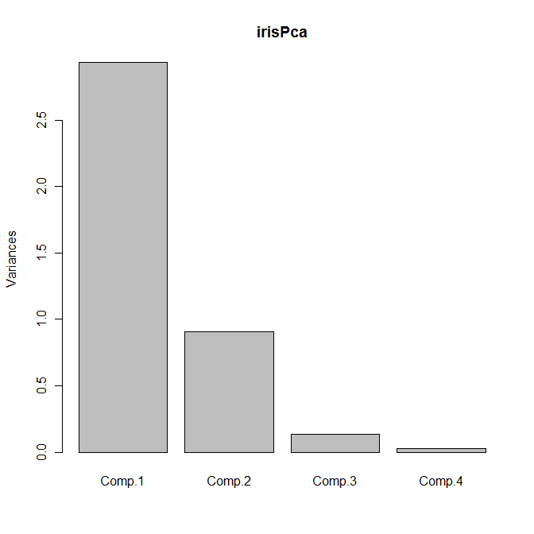
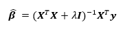
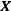

---

# required metadata
title: "RevoScaleR User's Guide--Estimating Correlation and Variance/Covariance Matrices"
description: "Correlation and variance/covariance matrices in RevoScaleR."
keywords: ""
author: "richcalaway"
manager: "mblythe"
ms.date: "03/17/2016"
ms.topic: "get-started-article"
ms.prod: "rserver"
ms.service: ""
ms.assetid: ""

# optional metadata
ROBOTS: ""
audience: ""
ms.devlang: ""
ms.reviewer: ""
ms.suite: ""
ms.tgt_pltfrm: ""
ms.technology: ""
ms.custom: ""

---

# Estimating Correlation and Variance/Covariance Matrices

The *rxCovCor* function in RevoScaleR calculates the covariance, correlation, or sum of squares/cross-product matrix for a set of variables in an .xdf file or data frame. The size of these matrices is determined by the number of variables rather than the number of observations, so typically the results can easily fit into memory in R. A broad category of analyses can be computed from some form of a cross-product matrix, for example, factor analysis and principal components.

A cross-product matrix is a matrix of the form X'X, where X represents an arbitrary set of raw or standardized variables. More generally, this is a matrix of the form X'WX, where W is a diagonal weighting matrix.

### Computing Cross-Product Matrices

While rxCovCor is the primary tool for computing covariance, correlation, and other cross-product matrices, you will seldom call it directly. Instead, it is usually simpler to use one of the following convenience functions:

-   rxCov: Use rxCov to return the covariance matrix
-   rxCor: Use rxCor to return the correlation matrix
-   rxSSCP: Use rxSSCP to return the augmented cross-product matrix, that is, we first add a column of 1’s (if no weights are specified) or a column equaling the square root of the weights to the data matrix, and then compute the cross-product.

### Computing a Correlation Matrix for Use in Factor Analysis

The 5% sample of the U.S. 2000 census has over 14 million observations. In this example we will compute the correlation matrix for 16 variables derived from variables in the data set for individuals over the age of 20. This correlation matrix is then used as input into the standard R factor analysis function, *factanal.*

First, we specify the name and location of the data set:

	######################################################## 
	# Chapter 15: Estimating Correlation and Variance/Covariance Matrices
	#  Computing a Correlation Matrix for Use in Factor Analysis
	Ch15Start <- Sys.time()
	
	  
	bigDataDir <- "C:/MRS/Data"
	bigCensusData <- file.path(bigDataDir, "Census5PCT2000.xdf"

Next, we can take a quick look at some basic demographic and socio-economic variables by calling *rxSummary.* (For more information on variables in the census data, see <http://usa.ipums.org/usa-action/variables/group>.) Throughout the analysis we will use the probability weighting variable, *perwt*, and restrict the analysis to people over the age of 20.

	rxSummary(~phone + speakeng + wkswork1 + incwelfr + incss + educrec + metro +
		ownershd + marst + lingisol + nfams + yrsusa1 + movedin + racwht + age,
	 	data = bigCensusData, blocksPerRead = 5, pweights = "perwt", 
		rowSelection = age > 20)

This call provides summary information about the variables in this weighted sub-sample, including cell counts for factor variables:

	Call:
	rxSummary(formula = ~phone + speakeng + wkswork1 + incwelfr + 
	    incss + educrec + metro + ownershd + marst + lingisol + nfams + 
	    yrsusa1 + movedin + racwht + age, data = censusData, pweights = "perwt", 
	    rowSelection = age > 20, blocksPerRead = 5)
	
	Summary Statistics Results for: ~phone + speakeng + wkswork1 + incwelfr
	    + incss + educrec + metro + ownershd + marst + lingisol + nfams +
	    yrsusa1 + movedin + racwht + age
	File name: C:\MRS\Data\Census5PCT2000.xdf
	Probability weights: perwt
	Number of valid observations: 9822124 
	 
	 Name     Mean        StdDev       Min Max   SumOfWeights MissingWeights
	 wkswork1   32.068473   23.2438663  0     52 196971131    0             
	 incwelfr   61.155293  711.0955602  0  25500 196971131    0             
	 incss    1614.604835 3915.7717233  0  26800 196971131    0             
	 nfams       1.163434    0.5375238  1     48 196971131    0             
	 yrsusa1     2.868573    9.0098343  0     90 196971131    0             
	 age        46.813005   17.1797905 21     93 196971131    0             
	
	Category Counts for phone
	Number of categories: 3
	
	 phone                  Counts   
	 N/A                      5611380
	 No, no phone available   3957030
	 Yes, phone available   187402721
	
	Category Counts for speakeng
	Number of categories: 10
	
	 speakeng                 Counts   
	 N/A (Blank)                      0
	 Does not speak English     2956934
	 Yes, speaks English...           0
	 Yes, speaks only English 162425091
	 Yes, speaks very well     17664738
	 Yes, speaks well           7713303
	 Yes, but not well          6211065
	 Unknown                          0
	 Illegible                        0
	 Blank                            0
	
	Category Counts for educrec
	Number of categories: 10
	
	 educrec                 Counts  
	 N/A  or No schooling           0
	 None or preschool        2757363
	 Grade 1, 2, 3, or 4      1439820
	 Grade 5, 6, 7, or 8     10180870
	 Grade 9                  4862980
	 Grade 10                 5957922
	 Grade 11                 5763456
	 Grade 12                63691961
	 1 to 3 years of college 55834997
	 4+ years of college     46481762
	
	Category Counts for metro
	Number of categories: 5
	
	 metro                                Counts  
	 Not applicable                       13829398
	 Not in metro area                    32533836
	 In metro area, central city          32080416
	 In metro, area, outside central city 60836302
	 Central city status unknown          57691179
	
	Category Counts for ownershd
	Number of categories: 8
	
	 ownershd                    Counts  
	 N/A                          5611380
	 Owned or being bought              0
	 Check mark (owns?)                 0
	 Owned free and clear        40546259
	 Owned with mortgage or loan 94626060
	 Rents                              0
	 No cash rent                 3169987
	 With cash rent              53017445
	
	Category Counts for marst
	Number of categories: 6
	
	 marst                      Counts   
	 Married, spouse present    112784037
	 Married, spouse absent       5896245
	 Separated                    4686951
	 Divorced                    21474299
	 Widowed                     14605829
	 Never married/single (N/A)  37523770
	
	Category Counts for lingisol
	Number of categories: 3
	
	 lingisol                    Counts   
	 N/A (group quarters/vacant)   5611380
	 Not linguistically isolated 182633786
	 Linguistically isolated       8725965
	
	Category Counts for movedin
	Number of categories: 7
	
	 movedin                Counts  
	 NA                     92708540
	 This year or last year 20107246
	 2-5 years ago          30328210
	 6-10 years ago         16959897
	 11-20 years ago        16406155
	 21-30 years ago        10339278
	 31+ years ago          10121805
	
	Category Counts for racwht
	Number of categories: 2
	
	 racwht Counts   
	 No      40684944
	 Yes    156286187

Next we will call the *rxCor* function, a convenience function for *rxCovCor* that returns just the Pearson’s correlation matrix for the variables specified. We will make heavy use of the *transforms* argument to create a series of logical (or dummy) variables from factor variables to be used in the creation of the correlation matrix.

	censusCor <- rxCor(formula=~poverty + noPhone + noEnglish  + onSocialSecurity + 
		onWelfare + working + incearn + noHighSchool + inCity + renter + 
		noSpouse + langIsolated + multFamilies + newArrival + recentMove + 
		white + sei + older, 
		data = bigCensusData, pweightsb= "perwt", blocksPerRead = 5, 
		rowSelection = age > 20,
		transforms= list(
			noPhone = phone == "No, no phone available",
			noEnglish = speakeng == "Does not speak English",
			working = wkswork1 > 20,
			onWelfare = incwelfr > 0,
			onSocialSecurity = incss > 0,
	 		noHighSchool = 
				!(educrec %in% 
				c("Grade 12", "1 to 3 years of college", "4+ years of college")),
			inCity = metro == "In metro area, central city",
			renter = ownershd %in% c("No cash rent", "With cash rent"),
			noSpouse = marst != "Married, spouse present",
			langIsolated = lingisol == "Linguistically isolated",
			multFamilies = nfams > 2,
			newArrival = yrsusa2 == "0-5 years",
			recentMove = movedin == "This year or last year",
			white = racwht == "Yes",
			older = age > 64	
	 		))
	
The resulting correlation matrix is used as input into the factor analysis function provided by the stats package in R. In interpreting the results, note that the variable *poverty* represents family income as a percentage of a poverty threshold, so increases as family income increases. First, specify two factors:

	censusFa <- factanal(covmat = censusCor, factors=2)
	print(censusFa, digits=2, cutoff = .2, sort= TRUE)

This results in:

	Call:
	factanal(factors = 2, covmat = censusCor)
	
	Uniquenesses:
	         poverty          noPhone        noEnglish onSocialSecurity 
	            0.53             0.96             0.93             0.23 
	       onWelfare          working          incearn     noHighSchool 
	            0.96             0.51             0.68             0.82 
	          inCity           renter         noSpouse     langIsolated 
	            0.97             0.79             0.90             0.90 
	    multFamilies       newArrival       recentMove            white 
	            0.96             0.93             0.97             0.88 
	             sei            older 
	            0.57             0.24 
	
	Loadings:
	                 Factor1 Factor2
	onSocialSecurity  0.83   -0.29  
	working          -0.68          
	sei              -0.59   -0.29  
	older             0.82   -0.29  
	poverty          -0.28   -0.63  
	noPhone                         
	noEnglish                 0.26  
	onWelfare                       
	incearn          -0.46   -0.34  
	noHighSchool      0.31    0.29  
	inCity                          
	renter                    0.45  
	noSpouse                  0.28  
	langIsolated              0.31  
	multFamilies                    
	newArrival                0.26  
	recentMove                      
	white                    -0.34  
	
	               Factor1 Factor2
	SS loadings       2.60    1.67
	Proportion Var    0.14    0.09
	Cumulative Var    0.14    0.24
	
	The degrees of freedom for the model is 118 and the fit was 0.6019  

We can use the same correlation matrix to estimate three factors:

	censusFa <- factanal(covmat = censusCor, factors=3)
	print(censusFa, digits=2, cutoff = .2, sort= TRUE)

	  Call:
	  factanal(factors = 3, covmat = censusCor)
	  
	  Uniquenesses:
			   poverty          noPhone        noEnglish onSocialSecurity 
				  0.49             0.96             0.72             0.24 
			 onWelfare          working          incearn     noHighSchool 
				  0.96             0.50             0.62             0.80 
				inCity           renter         noSpouse     langIsolated 
				  0.96             0.80             0.90             0.59 
		  multFamilies       newArrival       recentMove            white 
				  0.96             0.79             0.97             0.88 
				   sei            older 
				  0.56             0.22 
	  
	  Loadings:
					   Factor1 Factor2 Factor3
	  onSocialSecurity  0.87                  
	  working          -0.62    0.34          
	  sei              -0.51    0.42          
	  older             0.88                  
	  poverty                   0.68          
	  incearn          -0.36    0.51          
	  noEnglish                         0.53  
	  langIsolated                      0.64  
	  noPhone                                 
	  onWelfare                -0.21          
	  noHighSchool      0.25   -0.26    0.26  
	  inCity                                  
	  renter                   -0.36    0.24  
	  noSpouse                 -0.30          
	  multFamilies                            
	  newArrival                        0.46  
	  recentMove                              
	  white                     0.24   -0.24  
	  
					 Factor1 Factor2 Factor3
	  SS loadings       2.41    1.50    1.18
	  Proportion Var    0.13    0.08    0.07
	  Cumulative Var    0.13    0.22    0.28
	  
	  The degrees of freedom for the model is 102 and the fit was 0.343

The degrees of freedom for the model is 102 and the fit was 0.343

### Computing A Covariance Matrix for Principal Components Analysis

Principal components analysis, or PCA, is a technique closely related to factor analysis. PCA seeks to find a set of orthogonal axes such that the first axis, or *first principal component*, accounts for as much variability as possible and subsequent axes or components are chosen to maximize variance while maintaining orthogonality with previous axes. Principal components are typically computed either by a singular value decomposition of the data matrix or an eigenvalue decomposition of a covariance or correlation matrix; the latter permits us to use *rxCovCor* and its relatives with the standard R function *princomp*.

As an example, we will use the rxCov function to calculate a covariance matrix for the log of the iris data, and pass this to the princomp function; this will reproduce the example from pages 303-304 of *Modern Applied Statistics with S* :

	#  Computing A Covariance Matrix for Principal Components Analysis
	  
	irisLog <- as.data.frame(lapply(iris[,1:4], log))
	irisSpecies <- iris[,5]
	irisCov <- rxCov(~ Sepal.Length + Sepal.Width + Petal.Length + Petal.Width,
	    data=irisLog)
	irisPca <- princomp(covmat=irisCov, cor=TRUE)
	summary(irisPca)

This yields the following:

	Importance of components:
	                          Comp.1    Comp.2     Comp.3    Comp.4
	Standard deviation     1.7124583 0.9523797 0.36470294 0.1656840
	Proportion of Variance 0.7331284 0.2267568 0.03325206 0.0068628
	Cumulative Proportion  0.7331284 0.9598851 0.99313720 1.0000000

The default plot method for objects of class princomp is a *screeplot*, which is a barplot of the variances of the principal components. We can obtain the plot as usual by calling plot with our principal components object:

	plot(irisPca)

This yields the following plot:

Another useful bit of output is given by the loadings function, which returns a set of columns showing the linear combinations for each principal component:

	loadings(irisPca)

	  Loadings:
				   Comp.1 Comp.2 Comp.3 Comp.4
	  Sepal.Length  0.504 -0.455  0.709  0.191
	  Sepal.Width  -0.302 -0.889 -0.331       
	  Petal.Length  0.577        -0.219 -0.786
	  Petal.Width   0.567        -0.583  0.580
	  
					 Comp.1 Comp.2 Comp.3 Comp.4
	  SS loadings      1.00   1.00   1.00   1.00
	  Proportion Var   0.25   0.25   0.25   0.25
	  Cumulative Var   0.25   0.50   0.75   1.00
	  
You may have noticed that we supplied the flag cor=TRUE in the call to princomp; this tells princomp to use the correlation matrix rather than the covariance matrix to compute the principal components. We can obtain the same results by omitting the flag but submitting the correlation matrix as returned by rxCor instead:

	irisCor <- rxCor(~ Sepal.Length + Sepal.Width + Petal.Length + Petal.Width, 
	    data=irisLog)
	irisPca2 <- princomp(covmat=irisCor)
	summary(irisPca2)
	loadings(irisPca2)
	plot(irisPca2)

### A Large Data Principal Components Analysis

Stock market data for open, high, low, close, and adjusted close from 1962 to 2010 is available at <https://github.com/thebigjc/HackReduce/blob/master/datasets/nyse/daily_prices/NYSE_daily_prices_subset.csv>. The full data set includes 9.2 million observations of daily open-high-low-close data for some 2800 stocks. As you might expect, these data are highly correlated, and principal components analysis can be used for data reduction. We read the original data into an .xdf file, NYSE\_daily\_prices.xdf, using the same process we used in the *Getting Started Guide* to read our mortgage data (set *revoDataDir* to the full path to the NYSE directory containing the .csv files when you unpack the download):

	#  A Large Data Principal Components Analysis
	
	if (bHasNYSE){  

	bigDataDir <- "C:/MRS/Data"
	nyseCsvFiles <- file.path(bigDataDir, "NYSE_daily_prices","NYSE",
		"NYSE_daily_prices_")

	nyseXdf <- "NYSE_daily_prices.xdf"
	append <- "none"
	for (i in LETTERS)
	{
	    importFile <- paste(nyseCsvFiles, i, ".csv", sep="")
	    rxImport(importFile, nyseXdf, append=append)
	    append <- "rows"
	}

Once we have our .xdf file, we proceed as before:

	stockCor <- rxCor(~ stock_price_open + stock_price_high + 
		stock_price_low + stock_price_close + 
		stock_price_adj_close, data="NYSE_daily_prices.xdf")
	stockPca <- princomp(covmat=stockCor)
	summary(stockPca)
	loadings(stockPca)
	plot(stockPca)

This yields the following output:

	> summary(stockPca)
	Importance of components:
	                          Comp.1    Comp.2      Comp.3       Comp.4
	Standard deviation     2.0756631 0.8063270 0.197632281 0.0454173922
	Proportion of Variance 0.8616755 0.1300327 0.007811704 0.0004125479
	Cumulative Proportion  0.8616755 0.9917081 0.999519853 0.9999324005
	                             Comp.5
	Standard deviation     1.838470e-02
	Proportion of Variance 6.759946e-05
	Cumulative Proportion  1.000000e+00
	> loadings(stockPca)
	
	Loadings:
	                      Comp.1 Comp.2 Comp.3 Comp.4 Comp.5
	stock_price_open      -0.470 -0.166  0.867              
	stock_price_high      -0.477 -0.151 -0.276  0.410 -0.711
	stock_price_low       -0.477 -0.153 -0.282  0.417  0.704
	stock_price_close     -0.477 -0.149 -0.305 -0.811       
	stock_price_adj_close -0.309  0.951                     
	
	               Comp.1 Comp.2 Comp.3 Comp.4 Comp.5
	SS loadings       1.0    1.0    1.0    1.0    1.0
	Proportion Var    0.2    0.2    0.2    0.2    0.2
	Cumulative Var    0.2    0.4    0.6    0.8    1.0

The screeplot is shown below:

Between them, the first two principal components explain 99% of the variance; we can therefore replace the five original variables by these two principal components with no appreciable loss of information.

	} # End of bHasNYSE

### Ridge Regression

Another application of correlation matrices is to calculate ridge regression, a type of regression that can help deal with multicollinearity and is part of a broader class of models called Penalized Regression Models.

Where the ordinary least squares regression minimizes the sum of squared residuals

ridge regression minimizes the slightly modified sum

The solution to the ridge regression is

where  is the model matrix. This is similar to the ordinary least squares regression solution with a “ridge” added along the diagonal.

Since the model matrix is embedded in the correlation matrix, the following function allows us to compute the ridge regression solution:

	#  Ridge regression
	rxRidgeReg <- function(formula, data, lambda, ...) {
	  myTerms <- all.vars(formula)
	  newForm <- as.formula(paste("~", paste(myTerms, collapse = "+")))
	  myCor <- rxCovCor(newForm, data = data, type = "Cor", ...)
	  n <- myCor$valid.obs
	  k <- nrow(myCor$CovCor) - 1
	  bridgeprime <- do.call(rbind, lapply(lambda, 
	        function(l) qr.solve(myCor$CovCor[-1,-1] + l*diag(k), 
	                             myCor$CovCor[-1,1])))
	  bridge <-  myCor$StdDevs[1] * sweep(bridgeprime, 2, 
	        myCor$StdDevs[-1], "/")
	  bridge <- cbind(t(myCor$Means[1] - 
	        tcrossprod(myCor$Means[-1], bridge)), bridge)
	  rownames(bridge) <- format(lambda)
	  return(bridge)
	}

The following example shows how ridge regression dramatically improves the solution in a regression involving heavy multicollinearity:

	set.seed(14)
	x <- rnorm(100)
	y <- rnorm(100, mean=x, sd=.01)
	z <- rnorm(100, mean=2 + x +y)
	data <- data.frame(x=x, y=y, z=z)
	lm(z ~ x + y)

	 Call:
	 lm(formula = z ~ x + y)

	 Coefficients:
	 (Intercept)            x            y  
		  1.827        4.359       -2.584  
	rxRidgeReg(z ~ x + y, data=data, lambda=0.02)
						  x         y
	 0.02 1.827674 0.8917924 0.8723334

You can supply a vector of lambdas as a quick way to compare various choices:

	rxRidgeReg(z ~ x + y, data=data, lambda=c(0, 0.02, 0.2, 2, 20))
	                        x           y
	  0.00 1.827112 4.35917238 -2.58387778
	  0.02 1.827674 0.89179239  0.87233344
	  0.20 1.833899 0.81020130  0.80959911
	  2.00 1.865339 0.44512940  0.44575060
	 20.00 1.896779 0.08092296  0.08105322

Notice that for \(\lambda = 0\), the ridge regression is identical to ordinary least squares, while as \(\backslash n\lambda \rightarrow \infty\), the coefficients of x and y approach 0.

