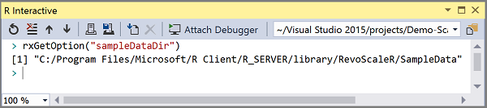

---

# required metadata
title: "Get started with ScaleR in Microsoft R"
description: "Learn the ScaleR functions found in Microsoft R Client and Microsoft R Server using this tutorial walkthrough."
keywords: ""
author: "HeidiSteen"
manager: "jhubbard"
ms.date: "10/17/2016"
ms.topic: "get-started-article"
ms.prod: "microsoft-r"
ms.service: ""
ms.assetid: ""

# optional metadata
ROBOTS: ""
audience: ""
ms.devlang: ""
ms.reviewer: ""
ms.suite: ""
ms.tgt_pltfrm: ""
ms.technology: "r-server"
ms.custom: ""

---

# Get started with ScaleR and data analysis (Microsoft R)

[ScaleR](scaler-user-guide-introduction.md) is a collection of proprietary functions in Microsoft R Client and R Server that are used for practicing data science at scale.

To bring you up to speed, this article includes a quick start demonstrating data import and analysis over a small built-in data set. In a few short steps, you can get first-hand experience of the essential workflow.

ScaleR functions are denoted with an **rx** or **Rx** prefix to make them readily identifiable. You can also work with base functions in the R language. ScaleR is built on the R language, and you can write scripts or code that use both in the same solution.

### Prerequisites

To complete this quick start as written, you will need about 15 minutes and the following components:

* [R Tools for Visual Studio download (RTVS)](https://www.visualstudio.com/vs/rtvs/)
* [Microsoft R Client](rclient.md)

Setup for **R Tools for Visual Studio** adds the R project template and optionally installs **Microsoft R Client**.

Sample data comes with Microsoft R so once you have the tools, there is nothing more to download.

*AirlineDemoSmall.csv* is the dataset used in this tutorial. It is a subset of a data set containing information on flight arrival and departure details for all commercial flights within the USA, from October 1987 to April 2008. The *AirlineDemoSmall.csv* file contains three columns of data: two numeric columns, *ArrDelay* and *CRSDepTime*, and a column of strings, *DayOfWeek*. The file contains 600,000 rows of data in addition to a first row with variable names.

### Start a project

1. In Visual Studio, create a new R project: **File** > **New** > **Project** > **Templates** > **R**.

2. Find or open the **R Interactive** window used for command line scripting. You can enter R functions at the `>` command prompt, including functions provided by ScaleR.

   

In this quick start, you will enter commands individually or in groups into the interactive window.

## Import data

A very common way to store data is in text files. ScaleR includes a sample data directory providing numerous data files that are ready to use, including the *AirlineDemoSmall.csv* file. The sample data directory is registered with ScaleR; the exact location can be returned through a "sampleDataDir" parameter on the *rxGetOption* function.

The following commands import a .csv file, stores the data in an .xdf file, and creates a data object (airData) representing the data source. There are a total of 600,000 rows in the data file. By specifying the argument *rowsPerRead*, we read and write the data in 3 blocks of 200,000 rows each.

~~~~
	inFile <- file.path(rxGetOption("sampleDataDir"), "AirlineDemoSmall.csv")
	airData <- rxImport(inData=inFile, outFile = "airExample.xdf",
	stringsAsFactors = TRUE, missingValueString = "M", rowsPerRead = 200000)
~~~~

If you leave out the *outFile* argument, the return *airData* object is a data frame containing the data. Including *outFile* creates an .xdf file, a type of file recognized by ScaleR.

Given an .xdf input file, *rxImport* returns an .xdf data source object. This object represents the data source, but doesn’t take up much memory. It can be used in many other ScaleR objects interchangeably with a data frame.

To get basic information about the data set and variables, use *rxGetInfo*:
~~~~
	rxGetInfo(airData, getVarInfo = TRUE)
~~~~
It returns in the following output:
~~~~
	File name: C:\YourOutputPath\airExample.xdf
	Number of observations: 6e+05
	Number of variables: 3
	Number of blocks: 3
	Compression type: zlib
	Variable information:
	Var 1: ArrDelay, Type: integer, Low/High: (-86, 1490)
	Var 2: CRSDepTime, Type: numeric, Storage: float32, Low/High: (0.0167, 23.9833)
	Var 3: DayOfWeek
		7 factor levels: Monday Tuesday Wednesday Thursday Friday Saturday Sunday
~~~~
Now let’s take a quick look at the data. Use the *rxHistogram* function to show the distribution in arrival delay by day of week. Internally, this function uses the *rxCube* function to calculate information for a histogram:
~~~~
	rxHistogram(~ArrDelay|DayOfWeek,  data = airData)
~~~~

We can also compute descriptive statistics for the variable:
~~~~
	rxSummary(~ ArrDelay, data = airData )

		Call:
		rxSummary(formula = ~ArrDelay, data = airData)

		Summary Statistics Results for: ~ArrDelay
		Data: airData (RxXdfData Data Source)
		File name: airExample.xdf
		Number of valid observations: 6e+05

		Name     Mean     StdDev   Min Max  ValidObs MissingObs
		ArrDelay 11.31794 40.68854 -86 1490 582628   17372
~~~~
This first look at the data tells us two important things: arrival delay has a long “tail” for every day of the week, with a few flights delayed for well over two hours, and there are quite a few missing values (17,372). Presumably the missing values for arrival delay represent flights that did not arrive, that is, were cancelled.

We can use ScaleR’s data step functionality to create a new variable, *VeryLate*, that represents flights that were either over two hours late or canceled. Since we have our original data safely stored in a text file, we will simply add this variable to our existing airline.xdf file using the *transforms* argument to *rxDataStep*. The *transforms* argument takes a list of one or more R expressions, typically in the form of assignment statements. In this case, we use the following expression: *list(VeryLate = (ArrDelay \> 120 | is.na(ArrDelay))*

The full ScaleR data step then consists of the following steps:

1.  Read in the *data* a block (200,000 rows) at a time.
2.  For each block, pass the *ArrDelay* data to the R interpreter for processing the transformation to create *VeryLate*.
3.  Write the data out to the data set a block at a time. The argument *overwrite=TRUE* allows us to overwrite the data file.

		airData <- rxDataStep(inData = airData, outFile = "airExample.xdf",
		    transforms=list(VeryLate = (ArrDelay > 120 | is.na(ArrDelay))),
		    overwrite = TRUE)

## Perform statistical analysis

We can perform statistical analysis using a data frame or .xdf file. For example, we can estimate a logistic regression on whether or not a flight is “very late” depending on the day of week using *rxLogit*:
~~~~
        logitResults <- rxLogit(VeryLate ~ DayOfWeek, data = airData )
        summary(logitResults)
~~~~
~~~~
        Call:
        rxLogit(formula = VeryLate ~ DayOfWeek, data = airData)

        Logistic Regression Results for: VeryLate ~ DayOfWeek
        File name:
        C:\YourOutputPath\airExample.xdf
        Dependent variable(s): VeryLate
        Total independent variables: 8 (Including number dropped: 1)
        Number of valid observations: 6e+05
        Number of missing observations: 0
        -2*LogLikelihood: 251244.7201 (Residual deviance on 599993 degrees of freedom)

        Coefficients:
                            Estimate Std. Error z value Pr(>|z|)    
        (Intercept)         -3.29095    0.01745 -188.64 2.22e-16 ***
        DayOfWeek=Monday     0.40086    0.02256   17.77 2.22e-16 ***
        DayOfWeek=Tuesday    0.84018    0.02192   38.33 2.22e-16 ***
        DayOfWeek=Wednesday  0.36982    0.02378   15.55 2.22e-16 ***
        DayOfWeek=Thursday   0.29396    0.02400   12.25 2.22e-16 ***
        DayOfWeek=Friday     0.54427    0.02274   23.93 2.22e-16 ***
        DayOfWeek=Saturday   0.48319    0.02282   21.18 2.22e-16 ***
        DayOfWeek=Sunday     Dropped    Dropped Dropped  Dropped    
        ---
        Signif. codes:  0 '***' 0.001 '**' 0.01 '*' 0.05 '.' 0.1 ' ' 1

        Condition number of final variance-covariance matrix: 16.7804
        Number of iterations: 3
~~~~
The results show that in this sample, a flight on Tuesday is most likely to be very late or cancelled, followed by flights departing on Friday. In this model, Sunday is the control group, so that coefficient estimates for other days of the week are relative to Sunday. The intercept shown is the same as the coefficient you would get for Sunday if you omitted the intercept term:
~~~~
    logitResults2 <- rxLogit(VeryLate ~ DayOfWeek - 1, data = airData )
            summary(logitResults2)
~~~~    

~~~~         
            Call:
            rxLogit(formula = VeryLate ~ DayOfWeek - 1, data = airData)

            Logistic Regression Results for: VeryLate ~ DayOfWeek - 1
            File name:
            	C:\YourOutputPath\airExample.xdf
            Dependent variable(s): VeryLate
            Total independent variables: 7
            Number of valid observations: 6e+05
            Number of missing observations: 0
            -2*LogLikelihood: 251244.7201 (Residual deviance on 599993 degrees of freedom)

            Coefficients:
                                Estimate Std. Error z value Pr(>|z|)    
            DayOfWeek=Monday    -2.89008    0.01431  -202.0 2.22e-16 ***
            DayOfWeek=Tuesday   -2.45077    0.01327  -184.7 2.22e-16 ***
            DayOfWeek=Wednesday -2.92113    0.01617  -180.7 2.22e-16 ***
            DayOfWeek=Thursday  -2.99699    0.01648  -181.9 2.22e-16 ***
            DayOfWeek=Friday    -2.74668    0.01459  -188.3 2.22e-16 ***
            DayOfWeek=Saturday  -2.80776    0.01471  -190.9 2.22e-16 ***
            DayOfWeek=Sunday    -3.29095    0.01745  -188.6 2.22e-16 ***
            ---
            Signif. codes:  0 '***' 0.001 '**' 0.01 '*' 0.05 '.' 0.1 ' ' 1

            Condition number of final variance-covariance matrix: 1
            Number of iterations: 7
~~~~

## Next steps

This quick start demonstrated a basic workflow, but there are several more tutorials that go into more detail and cover more scenarios, including instructions for working with bigger data sets.

  - [ScaleR tutorial using airplane flight data](scaler-getting-started-0-example-airline-data.md)
  - [Analyze large data with ScaleR](scaler-getting-started-3-analyze-large-data.md)
  - [Example: Analyzing loan data with ScaleR](scaler-getting-started-1-example-loan-data.md)
  - [Example: Analyzing census data with ScaleR](scaler-getting-started-2-census-loan-data.md)

### Try demo scripts

 Another way to learn about ScaleR is through demo scripts. Scripts provided in your Microsoft R installation contain code that's very similar to what you see in the tutorials. You can highlight portions of the script, right-click **Execute in Interactive** to run the script in RTVS.

 Demo scripts are located in the *demoScripts* subdirectory of your Microsoft R installation. On Windows, this is typically:

 	`C:\Program Files\Microsoft\R Client\R_SERVER\library\RevoScaleR\demoScripts`

### Watch this video

This 30-minute video is the second in a 4-part video series. It demonstrates ScaleR functions for data ingestion.

 
<iframe src="https://channel9.msdn.com/Series/Microsoft-R-Server-Series/Introduction-to-Microsoft-R-Server-Session-2--Data-Ingestion/player" width="600" height="400" allowFullScreen frameBorder="0"></iframe>

### Get function help

  R packages typically include embedded package help reference and ScaleR is no exception. To view embedded help, use the **R Help** tab, located next to Solution Explorer.

  - In R Help, click the Home button.
  - Click **Packages**.
  - Scroll down and click **RevoScaleR** to open the package help. All ScaleR functions are documented here. A subset of more commonly used functions have [help pages on MSDN](../scaler/scaler.md).

### Get more information

Continue building up your knowledge of ScaleR with these additional resources.

- [ScaleR Getting Started with Hadoop](scaler-hadoop-getting-started.md)
- [ScaleR Getting Started with Teradata](scaler-teradata-getting-started.md)
- [ScaleR Getting Started with SQL Server](https://msdn.microsoft.com/library/mt604885.aspx)
- [ScaleR Distributed Computing Guide](scaler-distributed-computing.md)
- [ScaleR ODBC Data Import Guide](scaler-odbc.md)

## See Also

[Introduction to Microsoft R](microsoft-r-getting-started.md)

[Diving into data analysis in Microsoft R](data-analysis-in-microsoft-r.md)

[RevoScaleR Functions](../scaler/scaler.md)
