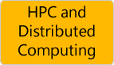

---

# required metadata
title: "RevoScaleR Functions"
description: "ScaleR Functions"
keywords: "RevoScaleR, ScaleR"
author: "j-martens"
manager: "Paulette.McKay"
ms.date: "06/13/2016"
ms.topic: "article"
ms.prod: "microsoftr"
ms.service: ""
ms.assetid: ""

# optional metadata
ROBOTS: ""
audience: ""
ms.devlang: ""
ms.reviewer: ""
ms.suite: ""
ms.tgt_pltfrm: ""
ms.technology: ""
ms.custom: ""

---

# ScaleR Function Map for Microsoft R Server

The `RevoScaleR` package includes hundreds of functions you can use for data analysis, for high-performance and distributed computing, and more. About 180 functions can be called directly from the command-line.

This topic is specific to Microsoft R Server. Here you can learn about the most commonly used functions for Microsoft R Server users.  

## Functions for Data Analysis

| |||||  
|-----------------------|-----------------------|-----------------------|-----------------------|-----------------------|
|                       |**Import / Export**    |**Manipulate / Clean / Transform**|**Visualize**          |**Analyze / Learn / Predict**    |
|**Most Popular  Functions**  |<!--COL-1-->[`rxImport()`]()   [`rxXdfToText()`]()   [`rxGetInfo()`]()   [`rxSetInfo()`]()   [`rxGetVarInfo()`]()   [`rxSetVarInfo()`]()   [`rxGetVarNames()`]()   [`rxCompressXdf()`]()   [`RxXdfData()`]() [`RxTextData()`]()   [`RxSasData()`]()   [`RxSpssData()`]()   [`RxOdbcData()`]()   [`RxSqlServerData()`](RxSqlServerData.md)  [`RxTeradata()`]()  [`rxOpen()`](rxOpen.md)  [`rxClose()`](rxClose.md)   [`rxReadNext()`](rxReadNext.md)   [`rxSetFileSystem()`]()   [`rxGetFileSystem()`]()  [`RxHdfsFileSystem()`]()   [`RxNativeFileSystem()`]()     Functions `rxDataStep()`,  `rxXdfToDataFrame()`,  and `rxReadXdf:Reads()`  can also read  an .XDF file into  a data  frame.|<!--COL-2--> [`rxDataStep()`]()   [`rxFactors()`]()   [`rxSort()`]()   [`rxMerge()`]()   [`rxSplit()`]()   [`rxExecuteSQLDDL()`](rxExecuteSQLDDL.md)  |<!--COL-3--> [`rxHistogram()`]()  [`rxLinePlot()`]()   [`rxLorenz()`]()    [`rxRocCurve()`]()|<!--COL-4-->_Descriptive Statistics  & Cross-Tabulation:_   [`rxSummary()`]()   [`rxQuantile()`]()   [`rxCrossTabs()`]()   [`rxCube()`]()   [`rxMarginals()`]()    [`rxChiSquaredTest()`]()   [`rxFisherTest()`]()   [`rxKendallCor()`]()   [`rxPairwiseCrossTab()`]()   [`rxRiskRatio()`]()   [`rxOddsRatio()`]()     _Statistical Modeling:_   [`rxLinMod()`]()   [`rxCovCor()`]()  [`rxCov()`]()   [`rxCor()`]()    [`rxSSCP()`]()  [`rxLogit()`]()   [`rxRoc()`]()    [`rxGlm()`]()  [`rxDTree()`]()   [`rxKmeans()`]()    [`rxDForest()`]()     _Prediction:_   [`rxPredict()`]() |
|**Less Used  Functions**  |<!--COL-1--> [`RxNativeFileSystem()`]() |<!--COL-2--> [`rxDataStep()`]()   [`rxFactors()`]()|<!--COL-3--> [`rxHistogram()`]()|<!--COL-4--> Something |

>[!IMPORTANT]
>This is not an exhaustive list of functions in the RevoScaleR package. If you want to see the entire set of functions,  [follow these steps.](scaler.md#findmore)

 
## Other Functions 

|  || | |  
|----------------------------------------|--------------------------------------|--------------------------------------|--------------------------------------|
|**Data Sources**                        |**Compute Context**                 |**Utility Functions**                 |**High Performance / Distributed Computing**  |
|<!--COL-1--> [`()`]()   [`()`]()   [`()`]()   [`()`]()   [`()`]()   [`()`]()   [`()`]()   [`()`]()   [`()`]()   [`()`]()   [`()`]()   [`()`]()   [`()`]()   [`()`]()   [`()`]()   [`()`]()|<!--COL-2-->  |<!--COL-3--> [`rxOptions()`]()  [`rxGetOption()`]()   [`rxRngNewStream()`]()   [`rxRngDelStream()`]()   [`rxRngGetStream()`]()   [`rxRngSetStream()`]()   [`rxGetEnableThreadPool()`]()   [`rxSetEnableThreadPool()`]()    [`rxStepControl()`]()  |<!--COL-4--> [`RxComputeContext()`](RxComputeContext.md)   [`RxForeachDoPar()`]()   [`RxLocalParallel()`]()   [`RxLocalSeq()`]()   [`rxGetComputeContext()`](rxGetComputeContext.md)   [`rxSetComputeContext()`](rxSetComputeContext.md)   [`RxInSqlServer()`](RxInSqlServer.md) |

 
[`rxIsOpen()`](rxIsOpen.md)
[`rxSqlServerDropTable()`](rxSqlServerDropTable.md)     
[`rxSqlServerTableExists()`](rxSqlServerTableExists.md)
[`rxWriteNext()`](rxWriteNext.md)
 