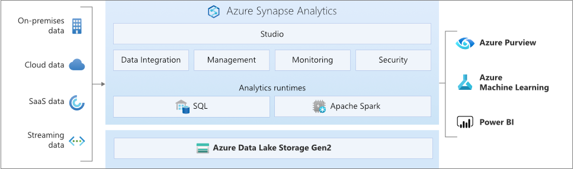
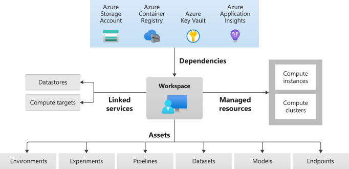

# What's happening to Machine Learning Server?

> [!IMPORTANT]
> The support for [Microsoft Machine Learning Server 9.4.7](what-is-machine-learning-server.md) will **end on July 1, 2022**. For more information, see [Support timeline for Microsoft R Server & Machine Learning Server](resources-servicing-support.md).

This article explains options for replacing the functionality of Machine Learning Server and migration strategies for code and data to other platforms.

Machine Learning Server is enterprise software for data science, providing R and Python interpreters, base distributions of R and Python, additional libraries from Microsoft, and operationalization capability.

The first decision point for the replacement options is the locations of compute and data storage for analysis, either on-premises or in the cloud.

## On-premises analytics options

Machine Learning Server environments are available independent of connecting to the Internet or intranets. These are normally high-security environments where large-scale data analysis is critical, but the data is sensitive.

If you want to use an on-premises solution, SQL Server Big Data Clusters is an option.

### SQL Server Big Data Clusters

[SQL Server Big Data Clusters](/sql/big-data-cluster/big-data-cluster-overview) allow you to deploy scalable clusters of [SQL Server](/sql/sql-server), Spark, and HDFS containers running on Kubernetes. These components are running side by side to enable you to read, write, and process big data from Transact-SQL or Spark, allowing you to easily combine and analyze your high-value relational data with high-volume big data.  

It includes [Machine Learning Services](/sql/machine-learning/sql-server-machine-learning-services) and [Language Extensions](/sql/language-extensions/language-extensions-overview), which runs Python, R, and Java languages from inside SQL Server stored procedures. The Spark subsystem within the cluster is a standard Apache Spark distribution, and can run Scala, R, Python and other supported languages and constructs.  

SQL Server Big Data Clusters has relational data stores (SQL Server databases), HDFS data stores, and a relational large-scale store within the architecture.  

Use SQL Server Big Data Clusters as a replacement for Machine Learning Server when you need to:

- [Deploy scalable clusters](/sql/big-data-cluster/deploy-get-started) of SQL Server, Spark, and HDFS containers running on Kubernetes, on-premises or in the cloud.
- Read, write, and process big data from Transact-SQL or Spark.
- Easily combine and analyze high-value relational data with high-volume big data, storing data in HDFS that is also accessible by SQL Server.
- Query virtualized data from external SQL Server, Oracle, Teradata, MongoDB, and ODBC data sources with external tables using PolyBase.
- Use data for AI, machine learning, and other analysis tasks.
- [Deploy and run applications in the cluster](/sql/big-data-cluster/concept-application-deployment), accessible from anywhere you determine.
- Provide high availability for the SQL Server master instance and all databases by using Always On availability group technology.  

The architecture of a SQL Server Big Data Cluster is as follows:

 

For more information on SQL Server Big Data Clusters, see [What are SQL Server Big Data Clusters?](/sql/big-data-cluster/big-data-cluster-overview).

## Cloud analytics options

Many workloads from Machine Learning Server can also be uploaded to the Azure platform. Data *born in the cloud* (originated in cloud-based applications) are prime candidates for these technologies, and data movement services can migrate large-scale data securely and quickly. For more on data movement options, see [Choose an Azure solution for data transfer](/azure/storage/common/storage-choose-data-transfer-solution).

Azure has systems and certifications allowing secure data and data processing in a variety of tools. More information on these certifications is located at the [Microsoft Trust Center resource](https://www.microsoft.com/en-us/trust-center).

### Azure Synapse Analytics

[Azure Synapse Analytics](/azure/synapse-analytics/overview-what-is) is an enterprise analytics service that accelerates time to insight across data warehouses and big data systems, using distributed processing and data constructs. Azure Synapse Analytics brings together SQL technologies used in enterprise data warehousing, Spark technologies used for big data, pipelines for data integration and ETL/ELT, and deep integration with other Azure services such as [Power BI](/power-bi/), [Azure Cosmos DB](/azure/cosmos-db/), and [Azure Machine Learning](/azure/machine-learning/).

Use Azure Synapse Analytics as a replacement for Machine Learning Server when you need to:

- Leverage both serverless and dedicated resource models. For predictable performance and cost, create dedicated SQL pools to reserve processing power for data stored in SQL tables.  
- Process unplanned or *burst* workloads, access an always-available, serverless SQL endpoint. 
- Use built-in streaming capabilities to land data from cloud data sources into SQL tables. 
- Integrate AI with SQL by using machine learning models to score data using the T-SQL PREDICT function. 
- Leverage ML models with SparkML algorithms and Azure Machine Learning integration for Apache Spark 2.4 supported for Linux Foundation Delta Lake. 
- Use a simplified resource model that frees you from having to worry about managing clusters. 
- Process data that requires fast Spark start-up and aggressive autoscaling. 
- Process data using.NET for Spark allowing you to reuse your C# expertise and existing .NET code within a Spark application. 
- Work with tables defined on files in the data lake are seamlessly consumed by either Spark or Hive. 
- Use SQL with Spark to directly explore and analyze Parquet, CSV, TSV, and JSON files stored in a data lake. 
- Enable fast, scalable data loading between SQL and Spark databases. 
- Ingest data from 90+ data sources. 
- Enable “Code-Free” ETL with Data flow activities. 
- Orchestrate notebooks, Spark jobs, stored procedures, SQL scripts, and more. 
- Monitor resources, usage, and users across SQL and Spark. 
- Use Role-based access control to simplify access to analytics resources. 
- Write SQL or Spark code and integrate with enterprise CI/CD processes. 

The architecture of Azure Synapse Analytics is as follows: 

 

For more information, see [Machine Learning capabilities in Azure Synapse Analytics](/azure/synapse-analytics/machine-learning/what-is-machine-learning).

### Azure SQL Managed Instance Machine Learning Services

[Machine Learning Services in Azure SQL Managed Instance](/azure/azure-sql/managed-instance/machine-learning-services-overview) provides in-database machine learning, supporting both Python and R scripts. The feature includes Microsoft Python and R packages for high-performance predictive analytics and machine learning. The relational data can be used in scripts through stored procedures, T-SQL script containing Python or R statements, or Python or R code containing T-SQL.

Use Azure SQL Managed Instance Machine Learning Services as a replacement for Machine Learning Server when you need to:

- Run R and Python scripts to do data preparation and general purpose data processing. 
- Train machine learning models in database.
- Deploy your models and scripts into production in stored procedures.

For more information, see [Machine Learning Services in Azure SQL Managed Instance](/azure/azure-sql/managed-instance/machine-learning-services-overview).

### Azure Machine Learning

[Azure Machine Learning](/azure/machine-learning/) is a cloud-based service that can be used for any kind of machine learning, from classical machine learning to deep learning, supervised, and unsupervised learning. Whether you prefer to write Python or R code with the SDK or work with no-code/low-code options in the studio, you can build, train, and track machine learning and deep-learning models in an Azure Machine Learning Workspace. With Azure Machine Learning you can start training on your local machine and then scale out to the cloud. The service also interoperates with popular deep learning and reinforcement open-source tools such as PyTorch, TensorFlow, scikit-learn, and Ray RLlib. 

Use Azure Machine Learning as a replacement for Machine Learning Server when you need: 

- A designer-based web environment for Machine Learning: drag-n-drop modules to build your experiments and then deploy pipelines in a low-code environment. 
- Jupyter notebooks: use our example notebooks or create your own notebooks to leverage our SDK for Python samples for your machine learning. 
- R scripts or notebooks in which you use the SDK for R to write your own code or use the R modules in the designer. 
- The “Many Models Solution Accelerator” which builds on Azure Machine Learning and enables you to train, operate, and manage hundreds or even thousands of machine learning models. 
- Machine learning extensions for Visual Studio Code (preview) provides you with a full-featured development environment for building and managing your machine learning projects. 
- A Machine learning Command-Line Interface (CLI), Azure Machine Learning includes an Azure CLI extension that provides commands for managing with Azure Machine Learning resources from the command line. 
- Integration with open-source frameworks such as PyTorch, TensorFlow, and scikit-learn and many more for training, deploying, and managing the end-to-end machine learning process. 
- Reinforcement learning with Ray RLlib.
- MLflow to track metrics and deploy models or Kubeflow to build end-to-end workflow pipelines. 

The architecture of a Azure Machine Learning deployment is as follows: 

 

For more information, see [What is Azure Machine Learning?](/azure/machine-learning/overview-what-is-azure-ml)

## Other cloud analytics options

Other options include [Azure HDInsight](/azure/hdinsight/), [Azure Databricks](/azure/databricks/), and [Azure Cosmos DB](/azure/cosmos-db/).

### Azure HDInsight

[Azure HDInsight](/azure/hdinsight/) is a cloud distribution of Hadoop components. Azure HDInsight is a managed, full-spectrum, open-source analytics service in the cloud for enterprises. HDInsight allows you to use open-source frameworks such as Hadoop, Apache Spark, Apache Hive, LLAP, Apache Kafka, Apache Storm, R, and more. 

HDInsight includes specific cluster types and cluster customization capabilities, such as the capability to add components, utilities, and languages. For more information, see [Cluster types in HDInsight](/azure/hdinsight/hdinsight-overview#cluster-types-in-hdinsight).

The architecture of a Azure HDInsight deployment is as follows:

For more information, see [What is Azure HDInsight?](/azure/hdinsight/hdinsight-overview).

### Azure Databricks

[Azure Databricks](/azure/databricks/) is a data analytics platform optimized for the Azure cloud services platform. Azure Databricks offers two environments for developing data intensive applications: Azure Databricks SQL Analytics and Azure Databricks Workspace. 

Azure Databricks SQL Analytics provides an easy-to-use platform for analysts who want to run SQL queries on their data lake, create multiple visualization types to explore query results from different perspectives, and build and share dashboards. 

Azure Databricks Workspace provides an interactive workspace that enables collaboration between data engineers, data scientists, and machine learning engineers. For a big data pipeline, the data (raw or structured) is ingested into Azure through Azure Data Factory in batches, or streamed near real-time using Apache Kafka, Event Hub, or IoT Hub. This data lands in a data lake for long term persisted storage, in Azure Blob Storage or Azure Data Lake Storage. As part of your analytics workflow, use Azure Databricks to read data from multiple data sources and turn it into breakthrough insights using Spark.  

The architecture of a Microsoft Azure Databricks deployment is as follows:

 

For more information, see [What is Azure Databricks?](/azure/databricks/scenarios/what-is-azure-databricks)

### Azure Cosmos DB

[Azure Cosmos DB](/azure/cosmos-db/) is a fully managed NoSQL database for modern app development. Single-digit millisecond response times, and automatic and instant scalability, guarantee speed at any scale. Business continuity is assured with SLA-backed availability and enterprise-grade security. App development is faster and more productive thanks to turnkey multi region data distribution anywhere in the world, open-source APIs and SDKs for popular languages.  

As a fully managed service, Azure Cosmos DB handles database administration with automatic management, updates and patching. It also handles capacity management with serverless and automatic scaling options that respond to application needs to match capacity with demand.  

The architecture of a Microsoft Azure CosmosDB deployment is as follows: 

 

For more information on using Notebooks with Python or C# in CosmosDB Deployments, see [Built-in Jupyter Notebooks support in Azure Cosmos DB](/azure/cosmos-db/cosmosdb-jupyter-notebooks).

For more information, see the [Azure Cosmos DB documentation](/azure/cosmos-db/introduction).

## See Also

- [Support Timeline for Microsoft R Server & Machine Learning Server](resources-servicing-support.md)
- [Archived articles](/machine-learning-server/overview-machine-learning-server-archive)